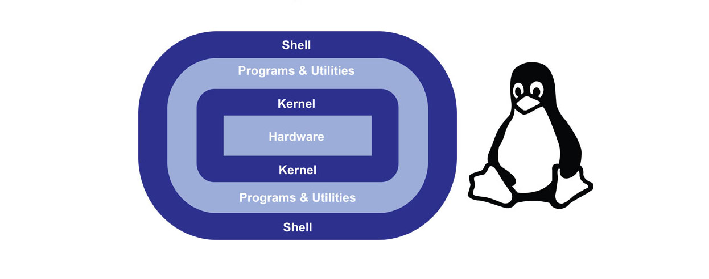
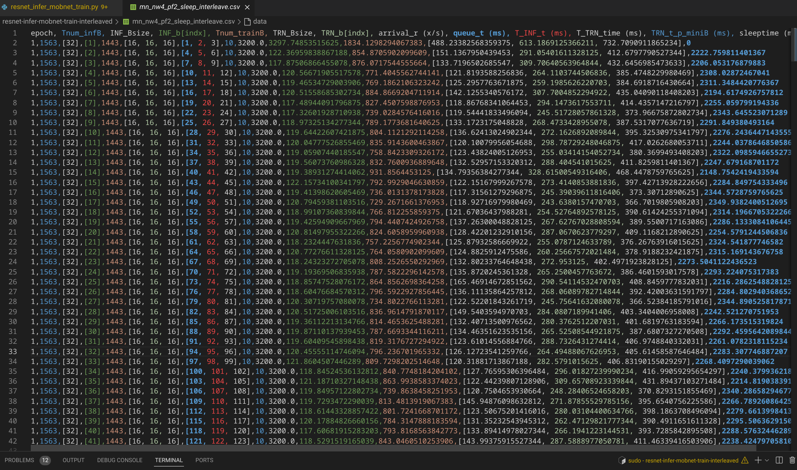
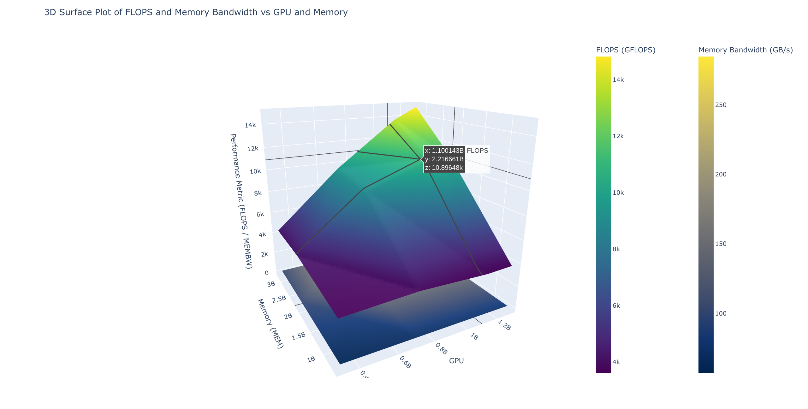
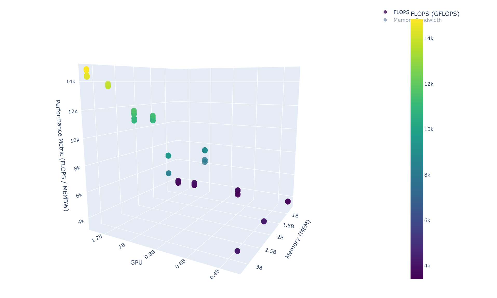

<table style="width:100%" >

## Linux Administration :

```bash
  $ sudo adduser saikia
  $ cat /etc/passwd 
  $ sudo ssh user@ip
  $ sudo scp -r user@ip:/path/ . 
```

Linux system administration is a process of setting up, configuring, and managing a computer system in a Linux environment. System administration involves creating a user account, taking reports, performing backup, updating configuration files, documentation, and performing recovery actions. The user who manages the server, fixes configuration issues, recommends new software updates, and updates document is the system administrator.

### Components of Linux operating system:

The Linux operating system contains the following components:

+ `Bootloader`: This is a software that manages the boot process of your computer.
+ `Kernel`: The kernel is also called the Linux kernel and is the system traffic controller that allocates system resources to the running application. Software applications request the kernel for hardware resources such as disc space, RAM, and CPU. Software applications use the API to work with the kernel on a high level of abstraction.
+ `Init system`: This is a subsystem that bootstraps the user space and controls daemons. The init system manages the boot process after it is handled by the bootloader.
+ `Daemons`: Daemons are programs or drivers that manage underground applications like printing sounds, network, etc.
+ `Graphical server`: The graphical server system supports the graphic display on the screen.
+ `Desktop environment`: The desktop environment allows the user to interface with the operating system. The Linux OS offers a variety of desktop environments with their own built-in applications to choose from.
+ `Application`: The desktop environment does not offer all of the applications a user might need, but Linux allows the user to install additional applications.
The Linux operating system is used as a client-side (desktop) and server-side operating system.

#### Login Shell:
+ `Definition`: A login shell is the first shell session you start after logging into the system. It typically happens when you log in to your system from the terminal or remotely via SSH.
+ `Usage`: When you start a new session (e.g., by logging in to the system), a login shell is created.
+ `Purpose`:
  + Sets up the environment for the user.
  + It loads system-wide and user-specific configuration files, which define environment variables and startup settings.
+ `Initialization Files`:
  + Reads configuration files like `/etc/profile`, `~/.bash_profile`, `~/.bash_login`, or `~/.profile` (in Bash shell).
  + These files are primarily used for setting up environment variables like $PATH, $USER, etc.
+ `How to start`: Can be started directly by logging in via a terminal or SSH, or by running a shell with a -l option, e.g., bash -l.

####  Non-Login Shell:
+ `Definition`: A non-login shell is usually any shell you start after the login shell. It is generally created when you open a new terminal window or run a script.
+ `Usage`: For executing scripts or starting a shell from within a running terminal session.
+ `Purpose`:
  + It inherits environment variables and settings from the login shell but doesn't read the same configuration files.
  + Used for day-to-day commands, running shell scripts, or interactive shell usage within a session.
+ `Initialization Files`:
  + Reads shell-specific configuration files like `~/.bashrc` in Bash (or other equivalents like `~/.zshrc` for Zsh).
  + These files usually contain aliases, shell options, or prompt customizations.
+ `How to start`: Automatically started when you open a new terminal window, or manually with commands like bash or sh without the -l option.

find number of directories:
```bash
  $ find . -mindepth 1 -type d | wc -l
```

find number of files with '*tegrastats*' name in it:

```bash
  $ find . -type f -name '*tegrastats*' | wc -l
```



<table style="width:100%" >

<tr>
<th>command</th>
<th>description <br /></th>
</tr>

<tr>
<th>man</th>
<td>Display information about all commands</td>
</tr>


<tr>
<th>uptime</th>
<td>Show how long system is running</td>
</tr>


<tr>
<th>users</th>
<td>Show username who are currently logged in</td>
</tr>

<tr>
<th>service</th>
<td>Call and execute script</td>
</tr>

<tr>
<th>pkill</th>
<td>Kill a process/td>
</tr>

<tr>
<th>pmap</th>
<td>Memory map of a process</td>
</tr>

<tr>
<th>wget</th>
<td>present working directory</td>
</tr>


<tr>
<th>pwd</th>
<td>Download file from network</td>
</tr>


<tr>
<th>ftp or sftp</th>
<td>Connect remote ftp host</td>
</tr>

<tr>
<th>free</th>
<td>Show memory status</td>
</tr>

<tr>
<th>top</th>
<td>Display processor activity of system</td>
</tr>

<tr>
<th>last</th>
<td>Display user's activity in the system</td>
</tr>

<tr>
<th>ps</th>
<td>Display about processes running on the system</td>
</tr>


<tr>
<th>du</th>
<td>Display usage</td>
</tr>

</table>

Bash scripts help automate scraping of data, here is an example of NVIDIA Jetson Tegrastats energy data I scraped at IISc, along with batch information while training the deep learning models at the edge:

<center></center>

3D visualzation of the data:

<center>




</center>


# t-mux:
[ [you need to learn tmux RIGHT NOW!!](https://youtu.be/nTqu6w2wc68?si=PrcTEK2fw1_9yWML), [Complete tmux Tutorial](https://youtu.be/Yl7NFenTgIo?si=Wrzs41pJOCH3Gg5a) ]

```bash
  $ sudo apt-get install tmux
```

C-b : CTRL + b

```bash
  $ tmux new -s <orin4>
  $ C-b % #create new panes (horizontal)
  $ C-b " #create new panes (vertical)
  $ C-b <arrow> #switch between panes
  $ C-b d - detach
  $ tmux attach-session -t
  $ tmux rename-session -t 0 database
  $ C-b z #make a pane go full screen. Hit 
```

resources: [linux administration notes](./THEORY.MD) - daemons & processes, [Linux System Administration](https://youtu.be/UCr04qIB7uc), [manual](https://www.tuxcademy.org/download/en/adm1/adm1-en-manual.pdf), [tmux-guide](https://hamvocke.com/blog/a-quick-and-easy-guide-to-tmux/).
