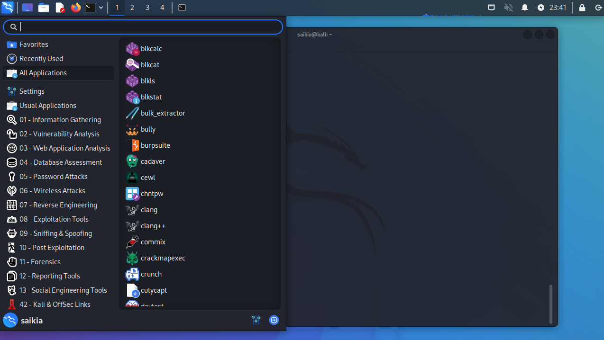
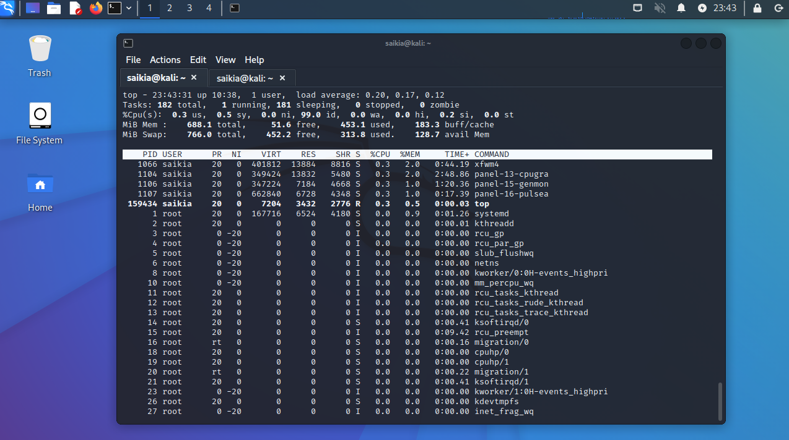
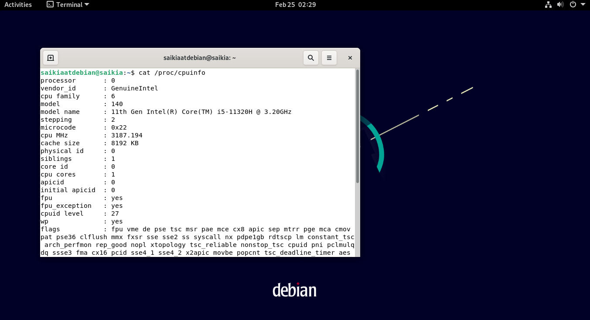
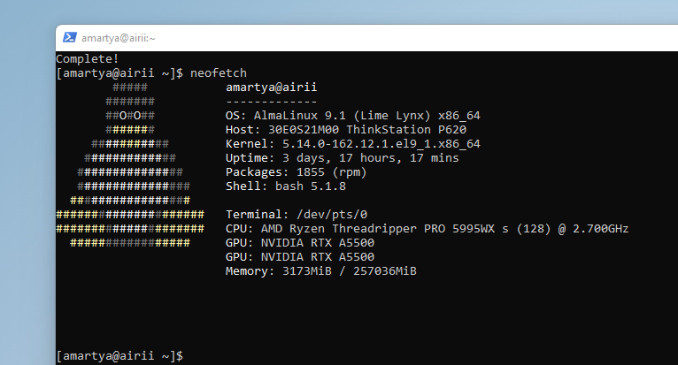
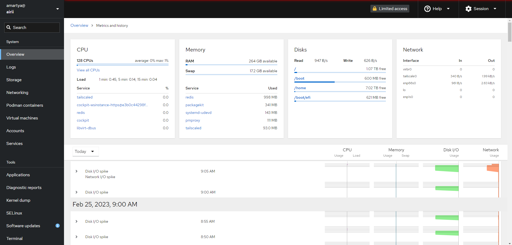
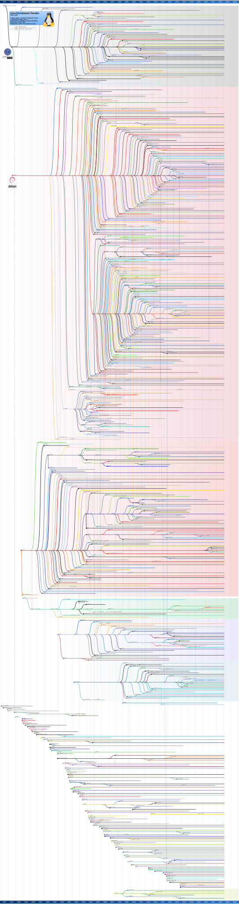

# Linux Distros:

There are three main branches of Linux distros - Debian (deb), Red Hat (rpm), and Slackware (slp). There are also some smaller branches and some individual distros that have their own structure and setup. Some of these branches of Linux have large subgroups. For instance, Ubuntu is a large family of Linux distros within the Debian group. Some distros may stray far from their original group. For instance, OpenSUSE came from SUSE which came from Slackware. So, OpenSUSE is a descendant of Slackware, although OpenSUSE now uses RPM packages like RedHat-based Linux systems. So, that would make OpenSUSE a RedHat-based system. Some new major branches are forming. The Arch branch is starting to become as large as the three main branches of Linux distros.
Follow [distrowatch](https://distrowatch.com/) for latest distro updates, [compare linux distributions](https://en.wikipedia.org/wiki/Comparison_of_Linux_distributions) ; [svg](https://upload.wikimedia.org/wikipedia/commons/5/58/Linux_Distribution_Timeline_with_Android.svg), [Scientific Linux](https://scientificlinux.org/) and here are my distro choices:

<table style="width:100%" >

<tr>
<th>distro</th>
<th>description  </th>
<th>reference  </th>
</tr>

<tr>
<th>Arch Linux</th>
<td>Arch Linux is a lightweight and flexible geeky Linux distro designed for advanced users or Linux experts who care much about what is installed and the services running. It gives users the freedom to custom or configures the system, to their preference. In a nutshell, Arch is meant for users who really know the ins and outs of working with Linux. </td>
<td>

[Arch Linux](https://archlinux.org/)
 </td>
</tr>

<tr>
<th>Kali Linux</th>
<td>Developed and maintained by offensive security, Kali Linux is a Debian-based Linux distro designed for penetration testing and conducting digital forensics. It ships with out-of-the-box tools meant for penetration testing such as Nmap, Metasploit Framework, Maltego, and Aircrack-ng to mention a few.  

</td>
<td>

[Kali Linux](https://www.kali.org/)
 </td>
</tr>

<tr>
<th>Red Hat Enterprise Linux (RHEL)</th>
<td>Red Hat is usually a top choice for server environments given its stability and regular security patches which boost its overall security. </td>
<td>

[RHEL](https://www.redhat.com/en/technologies/linux-platforms/enterprise-linux)
 </td>
</tr>

<tr>
<th>Fedora</th>
<td>It’s a powerful and flexible operating system that’s tailored for desktops & laptops, servers, and even for IoT ecosystems. Fedora, just like CentOS, is based on Red Hat and is in fact, a testing environment for Red Hat before transitioning to the Enterprise phase. </td>
<td>

[Fedora](https://getfedora.org/)
 </td>
</tr>

<tr>
<th>Ubuntu</th>
<td>Ubuntu is beautiful and home. </td>
<td>

[Ubuntu](https://ubuntu.com/)
 </td>
</tr>

<tr>
<th>Debian</th>
<td> 
 </td>
<td>

[Debian](https://www.debian.org/)
 </td>
</tr>

<tr>
<th>Alma Linux</th>
<td>AlmaLinux is a free and open source Linux distribution, created originally by CloudLinux to provide a community-supported, production-grade enterprise operating system that is binary-compatible with Red Hat Enterprise Linux (RHEL). The name of the distribution comes from the word "alma", meaning "soul" in Spanish and other Latin languages. It was chosen to be an homage to the Linux community. Do an $ifconfig and cockpit (dashboard) available at ip:9090 (port 9090).  

</td>
<td>

[Alma Linux](https://almalinux.org/)
 </td>
</tr>

<tr>
<th>Parrot OS</th>
<td>Parrot OS is a wonderful penetration testing and vulnerability assessment distro that can do a lot more than some of its more popular peers like Kali Linux.

If you boot Parrot from a USB disk, you can choose to create a persistent partition to save your changes. Very thoughtfully the developers also allow you to encrypt this persistent partition for maximum security. </td>
<td>

[Parrot OS](https://www.parrotsec.org/)

 </td>
</tr>

</table>

