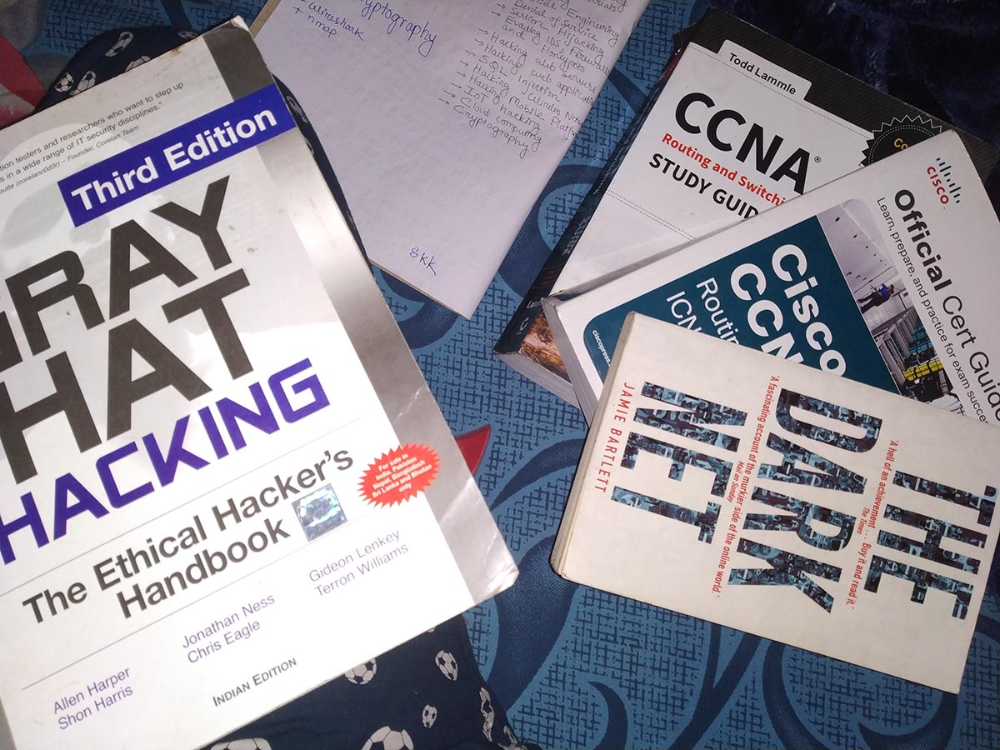
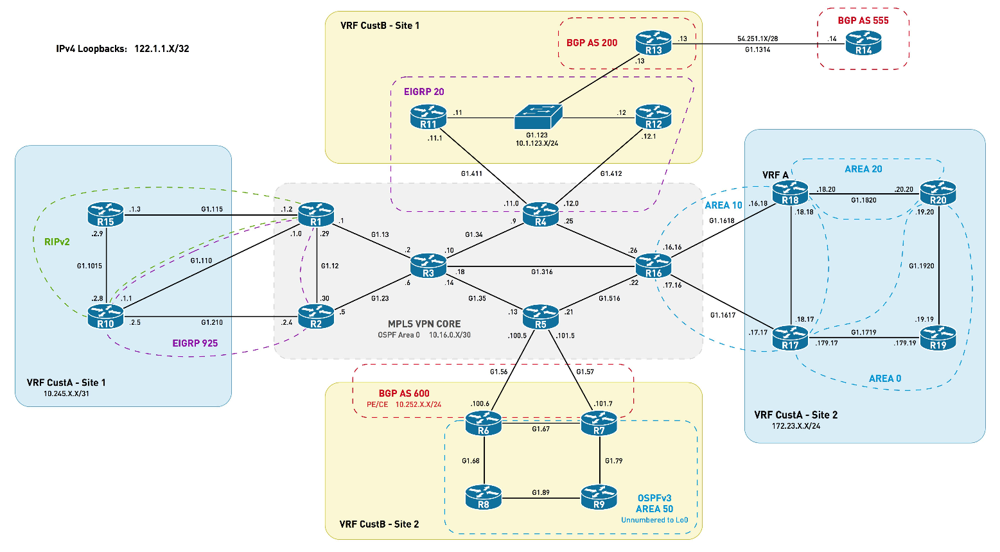

<table style="width:100%" >

# Linux Networking

I studied networking (CCNA syllabus) (2015-2016) and did lot of packet tracking with GNS3 (CISCO IOS).

Linux Networking Command Pallette🌸:

<table style="width:100%" >

<tr>
<th>command</th>
<th>description  </th>
<th>reference  </th>
</tr>

<tr>
<th>ifconfig</th>
<td>Display and manipulate route and network interfaces. </td>
<td>$ ifconfig </td>
</tr>

<tr>
<th>ip</th>
<td>It is a replacement of ifconfig command. Use ip link show command to display all network interfaces on the system. </td>
<td>$ ip link show </td>
</tr>

<tr>
<th>ip route show</th>
<td>Use the IP route to print or display the routing table. </td>
<td>$ ip route show </td>
</tr>

<tr>
<th>ping -c 3 google.com </th>
<td>By default, ping runs in an infinite loop. To send a defined number of packets, use -c flag </td>
<td>$ ping -c 3 google.com  </td>
</tr>

<tr>
<th>ss -t -a</th>
<td> ss command with -t and -a flags to list all TCP sockets. This displays both listening and non-listening sockets. ss gets details about network sockets. </td>
<td>$ ss -t -a </td>
</tr>

<tr>
<th>iftop</th>
<td>Monitors stats related to bandwidth. </td>
<td>$ iftop </td>
</tr>

<tr>
<th>dig [domain] </th>
<td>Show DNS information about a domain using the dig command </td>
<td>$dig [domain]  </td>
</tr>

<tr>
<th>dig -x [ip_address]</th>
<td>Do reverse lookup of an IP address </td>
<td>$dig -x [ip_address] </td>
</tr>

<tr>
<th>lastlog </th>
<td> The lastlog command is used to find the details of a recent login of all users or of a given user. </td>
<td>$lastlog  </td>
</tr>

<tr>
<th>firewalld</th>
<td>CLI tool to configure rules of Firewall. </td>
<td>$ firewalld </td>
</tr>

<tr>
<th>tcpdump</th>
<td>Packet sniffing and analyzing utility used to capture, analyze and filter network traffic. </td>
<td>$ tcpdump </td>
</tr>

</table>

I have some CISCO IOS [here](net/GNS3IOS) and CCNA [labs](net/Labs/).

