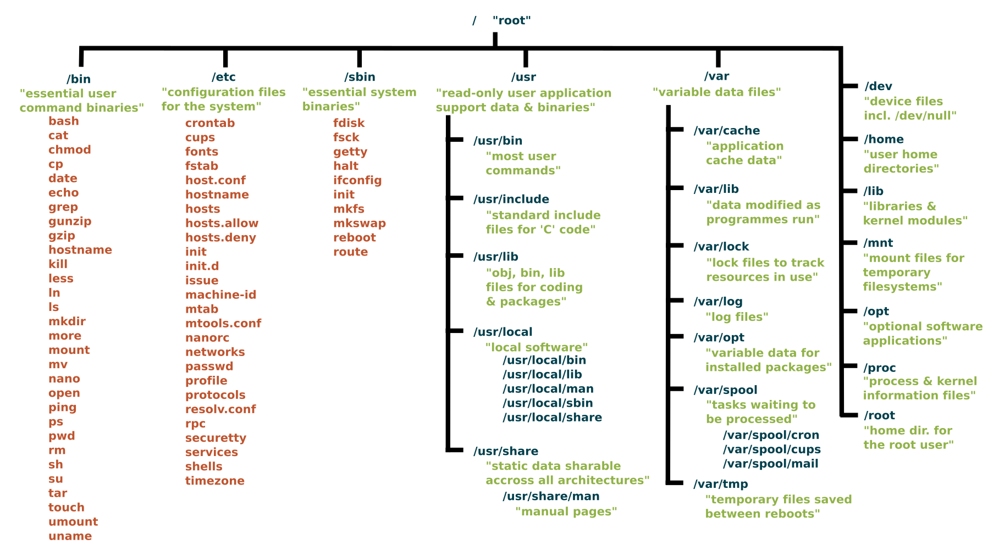
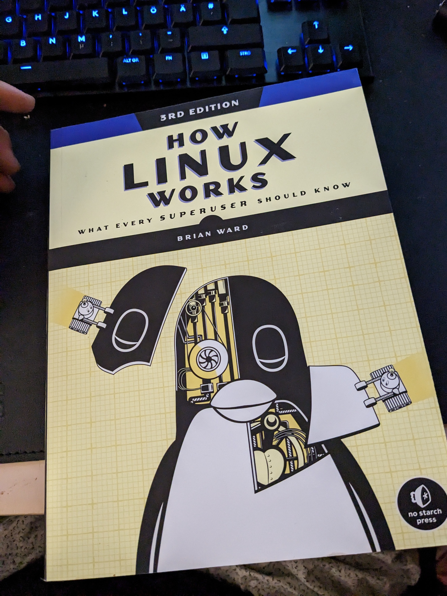
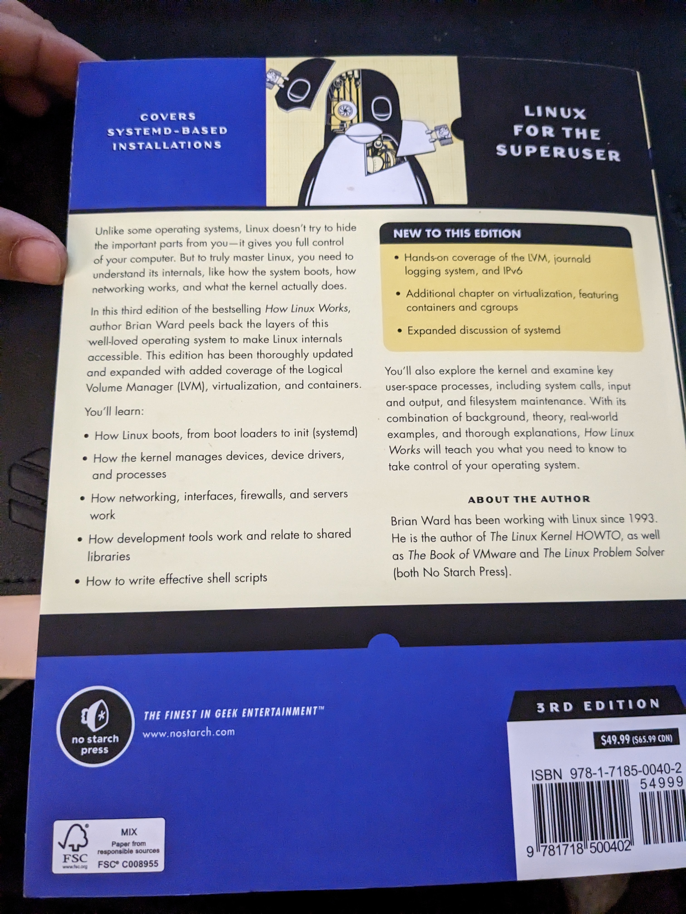
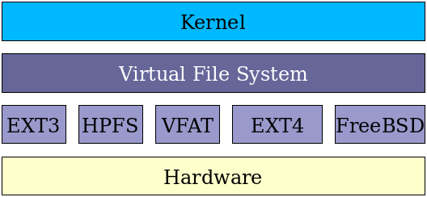

# Linux Fundamentals:

```
 $ cat /var/log/lastlog

 ```





resources : [Linux Directories Explained in 100 Seconds](https://youtu.be/42iQKuQodW4), [Navigating the Linux Filesystem](https://youtu.be/BNL3qBN9pP0), [the Linux File System explained in 1,233 seconds](https://youtu.be/A3G-3hp88mo), [Linux File System/Structure Explained!](https://youtu.be/HbgzrKJvDRw), [Introduction to Linux – Full Course for Beginners](https://youtu.be/sWbUDq4S6Y8), [Linux for Hackers //](https://www.youtube.com/watch?v=VbEx7B_PTOE&list=PLIhvC56v63IJIujb5cyE13oLuyORZpdkL)

Everything in linux is a "file" - "On a UNIX system, everything is a file; if something is not a file, it is a process.".

### Linux Filesystem

<table style="width:100%" >

<tr>
<th>directory</th>
<th>description <br /></th>
</tr>

<tr>
<th>/</th>
<td>root directory.<br /></td>
</tr>

<tr>
<th>~</th>
<td>home directory.<br /></td>
</tr>

<tr>
<th>/bin</th>
<td>Common programs, shared by the system, the system administrator and the users.<br /></td>
</tr>


<tr>
<th>/boot</th>
<td>The startup files and the kernel, vmlinuz. In some recent distributions also grub data. Grub is the GRand Unified Boot loader and is an attempt to get rid of the many different boot-loaders we know today.<br /></td>
</tr>


<tr>
<th>/dev</th>
<td>Contains references to all the CPU peripheral hardware, which are represented as files with special properties.<br /></td>
</tr>


<tr>
<th>/etc</th>
<td>Most important system configuration files are in /etc, this directory contains data similar to those in the Control Panel in Windows<br /></td>
</tr>


<tr>
<th>/home</th>
<td>Home directories of the common users.<br /></td>
</tr>


<tr>
<th>/lib</th>
<td>Library files, includes files for all kinds of programs needed by the system and the users.<br /></td>
</tr>


<tr>
<th>/net</th>
<td>Standard mount point for entire remote file systems<br /></td>
</tr>


<tr>
<th>/proc</th>
<td>A virtual file system containing information about system resources. More information about the meaning of the files in proc is obtained by entering the command man proc in a terminal window. The file proc.txt discusses the virtual file system in detail.<br /></td>
</tr>


<tr>
<th>/root</th>
<td>The administrative user's home directory. Mind the difference between /, the root directory and /root, the home directory of the root user.<br /></td>
</tr>


<tr>
<th>/sbin</th>
<td>Programs for use by the system and the system administrator.<br /></td>
</tr>


<tr>
<th>/tmp</th>
<td>Temporary space for use by the system, cleaned upon reboot, so don't use this for saving any work!<br /></td>
</tr>


<tr>
<th>/usr</th>
<td>Programs, libraries, documentation etc. for all user-related programs.<br /></td>
</tr>


<tr>
<th>/var</th>
<td>Storage for all variable files and temporary files created by users, such as log files, the mail queue, the print spooler area, space for temporary storage of files downloaded from the Internet, or to keep an image of a CD before burning it.<br /></td>
</tr>


<tr>
<th>/opt</th>
<td>Typically contains extra and third party software.<br /></td>
</tr>


<tr>
<th>/mnt</th>
<td>Standard mount point for external file systems, e.g. a CD-ROM or a digital camera.<br /></td>
</tr>

<tr>
<th>/misc</th>
<td>For miscellaneous purposes.<br /></td>
</tr>

<tr>
<th>/initrd</th>
<td>(on some distributions) Information for booting. Do not remove!<br /></td>
</tr>

<tr>
<th>/srv</th>
<td>server related files are stored.<br /></td>
</tr>

<tr>
<th>/lost+found</th>
<td>Every partition has a lost+found in its upper directory. Files that were saved during failures are here.<br /></td>
</tr>

<tr>
<th>/sys</th>
<td> It is a virtual filesystem for modern Linux distributions to store and allows modification of the devices connected to the system.<br /></td>
</tr>
</table>


<a> </a>

<table style="width:100%" >

<tr>
<th>location</th>
<th>description <br /></th>
</tr>

<tr>
<th>/boot/vmlinux</th>
<td>The Linux kernel file.<br /></td>
</tr>

<tr>
<th>Device Files:</th>
<td><br /></td>
</tr>

<tr>
<th>/dev/hda</th>
<td> Device file for the first IDE HDD.<br /></td>
</tr>

<tr>
<th>/dev/hdc</th>
<td>A pseudo-device that output garbage output is redirected to /dev/null.<br /></td>
</tr>

<tr>
<th>System Configuration Files:</th>
<td><br /></td>
</tr>

<tr>
<th>/etc/bashrc</th>
<td>It is used by bash shell that contains system defaults and aliases.<br /></td>
</tr>

<tr>
<th>/etc/crontab</th>
<td> A shell script to run specified commands on a predefined time interval.<br /></td>
</tr>

<tr>
<th>/etc/exports</th>
<td>It contains information on the file system available on the network.<br /></td>
</tr>

<tr>
<th>/etc/fstab</th>
<td>  Information of the Disk Drive and their mount point.<br /></td>
</tr>

<tr>
<th>/etc/group</th>
<td>  It is a text file to define Information of Security Group.<br /></td>
</tr>

<tr>
<th>/etc/grub.conf</th>
<td> It is the grub bootloader configuration file.<br /></td>
</tr>

<tr>
<th>/etc/init.d</th>
<td> Service startup Script.<br /></td>
</tr>

<tr>
<th>/etc/lilo.conf</th>
<td>It contains lilo bootloader configuration file.<br /></td>
</tr>

<tr>
<th>/etc/hosts</th>
<td>Information of IP and corresponding hostnames.<br /></td>
</tr>

<tr>
<th>/etc/hosts.allow</th>
<td>It contains a list of hosts allowed accessing services on the local machine.<br /></td>
</tr>

<tr>
<th>/etc/host.deny</th>
<td>List of hosts denied to access services on the local machine.<br /></td>
</tr>

<tr>
<th>/etc/inittab</th>
<td>INIT process and their interaction at the various run level.<br /></td>
</tr>


<tr>
<th>/etc/issue</th>
<td> Allows editing the pre-login message.<br /></td>
</tr>

<tr>
<th>/etc/modules.conf </th>
<td>It contains the configuration files for the system modules.<br /></td>
</tr>

<tr>
<th>/etc/motd</th>
<td>It contains the message of the day.<br /></td>
</tr>

<tr>
<th>/etc/mtab</th>
<td>Currently mounted blocks information.<br /></td>
</tr>

<tr>
<th>/etc/passwd</th>
<td>It contains username, password of the system, users in a shadow file.<br /></td>
</tr>

<tr>
<th>/etc/printcap</th>
<td>It contains printer Information.<br /></td>
</tr>

<tr>
<th>/etc/profile</th>
<td>Bash shell defaults.<br /></td>
</tr>

<tr>
<th>/etc/profile.d</th>
<td>It contains other scripts like application scripts, executed after login.<br /></td>
</tr>

<tr>
<th>/etc/rc.d</th>
<td>It avoids script duplication.<br /></td>
</tr>

<tr>
<th>/etc/rc.d/init.d</th>
<td>Run Level Initialisation Script.<br /></td>
</tr>

<tr>
<th>/etc/resolv.conf</th>
<td> DNS being used by System.<br /></td>
</tr>

<tr>
<th>/etc/security</th>
<td>It contains the name of terminals where root login is possible.<br /></td>
</tr>

<tr>
<th>/etc/skel</th>
<td> Script that initiates new user home directory.<br /></td>
</tr>

<tr>
<th>/etc/termcap</th>
<td>An ASCII file that defines the behavior of different types of the terminal.<br /></td>
</tr>

<tr>
<th>/etc/X11</th>
<td>Directory tree contains all the conf files for the X-window System.<br /></td>
</tr>

<tr>
<th>User Related Files:</th>
<td><br /></td>
</tr>

<tr>
<th>/usr/bin</th>
<td>It contains most of the executable files.<br /></td>
</tr>

<tr>
<th>/usr/bin/X11</th>
<td>Symbolic link of /usr/bin.<br /></td>
</tr>

<tr>
<th>/usr/include</th>
<td>It contains standard include files used by C program.<br /></td>
</tr>

<tr>
<th>/usr/share</th>
<td>It contains architecture independent shareable text files.<br /></td>
</tr>

<tr>
<th>/usr/lib</th>
<td>It contains object files and libraries.<br /></td>
</tr>

<tr>
<th>/usr/sbin</th>
<td>It contains commands for Super User, for System Administration.<br /></td>
</tr>

<tr>
<th>Virtual and Pseudo Process Related Files:</th>
<td><br /></td>
</tr>

<tr>
<th>/proc/cpuinfo</th>
<td>CPU Information<br /></td>
</tr>

<tr>
<th>/proc/filesystems</th>
<td>It keeps the useful info about the processes that are running currently.<br /></td>
</tr>

<tr>
<th>/proc/interrupts</th>
<td>it keeps the information about the number of interrupts per IRQ.<br /></td>
</tr>

<tr>
<th>/proc/ioports</th>
<td>Contains all the Input and Output addresses used by devices on the server.<br /></td>
</tr>

<tr>
<th>/proc/meminfo</th>
<td>It reports the memory usage information.<br /></td>
</tr>

<tr>
<th>/proc/modules</th>
<td>Currently using kernel module.<br /></td>
</tr>

<tr>
<th>/proc/mount</th>
<td>Mounted File-system Information.<br /></td>
</tr>

<tr>
<th>/proc/stat</th>
<td>It displays the detailed statistics of the current system.<br /></td>
</tr>

<tr>
<th>/proc/swaps</th>
<td>It contains swap file information.<br /></td>
</tr>

<tr>
<th>Version and Log Files:</th>
<td><br /></td>
</tr>

<tr>
<th>/version</th>
<td>It displays the Linux version information.<br /></td>
</tr>

<tr>
<th>/var/log/lastlog</th>
<td>It stores user last login info.<br /></td>
</tr>

<tr>
<th>/var/log/messages</th>
<td>It has all the global system messages.<br /></td>
</tr>

<tr>
<th>/var/log/wtmp</th>
<td>It keeps a history of login and logout information.<br /></td>
</tr>

</table>

 Linux uses a two-part software implementation as a way to improve both system and programmer efficiency.

 <a> </a> 

 The first part of this two-part implementation is the Linux virtual filesystem. This virtual filesystem provides a single set of commands for the kernel, and developers, to access all types of filesystems. The virtual filesystem software calls the specific device driver required to interface to the various types of filesystems. The filesystem-specific device drivers are the second part of the implementation. The device driver interprets the standard set of filesystem commands to ones specific to the type of filesystem on the partition or logical volume.

 ### SUDO Power and User Management:

sudo = superuser do

```
 $ adduser saikia (ain't gonna work without sudo access)
 $ sudo adduser saikia
 $ cat /etc/passwd (find all users)

 $ sudo useradd skk (useradd is lazy - no bash & no home)

 $ sudo passwd skk  (add password)
 $ cd /home
 $ ls               (skk doesn't has a /home but skk does)

 $ usermod -h
 $ sudo usermod skk --shell /bin/bash (now skk has a bash shell)

 $ sudo usermod -l ranjan skk (ranjan is the new name for skk)
 $ sudo useradd amartya -m (-m will create a home directory)

 $ su saikia
 $ su - (switch to root user)
 $ sudo su -


sudoers file
 $ sudo visudo 

 $ sudo userdel ranjan

 $ sudo group add digi55
 $ cat /etc/group
 $ groups

 $ sudo usermod -aG digi55 amartya (add user to group, -a equals append)
 $ sudo gpasswd -d amartya digi55 (remove user from group)
 $ sudo groupdel digi55 

 ```
### Package Managers in Linux
dpkg doesn't install dependencies but apt (advanced package tool) does :) snap is another package store.

 ```
 $ sudo apt update
 $ sudo apt install packagename
 $ sudo apt edit-sources (list of sources to pull packages from)
 $ sudo apt -h
 $ sudp apt list
 $ apt list --installed (find installed packages)
 $ apt list --installed > grep ^nmap
 $ sudo apt show nmap
 $ sudo apt search nmap
 $ sudo apt remove packagename (config files remains)
 $ sudo apt purge packagename (removes everything)
 $ sudo apt upgrade (update packages)
 $ sudo apt update && full-upgrade (removes old files and does fresh updates)
$ sudo aptitude


$sudo snap install --classic code (install vscode with snap)

  ```

  ## Daemons : start, stop, restart Linux services

Daemons are system services/ processes in linux. All daemons have a 'd' at the end. Master Daemon - 'systemd' with PID 1 and systemctl is used to control daemons. systemd refers other daemons as units.

```
    $ ps -aux
    $ ps -aux | grep nano (check processes for nano)
    $ pstree

    $ sudo systemctl stop sshd
    $ sudo systemctl status sshd
    $ sudo systemctl start sshd
    $ sudo systemctl restart sshd
    $ sudo systemctl reload-or-restart sshd (restart if not reload)
    $ sudo systemctl disable ntp
    $ sudo systemctl enable ntp
    $ sudo systemctl is-active ntp
    $ sudo systemctl is-enabled ntp
    $ sudo systemctl list-units (list all daemons that systemd knows)
    $ sudo systemctl list-units --all
    $ sudo systemctl list-units -t service (active services)

    $ sudo systemctl list-unit-files | grep nginx
    $ sudo systemctl list-units | grep journal
    $ sudo systemctl restart systemd-journald
    $ sudo journalctl -xe (systemd log)

```
### Manage processes in linux:
