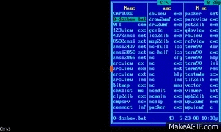

## Cyb3r Security : Introduction
[theme :  ““ ♬ ””](https://youtu.be/7cyI8ww7P8g)    

    ♀ Introduction to Ethical Hacking
    ♀ Footprinting and Reconnaissance
    ♀ Scanning Networks
    ♀ Enumeration
    ♀ Vulnerability Analysis
    ♀ System Hacking
    ♀ Malware Threats
    ♀ Sniffing
    ♀ Social Engineering
    ♀ Denial-of-Service
    ♀ Session Hijacking
    ♀ Evading IDS, Firewalls, and Honeypots
    ♀ Hacking Web Servers
    ♀ Hacking Web Applications
    ♀ SQL Injection
    ♀ Hacking Wireless Networks
    ♀ Hacking Mobile Platforms
    ♀ IoT and OT Hacking
    ♀ Cloud Computing
    ♀ Cryptography

This [Google Hacking Series](https://www.youtube.com/watch?v=5nEyjYn9_LI&list=PL590L5WQmH8dsxxz7ooJAgmijwOz0lh2H&index=1) is an amazing series with an inspiring back story driven from nature, history and real world. Every episode is a gem to watch and know what it takes to defend a business and ethical standards set to avoid misuse of power and how to keep learning from your lessons in real life. In the context of cybersecurity testing, red teams play the role of attackers, and blue teams act as defenders. A purple team falls somewhere in between, often performing both roles.

Interesting Stories : [The Dark side of the web](https://youtu.be/mUP0tx7Ib2w), [A858 - The most mysterious subreddit](https://youtu.be/TmoRowBRZvY), [Cicada 3301](https://en.wikipedia.org/wiki/Cicada_3301) - [Cicada 3301 an Internet Mystery](https://youtu.be/I2O7blSSzpI), [The Man that Solved Cicada 3301 | True Story of Marcus Wanner #decipher](https://youtu.be/lqL4rkWOmJw)

Certifications: [Certified Ethical Hacker (CEH)](https://www.eccouncil.org/programs/certified-ethical-hacker-ceh/), [Certified Hacking Forensic Investigator (CHFI)](https://www.eccouncil.org/programs/computer-hacking-forensic-investigator-chfi/), [Certified Penetration Testing Professional (CPENT)](https://www.eccouncil.org/programs/certified-penetration-testing-professional-cpent/), [Certified Threat Intelligence Analyst (CTIA)](https://www.eccouncil.org/programs/threat-intelligence-training/), [CISSP (Certified Information Systems Security Professional) | (ISC)²](https://www.isc2.org/Certifications/CISSP)

Challenges : [Google CTF](https://capturetheflag.withgoogle.com/), [cmd challenge](https://cmdchallenge.com/), [ctf.hacker 101](https://ctf.hacker101.com/), [immersive labs](https://www.immersivelabs.com/), [cyber defenders](https://cyberdefenders.org/blueteam-ctf-challenges/)

Youtube : @[danooct1](https://www.youtube.com/user/danooct1/videos), @[SIAM ALAM](https://www.youtube.com/channel/UCviSYAcwdnDX1UoRzAHYgNg/videos), @[Leurak](https://www.youtube.com/channel/UCnye-JRGe8gWjaslsvrh63g/videos), @[DEFCONConference](https://www.youtube.com/user/DEFCONConference), @[hak5](https://www.youtube.com/@hak5), @[LiveOverflow](https://www.youtube.com/@LiveOverflow), @[Cyberspatial](https://www.youtube.com/c/Cyberspatial/videos), @[hackaday](https://www.youtube.com/@hackaday), @[SSTechTutorials](https://www.youtube.com/channel/UCHvUTfxL_9bNQgqzekPWHtg), @[Seytonic](https://www.youtube.com/channel/UCW6xlqxSY3gGur4PkGPEUeA), @[HackerSploit](https://www.youtube.com/channel/UC0ZTPkdxlAKf-V33tqXwi3Q), @[GuidedHacking](https://www.youtube.com/channel/UCCMi6F5Ac3kQDfffWXQGZDw), @[Lo Liang Yang](https://www.youtube.com/@LoiLiangYang), @[club-eh](https://www.youtube.com/channel/UCYOS4HdbhDFtrwrVbK7UqaQ/videos), @[car-hacking-village](https://www.youtube.com/@carhackingvillage2576/videos), @[LiveUnderflow](https://www.youtube.com/channel/UCNNfzr9A5dEOscVEDyyzo-A), @[PwnFunction](https://www.youtube.com/channel/UCW6MNdOsqv2E9AjQkv9we7A), @[GynvaeIEN](https://www.youtube.com/user/GynvaelEN), @[13cubed](https://www.youtube.com/@13Cubed/featured), @[JohnHammond](https://www.youtube.com/c/JohnHammond010/videos), @[IppSec](https://www.youtube.com/channel/UCa6eh7gCkpPo5XXUDfygQQA), @[nahamsec](https://www.youtube.com/@NahamSec/videos), @[STÖK](https://www.youtube.com/@STOKfredrik/videos), @[Derek Rook](https://www.youtube.com/channel/UCMACXuWd2w6_IEGog744UaA), @[bisqwit](https://www.youtube.com/user/Bisqwit), @[NetworkChuck](https://www.youtube.com/@NetworkChuck), @[David Bombal](https://www.youtube.com/user/ConfigTerm/videos), @[Packet Pushers](https://www.youtube.com/@PacketPushersNetwork/videos).

Hacking conferences : [DEFCON](https://defcon.org/), [RSA conf](https://www.rsaconference.com/en), [CCC](https://www.ccc.de/en/); OS - [Kali Linux](https://www.kali.org/), [ParrotOS](https://www.parrotsec.org/) | [cybercom.mil](https://www.cybercom.mil/)

Blogs and resources : $[hackersploit_](https://hackersploit.org/), [guidedhacking](https://guidedhacking.com/), [blackhatethicalhacking](https://www.blackhatethicalhacking.com/),
[shadow brokers](https://en.wikipedia.org/wiki/The_Shadow_Brokers), [wikileaks](https://wikileaks.org/), [g0v.tw](https://g0v.tw/), @[youranonnews](https://twitter.com/YourAnonNews?), Tailored Access Operations ([TAO](https://en.wikipedia.org/wiki/Tailored_Access_Operations)), [Bureau 121](https://en.wikipedia.org/wiki/Bureau_121), [globalHell](https://en.wikipedia.org/wiki/GlobalHell), [lizard squad](https://en.wikipedia.org/wiki/Lizard_Squad), known hacker [groups](https://en.wikipedia.org/wiki/List_of_hacker_groups); [assange](https://en.wikipedia.org/wiki/Julian_Assange), [snowden](https://en.wikipedia.org/wiki/Edward_Snowden); [tor](https://www.torproject.org/); [cicada 3301](https://en.wikipedia.org/wiki/Cicada_3301).

Github : [awesome](https://github.com/Hack-with-Github/Awesome-Hacking); [hacking resource](https://github.com/vitalysim/Awesome-Hacking-Resources); [MHDDoS](https://github.com/MatrixTM/MHDDoS); [CrackMapExec](https://github.com/Porchetta-Industries/CrackMapExec); [monkey](https://github.com/guardicore/monkey); [hackertool](https://github.com/Z4nzu/hackingtool); [theZoo](https://github.com/ytisf/theZoo); [book-of-secret-knowledge](https://github.com/trimstray/the-book-of-secret-knowledge); [payloads-all-the-things](https://github.com/swisskyrepo/PayloadsAllTheThings); [ImHex](https://github.com/WerWolv/ImHex); [maltrain](https://github.com/stamparm/maltrail)

Documentaries : [Anonymous: Down The Deep Dark Web Documentary](https://youtu.be/osln0IWh__Q), [The Hidden Secrets Inside of Internet](https://youtu.be/J77VKWLdcfE), [Deep Web Documentary](https://youtu.be/Ax7r9Y9LBdA)

I used to be active in irc channels, seeding and tracking in rutracker and kat pre-2015, #hailhydra in support /og Gottfrid Svartholm aka anakata. #pir4t3 I took these UG security courses @ AEC : Information & System Security (CS 871), Computer Communication Network (CS676) and Ethical Hacking workshop @ IIT G.

Books: #Ethical Hacking: A Hands-on Introduction to Breaking In [[1](https://www.amazon.de/-/en/Daniel-G-Graham/dp/1718501870/)], #Bug Bounty Bootcamp: The Guide to Finding and Reporting Web Vulnerabilities [[2](https://www.amazon.de/-/en/Vickie-Li/dp/1718501544/)], #Black Hat Python, 2nd Edition: Python Programming for Hackers and Pentesters [[3](https://www.amazon.de/-/en/Justin-Seitz/dp/1718501129/)], #Linux Basics for Hackers: Getting Started with Networking, Scripting, and Security in Kali [[4](https://www.amazon.de/-/en/OccupyTheWeb/dp/1593278551/)], #Hacking APIs: Breaking Web Application Programming Interfaces [[5](https://www.amazon.de/-/en/Corey-J-Ball/dp/1718502443/)], #Hacking: The Art of Exploitation [[6](https://www.amazon.de/-/en/Jon-Erickson/dp/1593271441/)], #The Web Application Hacker's Handbook: Finding and Exploiting Security Flaws [[7](https://www.amazon.de/-/en/Dafydd-Stuttard/dp/1118026470/)], #RTFM: Red Team Field Manual v2 [[8](https://www.amazon.de/-/en/Ben-Clark-dp-1075091837/dp/1075091837/)], #Sandworm: A New Era of Cyberwar and the Hunt for the Kremlin's Most Dangerous Hackers [[9](https://www.amazon.de/-/en/Andy-Greenberg/dp/0525564632/)], #Gray Hat Hacking: The Ethical Hacker's Handbook [[10](https://www.amazon.de/-/en/Michael-Baucom-dp-1264268947/dp/1264268947/)], #The Hacker Playbook 3: Practical Guide To Penetration Testing [[11](https://www.amazon.de/-/en/Peter-Kim/dp/1980901759/)], #Metasploit: A Penetration Tester's Guide: The Penetration Tester's Guide [[12](https://www.amazon.de/-/en/David-Kennedy/dp/159327288X)], #Practical Malware Analysis: The Hands-On Guide to Dissecting Malicious Software [[13](https://www.amazon.de/-/en/Michael-Sikorski/dp/1593272901)], #Practical Binary Analysis: Build Your Own Linux Tools for Binary Instrumentation, Analysis, and Disassembly [[14](https://www.amazon.de/-/en/Dennis-Andriesse/dp/1593279124/)], #Attacking Network Protocols: A Hacker's Guide to Capture, Analysis, and Exploitation [[15](https://www.amazon.de/-/en/James-Forshaw/dp/1593277504/)], #Nmap Network Scanning: The Official Nmap Project Guide to Network Discovery and Security Scanning [[16](https://www.amazon.de/-/en/Gordon-Fyodor-Lyon/dp/0979958717/)], #The Art of Deception: Controlling the Human Element of Security [[17](https://www.amazon.de/-/en/Art-Deception-Kevin-D-Mitnick/dp/076454280X)], #Real-World Bug Hunting: A Field Guide to Web Hacking [[18](https://www.amazon.de/-/en/Peter-Yaworski-ebook/dp/B072SQZ2LG)], #Black Hat Go: Go Programming For Hackers and Pentesters [[19](https://www.amazon.de/-/en/Tom-Steele-ebook/dp/B073NPY29N/)], #The Art of Cyberwarfare: An Investigator's Guide to Espionage, Ransomware, and Organized Cybercrime [[20](https://www.amazon.de/-/en/Jon-DiMaggio-ebook/dp/B09BKLRH8P/)], #Blue Team Field Manual [[21](https://www.amazon.de/-/en/Alan-White-ebook/dp/B077WF4WYV/)], #PTFM: Purple Team Field Manual [[22](https://www.amazon.de/-/en/Tim-Bryant-ebook/dp/B08T7Y3TP2/)], #Rootkits and Bootkits: Reversing Modern Malware and Next Generation Threats [[23](https://www.amazon.de/-/en/Alex-Matrosov-ebook/dp/B07P8J5HZJ/)], #Violent Python: A Cookbook for Hackers, Forensic Analysts, Penetration Testers and Security Engineers [[24](https://www.amazon.de/Violent-Python-Cookbook-Penetration-Engineers/dp/1597499579)]

## DarkK : Dark Web

Check the [hiddden-wiki](https://thehiddenwiki.org/)

## H4CK3RS 4BO4RD

## PayLoads & V!RU$3$

