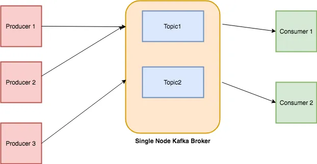

#  Apache [Kafka](https://kafka.apache.org/) and [Airflow](https://airflow.apache.org/):

Airflow™ is a platform created by the community to programmatically author, schedule and monitor workflows.

Goal: Create reliable and powerful data pipelines in a distributed environment while monitoring our DAGs.

<a></a>

Apache Airflow is a tool for authoring, scheduling, and monitoring pipelines. As a result, is an ideal solution for ETL and MLOps use cases. Example use cases include: @[doc.airflow](https://airflow.apache.org/docs/apache-airflow/stable/installation/index.html)

+ Extracting data from many sources, aggregating them, transforming them, and store in a data warehouse.

+ Extract insights from data and display them in an analytics dashboard

+ Train, validate, and deploy machine learning models

```bash
$ curl -LfO 'https://airflow.apache.org/docs/apache-airflow/stable/docker-compose.yaml'

```
To instantiate a DAG, we can use the DAG function or with a context manager as follows:

```python

from airflow import DAG
with DAG(
    "mlops",
    default_args={
        "retries": 1,
     },
    schedule=timedelta(days=1),
    start_date=datetime(2023, 1, 1)
) as dag:

```

Each node of the DAG represents a Task, meaning an individual piece of code. Each task may have some upstream and downstream dependencies. These dependencies express how tasks are related to each other and in which order they should be executed. Whenever a new DAG run is initialized, all tasks are initialized as Task instances. This means that each Task instance is a specific run for the given task.


Operators are defined inside the DAG context manager as below. The following code creates two tasks, one to execute a bash command and one to execute a MySQL query.

```python
with DAG(
    "tutorial"
   ) as dag:

    task1 = BashOperator(
        task_id="print_date",
        bash_command="date",
    )

   task2 = MySqlOperator(
        task_id="load_table",
        sql="/scripts/load_table.sql"
    )
```
To form the DAG’s structure, we need to define dependencies between each task. One way is to use the >> symbol as shown: `task1 >> task2 >> task3`, one task may have multiple dependencies: `task1 >> [task2, task3]`. The other way is through the set_downstream, set_upstream functions: `t1.set_downstream([t2, t3])`. XComs, or cross communications, are responsible for communication between tasks. XComs objects can push or pull data between tasks. [[source](https://theaisummer.com/apache-airflow-tutorial/)]


AIRFLOW : { Run AirFlow ub Python env & Docker; Airflow core concepts, task lifecyle and basic architecture; Airflow DAG with BashOperator, PythonOperator; Data Sharing via Airflow XComs; Airflow TaskFlow API, Catchup and Backfill, scheduler with cron expression, Airflow Hooks }

[Installing from PyPI](https://github.com/apache/airflow#installing-from-pypi) : `pip install 'apache-airflow[postgres,google]==2.6.3' \
 --constraint "https://raw.githubusercontent.com/apache/airflow/constraints-2.6.3/constraints-3.8.txt"`

 Settings: ` $ export AIRFLOW_HOME=.` and ` $ airflow db init` creates config & log files along with sql database for the project. To start airflow web server: ` $ airflow webserver -p 8080`

To create airflow users: ` $ airflow users create --help`  > ` $ airflow users create --username admin --firstname Amartya --lastname Saikia --role Admin --email amartya@saikia.com` ans set the password. Start the webserver : ` $ airflow webserver -p 8080`.

To start the scheduler : ` $ airflow scheduler`


resources : [Airflow tutorial](https://www.youtube.com/watch?v=K9AnJ9_ZAXE&list=PLwFJcsJ61oujAqYpMp1kdUBcPG0sE0QMT), [Master Airflow: Beginner to Advance with Project](https://www.udemy.com/course/master-airflow-beginner-to-advance-with-project/)


# Kafka:

Apache Kafka is an open-source distributed streaming system used for stream processing, real-time data pipelines, and data integration at scale. Sneakpeak from my kafka architecture presentation:

<a> </a>

<a> </a>

<b>Topics:</b> 
Every message that is feed into the system must be part of some topic. The topic is nothing but a stream of records. The messages are stored in key-value format. Each message is assigned a sequence, called Offset. The output of one message could be an input of the other for further processing.

<b>Producers:</b> 
Producers are the apps responsible to publish data into Kafka system. They publish data on the topic of their choice.

<b>Consumers:</b>
The messages published into topics are then utilized by Consumers apps. A consumer gets subscribed to the topic of its choice and consumes data.

<b>Broker: </b>
Every instance of Kafka that is responsible for message exchange is called a Broker. Kafka can be used as a stand-alone machine or a part of a cluster.

github: @[python-kafka](https://github.com/dpkp/kafka-python)

```python

>>> from kafka import KafkaConsumer
>>> consumer = KafkaConsumer('my_favorite_topic')
>>> for msg in consumer:
...     print (msg)

>>> # join a consumer group for dynamic partition assignment and offset commits
>>> from kafka import KafkaConsumer
>>> consumer = KafkaConsumer('my_favorite_topic', group_id='my_favorite_group')
>>> for msg in consumer:
...     print (msg)


>>> from kafka import KafkaProducer
>>> producer = KafkaProducer(bootstrap_servers='localhost:1234')
>>> for _ in range(100):
...     producer.send('foobar', b'some_message_bytes')

```

Resources : [Apache Kafka Series - Kafka Streams for Data Processing](https://www.udemy.com/course/kafka-streams/), [Apache Kafka Series - Kafka Connect Hands-on Learning](https://www.udemy.com/course/kafka-connect/), [Apache Kafka Series - Confluent Schema Registry & REST Proxy](https://www.udemy.com/course/confluent-schema-registry/), [Apache Kafka Series - Kafka Monitoring & Operations](https://www.udemy.com/course/kafka-monitoring-and-operations/), [Apache Kafka Series - Learn Apache Kafka for Beginners v3](https://www.udemy.com/course/apache-kafka/), [Apache Kafka Series - Kafka Cluster Setup & Administration](https://www.udemy.com/course/kafka-cluster-setup/), [Apache Airflow: The Hands-On Guide](https://www.udemy.com/course/the-ultimate-hands-on-course-to-master-apache-airflow/), [Apache Airflow: The Operators Guide](https://www.udemy.com/course/apache-airflow-the-operators-guide/), [Master Airflow: Beginner to Advance with Project](https://www.udemy.com/course/master-airflow-beginner-to-advance-with-project/).

Video/blog Resources : [Airflow Tutorial for Beginners](https://youtu.be/K9AnJ9_ZAXE), [Learning Apache Airflow with Python in easy way in 40 Minutes](https://youtu.be/2v9AKewyUEo), [Apache Airflow 2.0 Tutorial](https://medium.com/apache-airflow/apache-airflow-2-0-tutorial-41329bbf7211), [What is Kafka?](https://youtu.be/aj9CDZm0Glc), [ Stock Market Real-Time Data Analysis Using Kafka | End-To-End Data Engineering Project](https://youtu.be/KerNf0NANMo), [A Deep Dive into Apache Kafka This is Event Streaming by Andrew Dunnings & Katherine Stanley](https://youtu.be/X40EozwK75s), [Apache Kafka for Python Developers](https://www.youtube.com/watch?v=w6A-uDEb7JY&list=PLjfRmoYoxpNrs0VmIq6mOTqXP52RfZdRf), [Scalable & Event Driven Food Ordering App with Kafka & Python | System Design](https://youtu.be/qi7uR3ItaOY), [Apache Kafka and Python](https://youtu.be/qbROwuuDOJA), [Build a Reactive Data Streaming App with Python and Apache Kafka](https://youtu.be/jItIQ-UvFI4), [Apache Kafka](https://www.youtube.com/watch?v=vOWePzuy-O8&list=PLlBQ_B5-H_xhEHUC6OWI0eide_4wbt8Eo&index=8).