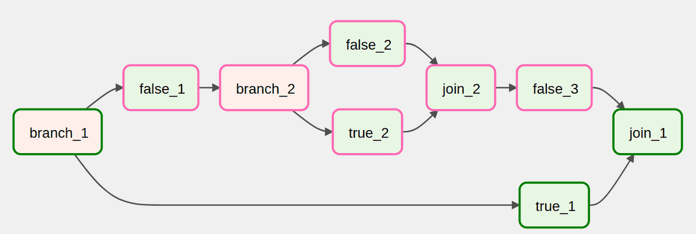
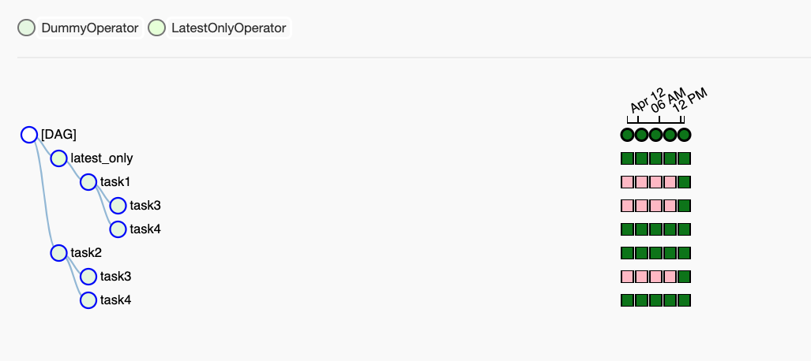
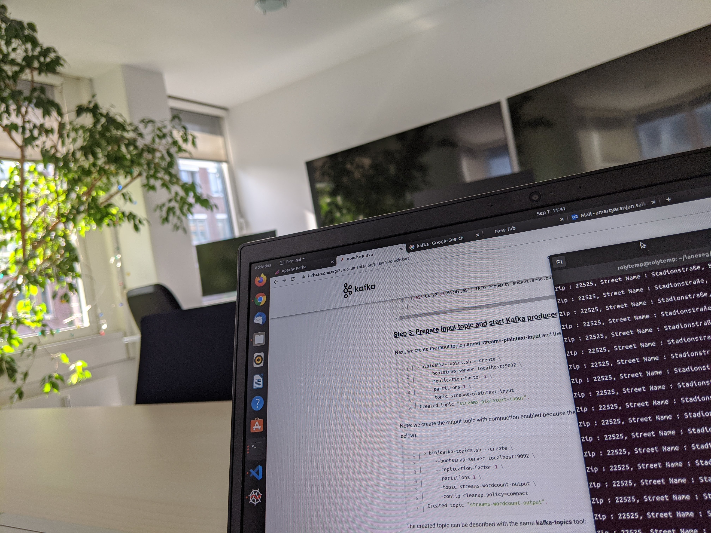
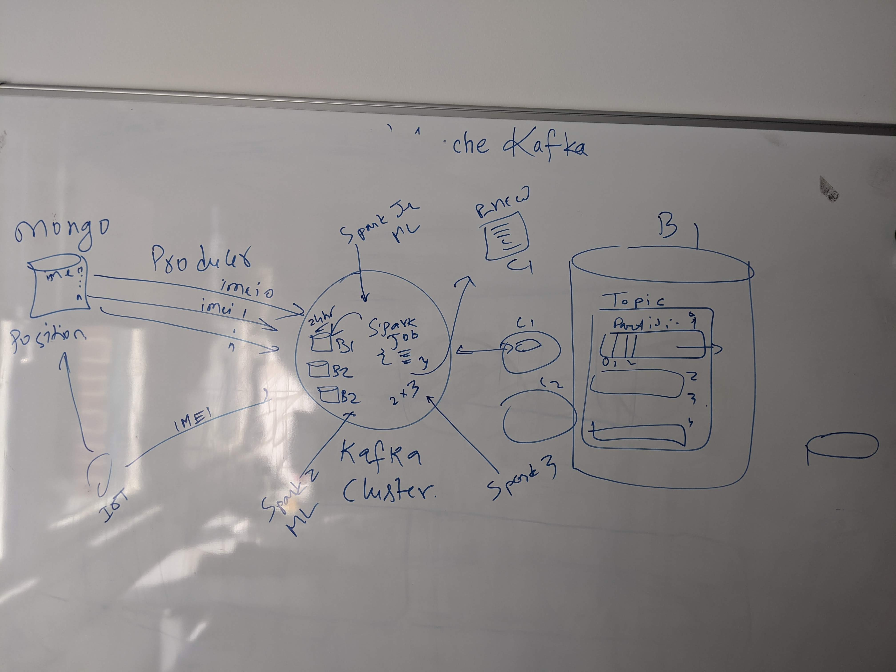
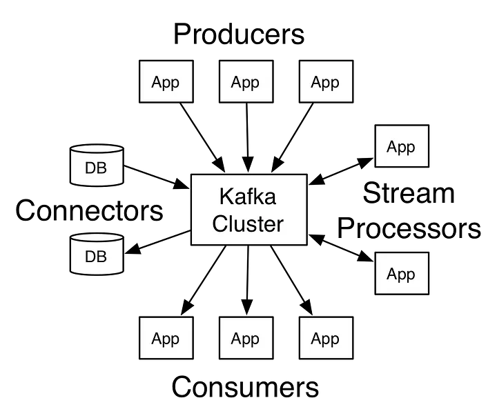
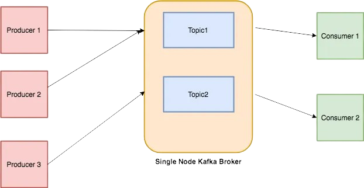

#  Apache [Kafka](https://kafka.apache.org/) and [Airflow](https://airflow.apache.org/):

Apache Airflow is an open-source platform used to programmatically create, schedule, and monitor workflows, or "data pipelines." A workflow is a sequence of tasks or steps that need to be performed, often in a specific order, to achieve a goal, like processing data, generating reports, or automating complex processes. Airflow makes it easier to manage these workflows, ensuring that tasks run in the right order and can be monitored for success or failure.

Airflow™ is a platform created by the community to programmatically author, schedule and monitor workflows. As a result, is an ideal solution for ETL and MLOps use cases. Example use cases include: @[doc.airflow](https://airflow.apache.org/docs/apache-airflow/stable/howto/docker-compose/index.html)

Goal: Create reliable and powerful data pipelines in a distributed environment while monitoring our DAGs.

<a></a>


+ Extracting data from many sources, aggregating them, transforming them, and store in a data warehouse.
+ Extract insights from data and display them in an analytics dashboard
+ Train, validate, and deploy machine learning models

```bash
 $ pip install apache-airflow
```

After installation, we need to set up the Airflow environment. Airflow uses a metadata database to keep track of the status of your tasks. To initialize the database, run: ` $ airflow db init`.

Next, we'll need to start the Airflow web server and scheduler:

```bash
$ airflow webserver -p 8080
$ airflow scheduler
```

The webserver will allow us to access the Airflow UI through your web browser, usually at `http://localhost:8080`.

### Creating a DAG (Directed Acyclic Graph):

Workflows in Airflow are represented as DAGs. A DAG is a collection of all the tasks we want to run, organized in a way that shows their dependencies.
We define a DAG using Python code. For example:

```python
from airflow import DAG
from airflow.operators.dummy import DummyOperator
from datetime import datetime

# Define the DAG
with DAG('simple_dag', start_date=datetime(2023, 1, 1), schedule_interval='@daily') as dag:
    start = DummyOperator(task_id='start')
    end = DummyOperator(task_id='end')

    start >> end  # Defines the order of tasks
```

In this example, a simple DAG is created with two tasks (`start` and `end`). The `start >> end` line tells Airflow that the `end` task should run after the `start` task.

Once we've created our DAG, we can monitor it in the Airflow UI, manually trigger it, or let it run according to its schedule.
Airflow will handle running each task in the correct order and will alert you if any task fails.

Install Airflow in Docker:

```bash
$ curl -LfO 'https://airflow.apache.org/docs/apache-airflow/stable/docker-compose.yaml'
```

Setting the right Airflow user:

```bash
$ mkdir -p ./dags ./logs ./plugins ./config
$ echo -e "AIRFLOW_UID=$(id -u)" > .env
```

Initializing the database : ` $ docker compose up airflow-init`

To instantiate a DAG, we can use the DAG function or with a context manager as follows:

```python
from airflow import DAG
with DAG(
    "mlops",
    default_args={
        "retries": 1,
     },
    schedule=timedelta(days=1),
    start_date=datetime(2023, 1, 1)
) as dag:
```

Each node of the DAG represents a task, meaning an individual piece of code. Each task may have some upstream and downstream dependencies. These dependencies express how tasks are related to each other and in which order they should be executed. Whenever a new DAG run is initialized, all tasks are initialized as task instances. This means that each task instance is a specific run for the given task.



Operators are defined inside the DAG context manager as below. The following code creates two tasks, one to execute a bash command and one to execute a MySQL query.

```python
with DAG(
    "tutorial"
   ) as dag:

    task1 = BashOperator(
        task_id="print_date",
        bash_command="date",
    )

   task2 = MySqlOperator(
        task_id="load_table",
        sql="/scripts/load_table.sql"
    )
```
To form the DAG’s structure, we need to define dependencies between each task. One way is to use the >> symbol as shown: `task1 >> task2 >> task3`, one task may have multiple dependencies: `task1 >> [task2, task3]`. The other way is through the set_downstream, set_upstream functions: `t1.set_downstream([t2, t3])`. XComs, or cross communications, are responsible for communication between tasks. XComs objects can push or pull data between tasks. [[source](https://theaisummer.com/apache-airflow-tutorial/)]


AIRFLOW : { Run AirFlow in Python env & Docker; Airflow core concepts, task lifecyle and basic architecture; Airflow DAG with BashOperator, PythonOperator; Data Sharing via Airflow XComs; Airflow TaskFlow API, Catchup and Backfill, scheduler with cron expression, Airflow Hooks }

[Installing from PyPI](https://github.com/apache/airflow#installing-from-pypi) : `pip install 'apache-airflow[postgres,google]==2.6.3' \
 --constraint "https://raw.githubusercontent.com/apache/airflow/constraints-2.6.3/constraints-3.8.txt"`

 Settings: ` $ export AIRFLOW_HOME=.` and ` $ airflow db init` creates config & log files along with sql database for the project. To start airflow web server: ` $ airflow webserver -p 8080`

To create airflow users: ` $ airflow users create --help`  > ` $ airflow users create --username admin --firstname Amartya --lastname Saikia --role Admin --email amartya@saikia.com` ans set the password. Start the webserver : ` $ airflow webserver -p 8080`.

To start the scheduler : ` $ airflow scheduler` and now we can go configure the DAGs in the web server.

 

The possible states for a Task Instance are:
  + `none`: The Task has not yet been queued for execution (its dependencies are not yet met)
  + `scheduled`: The scheduler has determined the Task’s dependencies are met and it should run
  + `queued`: The task has been assigned to an Executor and is awaiting a worker
  + `running`: The task is running on a worker (or on a local/synchronous executor)
  + `success`: The task finished running without errors
  + `shutdown`: The task was externally requested to shut down when it was running
  + `restarting`: The task was externally requested to restart when it was running
  + `failed`: The task had an error during execution and failed to run
  + `skipped`: The task was skipped due to branching, LatestOnly, or similar.
  + `upstream_failed`: An upstream task failed and the Trigger Rule says we needed it
  + `up_for_retry`: The task failed, but has retry attempts left and will be rescheduled.
  + `up_for_reschedule`: The task is a Sensor that is in reschedule mode
  + `deferred`: The task has been deferred to a trigger
  + `removed`: The task has vanished from the DAG since the run started

 

We achieve information sharing between tasks using Airflow XComs.

Resources : [Airflow tutorial](https://www.youtube.com/watch?v=K9AnJ9_ZAXE&list=PLwFJcsJ61oujAqYpMp1kdUBcPG0sE0QMT), [Master Airflow: Beginner to Advance with Project](https://www.udemy.com/course/master-airflow-beginner-to-advance-with-project/), [Working with TaskFlow](https://airflow.apache.org/docs/apache-airflow/stable/tutorial/taskflow.html)


# Kafka : 🌸

Apache Kafka is an open-source platform designed to handle real-time data streams. It acts as a high-performance, distributed messaging system that allows different parts of an application or different applications to communicate with each other by sending and receiving messages.

Think of Kafka as a middleman for data. It takes data from various sources, holds it temporarily, and then delivers it to different destinations in a reliable and efficient manner.

Specifically, Apache Kafka is an open-source distributed streaming system used for stream processing, real-time data pipelines, and data integration at scale. Kafka is designed to handle high-throughput, fault-tolerant, and real-time data streams. It is widely used for building real-time data pipelines and streaming applications due to its scalability, durability, and performance. Sneakpeak from my kafka architecture presentation at DigiLab, LSBG:

<a> </a>

<a> </a>

<b>`Topics`:</b> 
Every message that is feed into the system must be part of some topic. The topic is nothing but a stream of records. The messages are stored in key-value format. Each message is assigned a sequence, called Offset. The output of one message could be an input of the other for further processing.

<b>`Producers`:</b> 
Producers are the apps responsible to publish data into Kafka system. They publish data on the topic of their choice.

<b>`Consumers`:</b>
The messages published into topics are then utilized by Consumers apps. A consumer gets subscribed to the topic of its choice and consumes data.

<b>`Broker`: </b>
Every instance of Kafka that is responsible for message exchange is called a Broker. Kafka can be used as a stand-alone machine or a part of a cluster.

github: @[python-kafka](https://github.com/dpkp/kafka-python)

```python

>>> from kafka import KafkaConsumer
>>> consumer = KafkaConsumer('my_favorite_topic')
>>> for msg in consumer:
...     print (msg)

>>> # join a consumer group for dynamic partition assignment and offset commits
>>> from kafka import KafkaConsumer
>>> consumer = KafkaConsumer('my_favorite_topic', group_id='my_favorite_group')
>>> for msg in consumer:
...     print (msg)


>>> from kafka import KafkaProducer
>>> producer = KafkaProducer(bootstrap_servers='localhost:1234')
>>> for _ in range(100):
...     producer.send('foobar', b'some_message_bytes')

```

Kafka is used in a wide range of use cases across various industries:

+ `Real-time stream processing`: Kafka is used for building real-time analytics, monitoring, and alerting systems that process and analyze data streams in real-time.
+ `Log aggregation`: Kafka is used for collecting and aggregating logs from distributed systems and applications for centralized storage and analysis.
+ `Event sourcing`: Kafka is used as a foundation for event sourcing architectures, where changes to application state are captured as a series of immutable events.
+ `Messaging`: Kafka can be used as a high-performance messaging system for decoupling producers and consumers of data.
+ `Clickstream analysis`: Kafka is used for collecting and analyzing user clickstream data in real-time to understand user behavior and preferences.

Kafka is typically installed alongside Apache ZooKeeper, which manages Kafka’s distributed system. The easiest way to get started is to use pre-built binaries or Docker containers.

+ Start ZooKeeper: Kafka requires ZooKeeper to manage distributed brokers. Start ZooKeeper first by running: ` $ bin/zookeeper-server-start.sh config/zookeeper.properties`.

+ Start Kafka: Once ZooKeeper is running, start Kafka by running: ` $ bin/kafka-server-start.sh config/server.properties`.

+ Creating Topics: In Kafka, data is organized into topics. A topic is like a channel where messages are sent. To create a topic, use the Kafka command line tool: ` $ bin/kafka-topics.sh --create --topic my-topic --bootstrap-server localhost:9092 --partitions 1 --replication-factor 1 `.

+ Consuming Messages: To read messages from a Kafka topic, you use a consumer. You can read messages using the Kafka command line tool: ` $ bin/kafka-console-consumer.sh --topic my-topic --bootstrap-server localhost:9092 --from-beginning`.

Resources : [Apache Kafka Series - Kafka Streams for Data Processing](https://www.udemy.com/course/kafka-streams/), [Apache Kafka Series - Kafka Connect Hands-on Learning](https://www.udemy.com/course/kafka-connect/), [Apache Kafka Series - Confluent Schema Registry & REST Proxy](https://www.udemy.com/course/confluent-schema-registry/), [Apache Kafka Series - Kafka Monitoring & Operations](https://www.udemy.com/course/kafka-monitoring-and-operations/), [Apache Kafka Series - Learn Apache Kafka for Beginners v3](https://www.udemy.com/course/apache-kafka/), [Apache Kafka Series - Kafka Cluster Setup & Administration](https://www.udemy.com/course/kafka-cluster-setup/), [Apache Airflow: The Hands-On Guide](https://www.udemy.com/course/the-ultimate-hands-on-course-to-master-apache-airflow/), [Apache Airflow: The Operators Guide](https://www.udemy.com/course/apache-airflow-the-operators-guide/), [Master Airflow: Beginner to Advance with Project](https://www.udemy.com/course/master-airflow-beginner-to-advance-with-project/).

Video/blog Resources : [Airflow Tutorial for Beginners](https://youtu.be/K9AnJ9_ZAXE), [Learning Apache Airflow with Python in easy way in 40 Minutes](https://youtu.be/2v9AKewyUEo), [Apache Airflow 2.0 Tutorial](https://medium.com/apache-airflow/apache-airflow-2-0-tutorial-41329bbf7211), [What is Kafka?](https://youtu.be/aj9CDZm0Glc), [ Stock Market Real-Time Data Analysis Using Kafka | End-To-End Data Engineering Project](https://youtu.be/KerNf0NANMo), [A Deep Dive into Apache Kafka This is Event Streaming by Andrew Dunnings & Katherine Stanley](https://youtu.be/X40EozwK75s), [Apache Kafka for Python Developers](https://www.youtube.com/watch?v=w6A-uDEb7JY&list=PLjfRmoYoxpNrs0VmIq6mOTqXP52RfZdRf), [Scalable & Event Driven Food Ordering App with Kafka & Python | System Design](https://youtu.be/qi7uR3ItaOY), [Apache Kafka and Python](https://youtu.be/qbROwuuDOJA), [Build a Reactive Data Streaming App with Python and Apache Kafka](https://youtu.be/jItIQ-UvFI4), [Apache Kafka](https://www.youtube.com/watch?v=vOWePzuy-O8&list=PLlBQ_B5-H_xhEHUC6OWI0eide_4wbt8Eo&index=8).