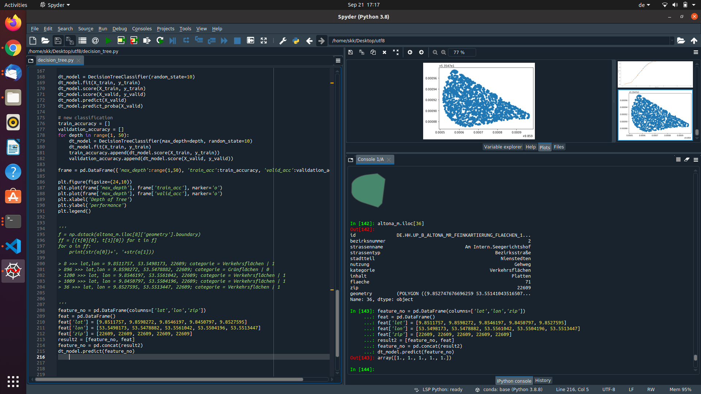
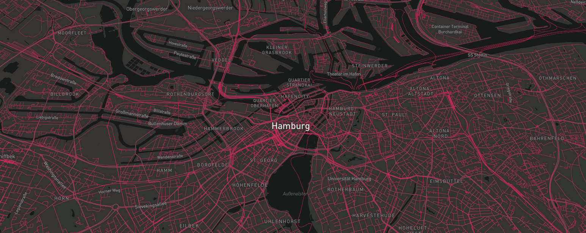
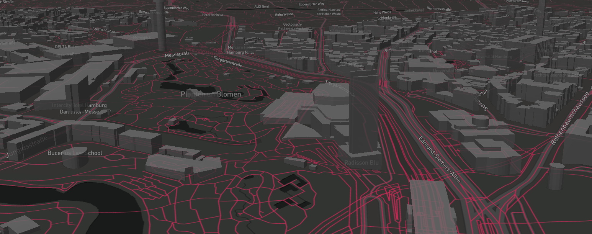
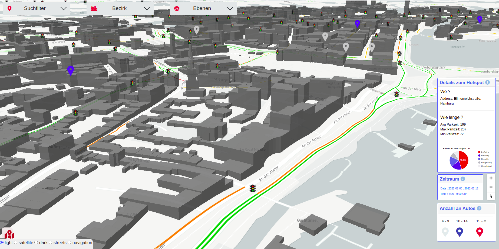
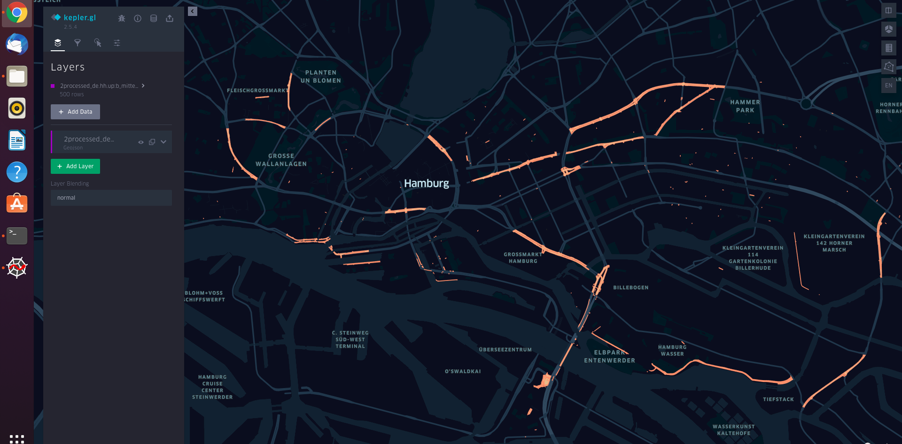

# Web application, Design and Maps  🌎🌸

I have rich experience in design and quick prototyping of web applications. I have worked extensively with geo data / geo servers and developed mapping web applications. In design, I am comfortable with : { Adobe Illustrator : [work](https://twitter.com/florist_notes/status/1637611388569890820), Inskscape : [work](https://twitter.com/florist_notes/status/1637833666528149506), Adobe Dimension and Illustrator : [work 1](https://twitter.com/florist_notes/status/1640346604510015489), [work 2](https://twitter.com/florist_notes/status/1637608005876187139), Adobe Photoshop : [work 1](https://twitter.com/florist_notes/status/1638159705947160576), [work 2](https://twitter.com/florist_notes/status/1640153416109359104), Blender : [work 1](https://twitter.com/florist_notes/status/1640407861049081874), [work 2](https://twitter.com/florist_notes/status/1653265276178145281) , Adobe After Effects : [work](https://twitter.com/florist_notes/status/1652409719779106818) }

I have been processing geo data with geopandas :

and using MapboxJS as my frontend mapping web application platform. Here is a map style I chose for my recent project:

I have worked with geo servers, fetching data (WMS/WFS), geojson and shapefiles. I did lot of data processing with geopandas ([work example](https://twitter.com/florist_notes/status/1640628940292145153)) to develop custom geo data layers for rich visualizations over maps. In hackathons, I worked with open street map (osm) data via Leaflet, CesiumJS and TerriaJS. Here are some glimpses from project work at DPS, uTUM ( [work](https://twitter.com/florist_notes/status/1660018656439353355) ) and code from my training at DPS, uTUM in 2022 [ @/[flask-mapbox-cesium](../sysdesign/FLASK.MD)]. 

To develop web applications, I picked up HTML, CSS, JavaScript, BootStrap and MongoDb skills. I used Flask as backend and MapboxJS as frontend for mapping applications with MongoDB database. I currently use MapboxJS as my frontend mapping application. It is easy to add custom geo json data layers from a database:

 

Add custom JavaScript charts to pop up when clicked in different data points in map fetched from MongoDb. This creates a rich display and visualization of geo data over time:

 

I also have remote sensing experience ( publication : [DOI:10.13140/RG.2.2.31237.68321](https://www.researchgate.net/publication/355196468_Characterizing_spatio-temporal_patterns_of_ground_subsidence_as_an_indicator_of_permafrost_thaw_in_Tso_Kar_valley_Ladakh_using_SAR_remote_sensing) ) with NRSC - ISRO, Department of Space, India, specifically with SAR satellite data. Here are some work samples : [ [work 1](https://twitter.com/florist_notes/status/1639684242853462017), [work 2](https://twitter.com/florist_notes/status/1641493303370690569), [work 3](https://twitter.com/florist_notes/status/1641501812753592320), [work 4](https://twitter.com/florist_notes/status/1641498598058651651) ]

### [MapboxJS](https://docs.mapbox.com/mapbox.js/api/v3.3.1/) : [Create interactive hover effects with Mapbox GL JS](https://docs.mapbox.com/help/tutorials/create-interactive-hover-effects-with-mapbox-gl-js/)

 

 