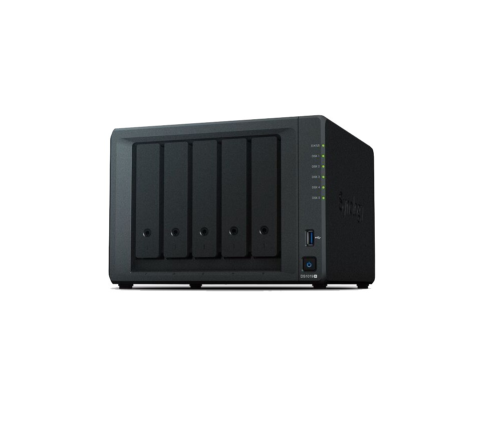

# 2 NAS / file server with [Ubuntu Server](https://ubuntu.com/download/server)

<a> </a>

A NAS (Network Attached Storage) or file server is a dedicated server that provides centralized storage and allows users to access files and data over a network. Ubuntu Server is a popular choice for setting up a NAS due to its stability, flexibility, and extensive community support.

NFS (Network File System) is ideal for sharing files between Linux systems.

```bash
    $ sudo apt install nfs-kernel-server
```

```bash
    $ sudo mkdir -p /srv/nfs/share
    $ sudo chown nobody:nogroup /srv/nfs/share
    $ sudo chmod 777 /srv/nfs/share
```

Configure NFS Exports: Edit the NFS exports file to define the directory that will be shared. ` $ sudo nano /etc/exports`. Add the following line to share the /srv/nfs/share directory with specific IP addresses or subnets (in this case, we share with any system on the local network `192.168.1.0/24`): `/srv/nfs/share 192.168.1.0/24(rw,sync,no_subtree_check)`.

+ Apply the new share by running: ` $ sudo exportfs -ra`.
+ Allow NFS Through the Firewall: If you have UFW enabled, allow NFS traffic: ` $ sudo ufw allow from 192.168.1.0/24 to any port nfs`.
+ Start and Enable the NFS Service:

```bash
    $ sudo systemctl enable nfs-kernel-server
    $ sudo systemctl start nfs-kernel-server
```

Access the NFS Share on Linux Clients: On the client Linux system, mount the NFS share.

+ Install NFS client : ` $ sudo apt install nfs-common`.
+ Create a mount point on the client: ` $ sudo mkdir -p /mnt/nfs_share`.
+ Mount the NFS share: ` $ sudo mount 192.168.1.100:/srv/nfs/share /mnt/nfs_share`. Replace `192.168.1.100` with the IP address of the Ubuntu server.
+ Verify the Mount: ` $ df -h`. We should see the NFS share mounted at `/mnt/nfs_share`.

For a more user-friendly NAS experience, we can install Nextcloud, which provides a web interface for managing files, similar to Google Drive or Dropbox.

```bash
    $ sudo apt install apache2 libapache2-mod-php7.4
    $ sudo apt install php7.4-cli php7.4-xml php7.4-zip php7.4-mbstring php7.4-curl php7.4-gd php7.4-intl php7.4-bcmath php7.4-gmp
    $ wget https://download.nextcloud.com/server/releases/nextcloud-23.0.0.zip
```


Reseources : [DIY NAS / File storage server using Ubuntu Server 20.04](https://youtu.be/AwMMROORSxg), [How to Create a NAS with Ubuntu Server](https://youtu.be/-5Z_-3EBIHE), [Creating a NAS with Ubuntu Server](CreatingaNASwithUbuntuServer.pdf), [Let's build a home lab server from scratch with Ubuntu Linux, OpenZFS and KVM](https://youtu.be/be4W-pSk8Ac), [i built a Raspberry Pi SUPER COMPUTER!! // ft. Kubernetes (k3s cluster w/ Rancher)](https://youtu.be/X9fSMGkjtug), [how to build a Raspberry Pi NAS (it’s AWESOME!!)](https://youtu.be/gyMpI8csWis), [Ubuntu Server: Getting started with a Linux Server](https://youtu.be/2Btkx9toufg).