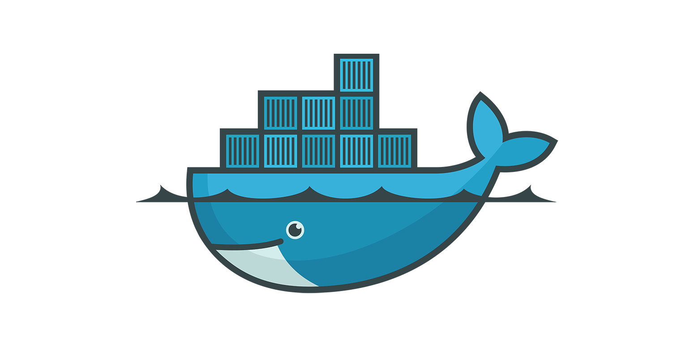
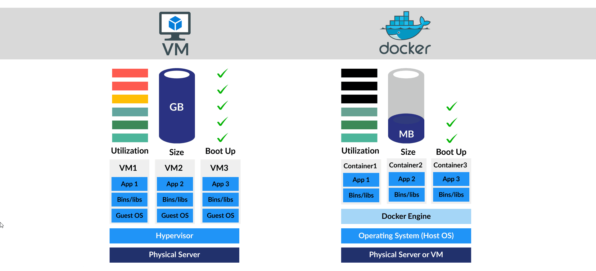

# DOCKER

<center></center><br /><br />
Docker is a tool that helps developers package and run applications in a consistent environment. Imagine you have a project that works perfectly on your computer, but when you share it with someone else, it doesn’t work on their machine. This can happen because their computer might have different software, libraries, or settings. Docker solves this problem by creating something called a "container," which is like a little box that contains everything your application needs to run, no matter where it is.

--- 

Docker is a powerful containerization platform that simplifies the process of developing, packaging, and deploying applications within lightweight, portable containers. Container is an isolated environment for running an application. To learn about docker in detail, here is a [docker blog](https://docker-curriculum.com/). Docker works in a CLIENT - SERVER (DOCKER ENGINE) architecture using REST API and shares OS kernel resources.

Install docker from : @[docs.docker.com](https://docs.docker.com/engine/install/)
```docker

    $ docker run IMAGE
    $ docker version (make sure both Client & Server Docker Engine is running)
    $ touch Dockerfile
```

In `Dockerfile` (all docker hub [images](https://hub.docker.com/search?q=)):

```docker
    FROM node:alpine              (alpine is the linux distro)
    COPY . /app                   (copy all files to docker fs /app)
    CMD node /app/app.js
```
Here, we create and move into the `/app` directory in the container. This helps organize the files and makes it easier to manage paths. The `COPY` instruction copies files or directories from your host machine into the Docker image.

`COPY . .` : This example copies everything from the current directory on your host machine (where the Dockerfile is located) into the working directory (/app) in the container. You can also specify individual files: `COPY myfile.txt /app/myfile.txt`.

or 

```docker
    FROM node:alpine              (alpine is the linux distro)
    COPY . /app                   (copy all files to docker fs /app)
    WORKDIR /app
    CMD node app.js
```
To install software or dependencies, you can use the `RUN` instruction. This instruction executes commands in the container.

```
RUN apt-get update && apt-get install -y python3 python3-pip

```

You can set environment variables in your Dockerfile using the `ENV` instruction. These variables can be used by your application during runtime. 

```
ENV PORT=8080
```

The `EXPOSE` instruction is used to indicate the ports on which the container listens for connections. This doesn’t actually publish the port; it’s more of a documentation step. To publish the port, you would do so when running the container.

```
EXPOSE 8080
```

The `CMD` or `ENTRYPOINT` instructions specify what command to run when the container starts. `CMD` is generally used to provide defaults that can be overridden, while `ENTRYPOINT` is used to set the main command.

```
CMD ["python3", "app.py"]
```

To build docker image:

```docker
    $ docker build -t image-name .
    $ docker image ls   
    $ docker run -p 8080:80 image-name
    $ docker pull username/image-name                  
```
Docker Containers:

```docker
    $ sudo apt install docker.io docker-compose -y
    $ docker pull centos
    $ docker run -d -t --name skk centos
    $ docker ps
    $ docker exec -it skk bash
    $ ls > $ exit          
    $ docker pull alpine
    $ docker run -t -d  --name saikia alpine
    $ docker pull username/imagename:tag
    $ docker run -t -d -p 80:80 --name skk username/imagename:tag (-p is for port mapping)
    $ sudo docker run --name web -itd -p 8080:80 nginx
    $ nano docker-compose.yaml
```

## DOCKER HUB:

<center></center><br /><br />

<table style="width:100%" >
<tr>
<th>Docker Hub Images :</th>
<td>

TensorFlow Serving [[image](https://hub.docker.com/r/bitnami/tensorflow-serving)]
</td>
<td>

PyTorch : [[image](https://hub.docker.com/r/bitnami/pytorch)]
</td>

<td>

intel/dlstreamer : [[image](https://hub.docker.com/r/intel/dlstreamer)]
</td>

<td>

mongo-express : [[image](https://hub.docker.com/_/mongo-express)]
</td>

</tr>

<tr>
<td>

MLflow [[image](https://hub.docker.com/r/ubuntu/mlflow)]</td>
<td>

NGINX [[image](https://hub.docker.com/r/ubuntu/nginx)]
</td>
<td>

Ubuntu : [[image](https://hub.docker.com/_/ubuntu)]</td>

<td>

kibana : [[image](https://hub.docker.com/_/kibana)]
</td>

<td>

ros 2 : [[image](https://hub.docker.com/_/ros)]
</td>

</tr>


</table>


DOCKER COMPOSE : In `docker-compose.yaml` :

```docker
    version: "3"
    services: 
        website:
            image: nginx
            ports: 
                - "8081:80"
            restart: always
            networks:
                netname:
                    ipv4_address: 192.168.92.21
    networks:
        netname:
            ipam:
                driver: default
                config:
                    - subnet: "192.168.92.0/24"


    $ sudo docker-compose up -d 
    $ sudo docker-compose ps
    $ sudo docker-compose stop
    $ sudo docker-compose down

To get a clean workspace:
    $ docker image rm imageid
    $ docker image ls
    $ docker image ls -q
    $ docker container rm -f $(docker container ls -aq)
    $ docker image rm -f $(docker image ls -aq)

DOCKER Networking:
    $ sudo docker network ls
    $ sudo docker inspect networkname
    $ sudo docker exec -it imagename sh
    $ sudo docker network create skkk
```

To dockerize an application, we just add a `DOCKERFILE` to it and we get an `IMAGE`. Resources : [How to dockerize your Flask application](https://medium.com/geekculture/how-to-dockerize-your-flask-application-2d0487ecefb8), [Dockerizing Flask with Postgres, Gunicorn, and Nginx](https://testdriven.io/blog/dockerizing-flask-with-postgres-gunicorn-and-nginx/)

## What is Docker Compose?
Docker Compose is a tool that allows you to define and manage multi-container Docker applications. Instead of managing each container individually, Docker Compose lets you describe the entire environment in a single YAML file, making it easier to manage, scale, and orchestrate multiple containers that need to work together.

<a> </a>


Udemy Classes : [Docker & Kubernetes: The Practical Guide [2023 Edition]](https://www.udemy.com/course/docker-kubernetes-the-practical-guide/), [Docker Mastery: with Kubernetes +Swarm from a Docker Captain](https://www.udemy.com/course/docker-mastery/)

Videos : [Docker Tutorial for Beginners](https://youtu.be/pTFZFxd4hOI), [Docker Tutorial for Beginners](https://youtu.be/3c-iBn73dDE), [Docker For Beginners: From Docker Desktop to Deployment](https://youtu.be/i7ABlHngi1Q), [you need to learn Docker RIGHT NOW!! // Docker Containers 101](https://youtu.be/eGz9DS-aIeY), [Docker Compose will BLOW your MIND!! (a tutorial)](https://youtu.be/DM65_JyGxCo), [Docker networking is CRAZY!! (you NEED to learn it)](https://youtu.be/bKFMS5C4CG0), [Docker Containers and Kubernetes Fundamentals – Full Hands-On Course](https://youtu.be/kTp5xUtcalw), [Docker Compose Tutoria](https://youtu.be/HG6yIjZapSA), [you need to learn Kubernetes RIGHT NOW!!](https://youtu.be/7bA0gTroJjw).

Resources : [docker-hub](https://hub.docker.com/), [docker-cheatsheet.pdf](docker_cheatsheet.pdf), [docker-cheatsheet-2.pdf](docker-commands-cheat-sheet-pdf.pdf).