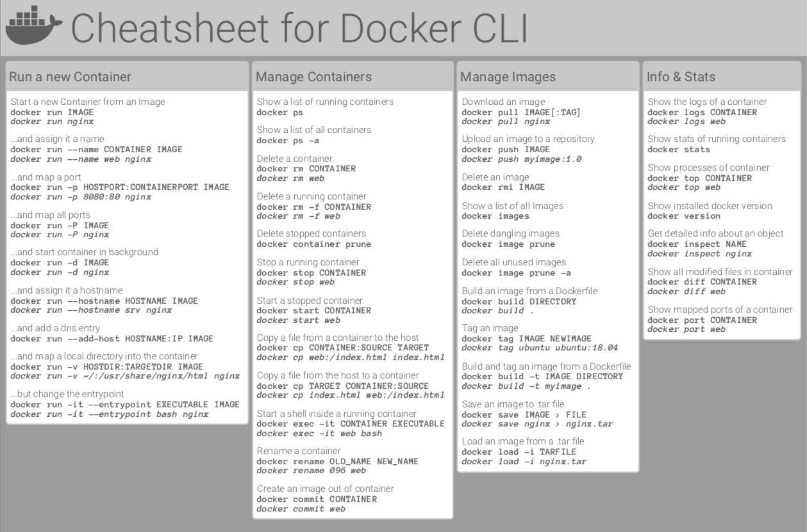

# DOCKER

<center></center><br /><br />


Container is an isolated environment for running an application. To learn about docker in detail, here is a [docker blog](https://docker-curriculum.com/). Docker works in a CLIENT - SERVER (DOCKER ENGINE) architecture using REST API and shares OS kernel resources.

Install docker from : @[docs.docker.com](https://docs.docker.com/engine/install/)
```docker

    $ docker run IMAGE
    $ docker version (make sure both Client & Server Docker Engine is running)
    $ touch Dockerfile
```

In `Dockerfile` (all docker hub [images](https://hub.docker.com/search?q=)):

```docker
    FROM node:alpine              (alpine is the linux distro)
    COPY . /app                   (copy all files to docker fs /app)
    CMD node /app/app.js
```

or 

```docker
    FROM node:alpine              (alpine is the linux distro)
    COPY . /app                   (copy all files to docker fs /app)
    WORKDIR /app
    CMD node app.js
```
To build docker image:

```docker
    $ docker build -t image-name .
    $ docker image ls   
    $ docker run image-name
    $ docker pull username/image-name                  
```
Docker Containers:

```docker
    $ sudo apt install docker.io docker-compose -y
    $ docker pull centos
    $ docker run -d -t --name skk centos
    $ docker ps
    $ docker exec -it skk bash
    $ ls > $ exit          
    $ docker pull alpine
    $ docker run -t -d  --name saikia alpine
    $ docker pull username/imagename:tag
    $ docker run -t -d -p 80:80 --name skk username/imagename:tag (-p is for port mapping)
    $ sudo docker run --name web -itd -p 8080:80 nginx
    $ nano docker-compose.yaml
```

DOCKER COMPOSE : In `docker-compose.yaml` :

```docker
    version: "3"
    services: 
        website:
            image: nginx
            ports: 
                - "8081:80"
            restart: always
            networks:
                netname:
                    ipv4_address: 192.168.92.21
    networks:
        netname:
            ipam:
                driver: default
                config:
                    - subnet: "192.168.92.0/24"


    $ sudo docker-compose up -d 
    $ sudo docker-compose ps
    $ sudo docker-compose stop
    $ sudo docker-compose down

To get a clean workspace:
    $ docker image rm imageid
    $ docker image ls
    $ docker image ls -q
    $ docker container rm -f $(docker container ls -aq)
    $ docker image rm -f $(docker image ls -aq)

DOCKER Networking:
    $ sudo docker network ls
    $ sudo docker inspect networkname
    $ sudo docker exec -it imagename sh
    $ sudo docker network create skkk
```

To dockerize an application, we just add a `DOCKERFILE` to it and we get an `IMAGE`. Resources : [How to dockerize your Flask application](https://medium.com/geekculture/how-to-dockerize-your-flask-application-2d0487ecefb8), [Dockerizing Flask with Postgres, Gunicorn, and Nginx](https://testdriven.io/blog/dockerizing-flask-with-postgres-gunicorn-and-nginx/)

<a> </a>




Udemy Classes : [Docker & Kubernetes: The Practical Guide [2023 Edition]](https://www.udemy.com/course/docker-kubernetes-the-practical-guide/), [Docker Mastery: with Kubernetes +Swarm from a Docker Captain](https://www.udemy.com/course/docker-mastery/)

Videos : [Docker Tutorial for Beginners](https://youtu.be/pTFZFxd4hOI), [Docker Tutorial for Beginners](https://youtu.be/3c-iBn73dDE), [Docker For Beginners: From Docker Desktop to Deployment](https://youtu.be/i7ABlHngi1Q), [you need to learn Docker RIGHT NOW!! // Docker Containers 101](https://youtu.be/eGz9DS-aIeY), [Docker Compose will BLOW your MIND!! (a tutorial)](https://youtu.be/DM65_JyGxCo), [Docker networking is CRAZY!! (you NEED to learn it)](https://youtu.be/bKFMS5C4CG0), [Docker Containers and Kubernetes Fundamentals – Full Hands-On Course](https://youtu.be/kTp5xUtcalw), [Docker Compose Tutoria](https://youtu.be/HG6yIjZapSA), [you need to learn Kubernetes RIGHT NOW!!](https://youtu.be/7bA0gTroJjw).

Resources : [docker-hub](https://hub.docker.com/), [docker-cheatsheet.pdf](docker_cheatsheet.pdf), [docker-cheatsheet-2.pdf](docker-commands-cheat-sheet-pdf.pdf).