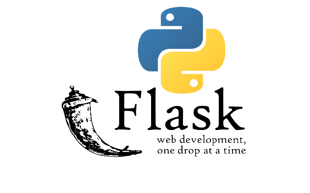
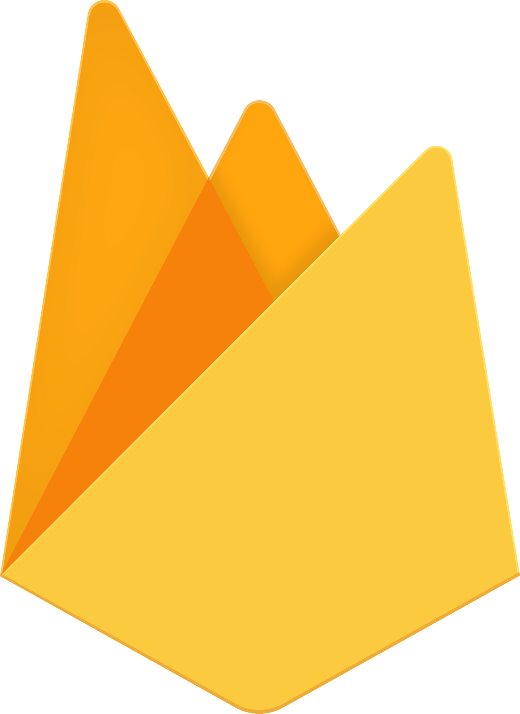

# Flask : [[documentation](https://flask.palletsprojects.com/en/2.3.x/)]

I have some experience with Flask. I recently gave a workshop at AI-Makerspace, Digital Product School, Unternehmer Technische Universität München on flask, maps and ML. Tech Stack : [ Flask, JavaScript, Bootstrap, Mapbox, MongoDB, PyTorch ] and here is the code [repository](https://github.com/DigitalProductschool/AI-Makerspace/tree/master/FlaskGeoAI).


## Flask Template Gallery :

<table style="width:100%" >
<tr>
<th>
  <p>
  
  <br />Flask (basic)<br />
  
  [code](https://github.com/DigitalProductschool/AI-Makerspace/tree/master/FlaskGeoAI/v1-prototype-basic) ✔️
  </p>

</th>
<th>
  <p>
  
  <br />Flask (design+js)<br />
  
  [code](https://github.com/DigitalProductschool/AI-Makerspace/tree/master/FlaskGeoAI/v2-aesthetic-design-%26-js) ✔️
  </p>
</th>
<th>

  <p>
  
  <br />Flask (input)<br />
  
  [code](https://github.com/DigitalProductschool/AI-Makerspace/tree/master/FlaskGeoAI/v3-input-users) ✔️
  </p></th>
<th>

  <p>
  
  <br />Flask (mapbox + mongoDB)<br />
  
  [code](https://github.com/DigitalProductschool/AI-Makerspace/tree/master/FlaskGeoAI/v4-map-mongo) ✔️
  </p>
  </a></th>
</tr>
<tr>
<th>
  <p>
  
  <br />Flask (3dmap - cesium + AR)<br />
  
  [code](https://github.com/DigitalProductschool/AI-Makerspace/tree/master/FlaskGeoAI/v5-3dmap-AR) ✔️
  </p>

</th>
<th>
  <p>
  
  <br />Flask (deep learning - tf/pytorch)<br />
  
  [code](https://github.com/DigitalProductschool/AI-Makerspace/tree/master/FlaskGeoAI/v6-ds-deeplearning) ✔️
  </p>
</th>
<th>

  <p>
  
  <br />Flask (docker + gcloud)<br />
  
  [code](https://github.com/DigitalProductschool/AI-Makerspace/tree/master/FlaskGeoAI/v7-glcoud-docker) ✔️
  </p></th>
<th>


  </a></th>
</tr>
</table>

Deployment of Flask server : [python anywhere](https://help.pythonanywhere.com/pages/Flask/), [heroku](https://devcenter.heroku.com/articles/getting-started-with-python), [Digital Ocean](https://docs.digitalocean.com/tutorials/app-deploy-flask-app/), Virtual Machine from Google Cloud : [Google App Engine](https://cloud.google.com/appengine/docs/standard/python3/runtime), [Google Cloud Run](https://cloud.google.com/run/docs/quickstarts/build-and-deploy/deploy-python-service), AWS : [Elastic Beanstalk](https://docs.aws.amazon.com/elasticbeanstalk/latest/dg/create-deploy-python-flask.html), Azure [IIS](https://learn.microsoft.com/en-us/azure/app-service/configure-language-python)etc. 

```python

from flask import Flask
from flask import Blueprint, request

app = Flask(__name__)

@app.route("/")
def hello_world():
    return "<p>Hello, World!</p>"


post_pages = Blueprint("posts", __name__)


@post_pages.get("/post/<string:title>")
def display_post(title: str):
    return "Display post page."


@post_pages.route("/post/", methods=["GET", "POST"])
def create_post():
    if request.method == "POST":
        pass
    return "Create post page."
```

Resources: [Flask Mega Tutrial](https://blog.miguelgrinberg.com/post/the-flask-mega-tutorial-part-i-hello-world), [Build a blog platform with Flask: writing and showing posts](https://blog.teclado.com/build-own-blog-platform-flask-python-part-1/), [Flask documentation : a minimal application](https://flask.palletsprojects.com/en/2.3.x/quickstart/#a-minimal-application), [The Ultimate Flask Course](https://www.udemy.com/course/the-ultimate-flask-course/), [REST APIs with Flask and Python](https://www.udemy.com/course/rest-api-flask-and-python/).