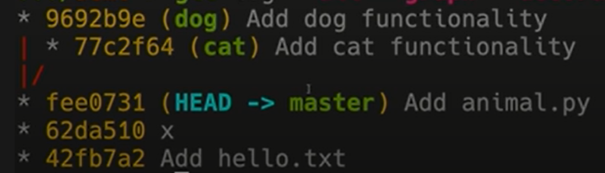
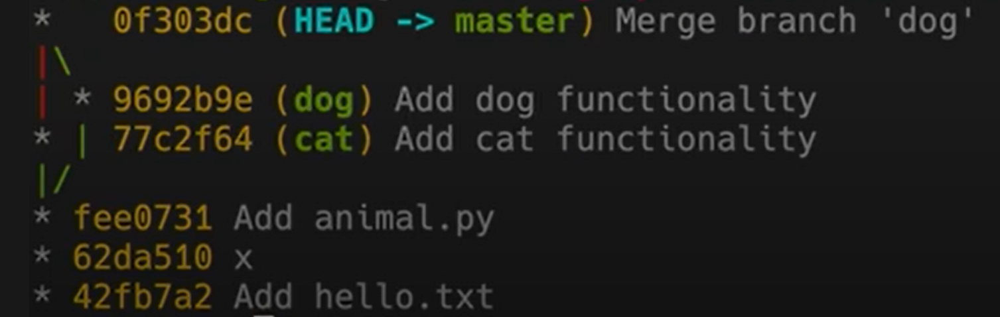

# Git, Docker and Kubernetes

### Git Version Control
<br />

<a> </a>


1. [Git & Github slide](gitngithub.pdf)


### Internals of Git
---

Git uses Directed Acyclic Graph (DAG) to model history. Commit = Snapshot! Git maintains set of objects as well as references.

```git
<root> (tree)
|
+- foo (tree)
|  |
|  + bar.txt (blob, contents = "hello world")
|
+- baz.txt (blob, contents = "git is wonderful")
```
How git models history:
```
// a file is a bunch of bytes
type blob = array<byte>

// a directory contains named files and directories
type tree = map<string, tree | blob>

// a commit has parents, metadata, and the top-level tree
type commit = struct {
    parent: array<commit>
    author: string
    message: string
    snapshot: tree
}
```
An “object” is a blob, tree, or commit:

```
type object = blob | tree | commit

objects = map<string, object>

def store(object):
    id = sha1(object)
    objects[id] = object

def load(id):
    return objects[id]
```

References:

```
references = map<string, string>

def update_reference(name, id):
    references[name] = id

def read_reference(name):
    return references[name]

def load_reference(name_or_id):
    if name_or_id in references:
        return load(references[name_or_id])
    else:
        return load(name_or_id)
```

All in all git stores references as a commit. references = "commit msg, sha1 hash"

# Git Commands

### Basics:
- `git help <command>:` get help for a git command
- `git init:` creates a new git repo, with data stored in the .git directory
- `git status:` tells you what’s going on
- `git add <filename>:` adds files to staging area
- `git commit:` creates a new commit
    - Write good commit messages!
    - Even more reasons to write good commit messages!
- `git log:` shows a flattened log of history
- `git log --all --graph --decorate:` visualizes history as a DAG
- `git diff <filename>:` show changes you made relative to the staging area
- `git diff <revision> <filename>:` shows differences in a file between snapshots
- `git checkout <revision>:` updates HEAD and current branch
### Branching and merging:
- `git branch:` shows branches
- `git branch <name>:` creates a branch
- `git checkout -b <name>:` creates a branch and switches to it
same as git branch <name>; git checkout <name>
- `git merge <revision>:` merges into current branch
- `git mergetool:` use a fancy tool to help resolve merge conflicts
- `git rebase:` rebase set of patches onto a new base
### Remotes:
- `git remote:` list remotes
- `git remote add <name> <url>:` add a remote
- `git push <remote> <local branch>:<remote branch>:` send objects to remote, and update remote reference
- `git branch --set-upstream-to=<remote>/<remote branch>:` set up correspondence between local and remote branch
- `git fetch:` retrieve objects/references from a remote
- `git pull:` same as git fetch; git merge
- `git clone:` download repository from remote
### Undo:
- `git commit --amend:` edit a commit’s contents/message
- `git reset HEAD <file>:` unstage a file
- `git checkout -- <file>:` discard changes
### Advanced Git:
- `git config:` Git is highly customizable
- `git clone --depth=1:` shallow clone, without entire version history
- `git add -p:` interactive staging
- `git rebase -i:` interactive rebasing
- `git blame:` show who last edited which line
- `git stash:` temporarily remove modifications to working directory
- `git bisect:` binary search history (e.g. for regressions)
- `.gitignore:` specify intentionally untracked files to ignore


```
- git init
- ls -a
- ls .git
- git help init 
- git cat-file -p 42fb7a2 #change the hash to know about the commit
- git add :/ #adds all from top down in repository
- git log
- git log --all --graph --decorate
- git checkout hashvalue
- git diff hello.txt #changes_since_the_last_snapshot
- git diff 42fb7a2 hello.txt #changes_since_the_42fb7a2_snapshot
- git diff 42fb7a2 56hs32d hello.txt #changes_from_the_42fb7a2__snapshot__to_56hs32d
- git branch -vv
- git branch branchname
- git branch abc; git checkout abc (git checkout -b abc)

```
To merge these branches:

<a> </a>

```
- git merge cat
- git mergetool
    - vimdiff
- git merge --continue
- git log --all --graph --decorate
```

```
- git remote
- git branch --set-upstream-to=origin/master
- git fetch + get merge = git pull
- git config / vim ~/.gitconfig
- git clone --shallow #no_version_history
- git diff --cached
- git blame abc.txt
- git show 42fb7a2
- git stash #temporarily_hide)the_current_changes
- git stash pop
- git bisect #powerful_tool_to_find_the_last_commit_where_unittest_was_passing
- git config --global user.name "My Name“
- git reset files/newcopy2.txt
- git rm '*.txt‘
```

## Lessons:
[MIT Lecture 6: Version Control (git) (2020)](https://youtu.be/2sjqTHE0zok) | [git assignments](https://missing.csail.mit.edu/2020/version-control/)

Udemy: [Complete Git Guide: Understand and master Git and GitHub](https://www.udemy.com/course/git-and-github-complete-guide/)

Udemy: [GitHub Ultimate: Master Git and GitHub - Beginner to Expert](https://www.udemy.com/course/github-ultimate/)

[ProGit Book](https://git-scm.com/book/en/v2) | [cli/cli](https://github.com/cli/cli) | [cli.github](https://cli.github.com/manual/) | [git merge vs git rebase](https://youtu.be/KWAZl2QHC44)

[Removing sensitive data from a repository](https://docs.github.com/en/free-pro-team@latest/github/authenticating-to-github/removing-sensitive-data-from-a-repository) | [GitHub Actions - Now with built-in CI/CD! Live from GitHub HQ](https://youtu.be/E1OunoCyuhY) | [Contributing to Open Source for the first time](https://youtu.be/c6b6B9oN4Vg)

[Github Workflow](https://www.youtube.com/watch?v=MnUd31TvBoU&list=PL4cUxeGkcC9goXbgTDQ0n_4TBzOO0ocPR&index=11&ab_channel=TheNetNinja) | [Github Workflow 2](https://youtu.be/oFYyTZwMyAg) | [Github Actions](https://youtu.be/J4EhgEskSZA) | [Github Actions 2](https://youtu.be/eB0nUzAI7M8)