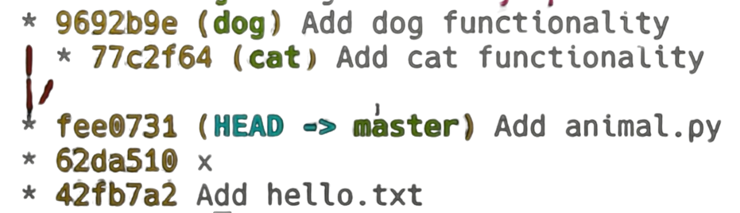
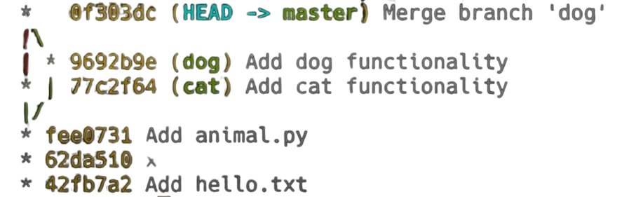

# Git and Github :  Version Control
<br />

[ [git ssh setup](./GITSSH.MD) ]

<a> </a><a> </a>

<p style='text-align: justify;'> 
Git is a version control system. Imagine you're working on a project, like writing a report, developing software, or designing something, and you need to keep track of all the changes you make over time. Git helps you do just that by recording snapshots of your work at different points. These snapshots are called "commits."
</p>

<p style='text-align: justify;'> 
Version control systems (VCS) are essential tools for tracking and managing changes to code and other files in software development. Git, one of the most popular VCS, provides powerful features for collaboration, history tracking, and code management. 
</p>

Git was created by Linus Torvalds in 2005 to manage the development of the Linux kernel, and since then, it's become one of the most popular tools for managing changes in projects, especially in software development.


On Linux, you can install it using your package manager, like ` $ sudo apt-get install git` on Ubuntu.


## Set Up Git:

After installing Git, you need to tell it who you are. Open your terminal or command prompt and type:

```git
    $ git config --global user.name "Your Name"
    $ git config --global user.email "your.email@example.com"
```

### Start a Project:

Go to the folder where you want to keep your project and type: ` $ git init `.

### Make Your First Commit:

Create or add files to your project. For example, you might create a text file called README.md.
To tell Git to start tracking the file, type: ` $ git add README.md `. Now, save a snapshot of your project by typing: ` $ git commit -m "Add README file" `. The `-m` flag lets you add a message describing what you did, like "Add README file."

If you're working with others, you might want to share your code using a service like GitHub, GitLab, or Bitbucket. You can push your commits to a remote repository and allow others to clone, pull, and push changes.

```bash
$ git remote add origin https://github.com/yourusername/yourproject.git
$ git push -u origin master

```

Here is my mini guide on version control with git. Some useful resources : [git & github slide](gitngithub.pdf), [git_cheatsheet.pdf](git-cheat-sheet-education.pdf), [git_cheatsheet_2.pdf](gitngithub.pdf), github actions : CI/CD - [example](https://youtu.be/J4EhgEskSZA) ('.yaml' config file in repository).


### Internals of Git: Understanding How Git Models History

<p style="text-align: justify;">
Git is more than just a tool for version control; it's a sophisticated system that models project history using a data structure called a Directed Acyclic Graph (DAG). This structure allows Git to efficiently track changes and manage the state of your project over time. To understand Git's internals, let's dive into how it models history and stores data.
</p>

#### Git's Data Model: Objects and References
At the core of Git's data model are three types of objects: blobs, trees, and commits. These objects represent the content of files, directories, and snapshots of the project, respectively.

---

#### + Blob:

A blob is essentially a file in Git. It stores the content of a file as a sequence of bytes.
In code terms, you can think of it as: ` $ type blob = array<byte> `.
```git
<root> (tree)
|
+- foo (tree)
|  |
|  + bar.txt (blob, contents = "hello world")
|
+- baz.txt (blob, contents = "git is wonderful")
```
#### + Tree:

A tree is a directory in Git. It maps filenames to either blobs (files) or other trees (subdirectories).
It represents the hierarchical structure of your project.

#### + Commit:

A commit is a snapshot of your project at a given point in time. It contains references to one or more parent commits (if the commit is part of a branch or merge), metadata (such as the author and commit message), and the top-level tree that represents the state of the project.

How git models history:
```
// a file is a bunch of bytes
type blob = array<byte>

// a directory contains named files and directories
type tree = map<string, tree | blob>

// a commit has parents, metadata, and the top-level tree
type commit = struct {
    parent: array<commit>
    author: string
    message: string
    snapshot: tree
}
```
### Storing and Loading Objects in Git
Git uses a unique identifier for each object, which is the SHA-1 hash of the object’s content. This ensures that every object is uniquely and immutably stored in Git's internal database.

An “object” is a blob, tree, or commit:

```python
type object = blob | tree | commit

objects = map<string, object>

def store(object):
    id = sha1(object)
    objects[id] = object

def load(id):
    return objects[id]
```

When you store an object (whether it's a blob, tree, or commit), Git computes its SHA-1 hash and stores it in a map where the key is the hash and the value is the object.

### References: Mapping Human-Friendly Names to Commits
While objects in Git are stored using SHA-1 hashes, which are not human-friendly, Git also maintains references that map human-readable names (like branch names or tags) to these hashes.

```python
references = map<string, string>

def update_reference(name, id):
    references[name] = id

def read_reference(name):
    return references[name]

def load_reference(name_or_id):
    if name_or_id in references:
        return load(references[name_or_id])
    else:
        return load(name_or_id)
```
When you create a new branch or tag, Git stores the associated commit hash in a map under the branch or tag name.

To load the content of a branch or tag, Git checks if the name corresponds to a reference. If so, it retrieves the associated commit; otherwise, it assumes the input is already a hash and directly loads the object.

<p style="text-align: justify;">
In Git, everything ultimately boils down to storing and retrieving objects (blobs, trees, and commits) and managing references to these objects. When you make a commit, Git takes the current state of your project, stores it as a tree of blobs, creates a commit object that points to this tree and any parent commits, and then updates the reference for your current branch to point to this new commit.
</p>

All in all git stores references as a commit. references = "commit msg, sha1 hash"

# Git Commands

### Basics:
- `git help <command>:` get help for a git command
- `git init:` creates a new git repo, with data stored in the .git directory
- `git status:` tells you what’s going on
- `git add <filename>:` adds files to staging area
- `git commit:` creates a new commit
    - Write good commit messages!
    - Even more reasons to write good commit messages!
- `git log:` shows a flattened log of history
- `git log --all --graph --decorate:` visualizes history as a DAG
- `git diff <filename>:` show changes you made relative to the staging area
- `git diff <revision> <filename>:` shows differences in a file between snapshots
- `git checkout <revision>:` updates HEAD and current branch
### Branching and merging:
- `git branch:` shows branches
- `git branch <name>:` creates a branch
- `git checkout -b <name>:` creates a branch and switches to it
same as git branch <name>; git checkout <name>
- `git merge <revision>:` merges into current branch
- `git mergetool:` use a fancy tool to help resolve merge conflicts
- `git rebase:` rebase set of patches onto a new base
### Remotes:
- `git remote:` list remotes
- `git remote add <name> <url>:` add a remote
- `git push <remote> <local branch>:<remote branch>:` send objects to remote, and update remote reference
- `git branch --set-upstream-to=<remote>/<remote branch>:` set up correspondence between local and remote branch
- `git fetch:` retrieve objects/references from a remote
- `git pull:` same as git fetch; git merge
- `git clone:` download repository from remote
### Undo:
- `git commit --amend:` edit a commit’s contents/message
- `git reset HEAD <file>:` unstage a file
- `git checkout -- <file>:` discard changes
### Advanced Git:
- `git config:` Git is highly customizable
- `git clone --depth=1:` shallow clone, without entire version history
- `git add -p:` interactive staging
- `git rebase -i:` interactive rebasing
- `git blame:` show who last edited which line
- `git stash:` temporarily remove modifications to working directory
- `git bisect:` binary search history (e.g. for regressions)
- `.gitignore:` specify intentionally untracked files to ignore

### What is a Branch?
A branch in Git is simply a pointer to a specific commit in the project history. It allows you to diverge from the main line of development and continue to work on your code independently. Each branch represents an isolated line of development.

Let’s say you have a project with a few commits on the `main` branch:

```
A---B---C   (main)
```

Here, `A`, `B`, and `C` represent commits, and the `main` branch points to commit `C`.

Now, you want to add a new feature without affecting the `main` branch. You create a new branch called `feature`: ` $ git checkout -b feature`.

This creates a new branch, `feature`, that also points to commit `C`:

```
A---B---C   (main, feature)
```

When you start making new commits on the `feature` branch, the history diverges:

```
A---B---C   (main)
         \
          D---E   (feature)
```
Now, `main` remains on commit `C`, while `feature` has advanced to commit `E`.

### What is a Merge?
Merging in Git is the process of integrating changes from one branch into another. The most common scenario is merging a `feature` branch into the main branch once the feature is complete.

#### Types of Merges:
+ Fast-Forward Merge:

    + Occurs when the main branch hasn't changed since the feature branch was created.
    + Git simply moves the main branch pointer forward to the latest commit on the feature branch.

```
Before:
A---B---C   (main)
         \
          D---E   (feature)

After:
A---B---C---D---E   (main)
                  (feature)
```

+ Three-Way Merge:

+ Occurs when both the `main` branch and the feature branch have made changes after the feature branch was created.
+ Git creates a new merge commit that has two parents, representing the history of both branches.

```
Before:
A---B---C---F   (main)
         \
          D---E   (feature)

After:
A---B---C---F---G   (main)
         \      /
          D----E   (feature)
```
Here, `G` is the merge commit that combines changes from both `F` (on `main`) and `E` (on `feature`).

To merge the feature branch into the main branch:

```
git checkout main
git merge feature
```

### What is a Rebase?
Rebasing in Git is an alternative to merging. It allows you to move or combine a sequence of commits from one branch onto another. Rebasing rewrites the commit history by applying your changes on top of another branch.

### How Does Rebasing Work?
When you rebase a branch onto another, Git essentially:

+ Finds the common ancestor between the branches.
+ Applies the commits from the current branch onto the target branch one by one.
+ Moves the branch pointer to the new commits.

If you rebase feature onto `main`:

```bash
$ git checkout feature
$ git rebase main
```

The `feature` branch commits `D` and `E` are replayed on top of `main`:

```
A---B---C---F   (main)
               \
                D'---E'   (feature)
```
Notice how the commits on `feature` (now `D'` and `E'`) have new hashes because they are new commits.

### Benefits of Rebasing:
+ Cleaner History: Rebasing results in a linear history, making it easier to follow the progression of changes.
+ No Merge Commits: Rebasing avoids creating merge commits, which can clutter the history.

[ [Git MERGE vs REBASE](https://youtu.be/0chZFIZLR_0?si=749D5-kuX184EjvL), [GIT: Working with Branches](https://youtu.be/JTE2Fn_sCZs?si=lznCKIl8r25Q01y7) ]

```
- git init
- ls -a
- ls .git
- git help init 
- git cat-file -p 42fb7a2 #change the hash to know about the commit
- git add :/ #adds all from top down in repository
- git log
- git log --all --graph --decorate
- git checkout hashvalue
- git diff hello.txt #changes_since_the_last_snapshot
- git diff 42fb7a2 hello.txt #changes_since_the_42fb7a2_snapshot
- git diff 42fb7a2 56hs32d hello.txt #changes_from_the_42fb7a2__snapshot__to_56hs32d
- git branch -vv
- git branch branchname
- git branch abc; git checkout abc (git checkout -b abc)

```
To merge these branches:

<a> </a>

```
- git merge cat
- git mergetool
    - vimdiff
- git merge --continue
- git log --all --graph --decorate
```

```
- git remote
- git branch --set-upstream-to=origin/master
- git fetch + get merge = git pull
- git config / vim ~/.gitconfig
- git clone --shallow #no_version_history
- git diff --cached
- git blame abc.txt
- git show 42fb7a2
- git stash #temporarily_hide)the_current_changes
- git stash pop
- git bisect #powerful_tool_to_find_the_last_commit_where_unittest_was_passing
- git config --global user.name "My Name“
- git reset files/newcopy2.txt
- git rm '*.txt‘
```

## Resources:
[MIT Lecture 6: Version Control (git) (2020)](https://youtu.be/2sjqTHE0zok) | [git assignments](https://missing.csail.mit.edu/2020/version-control/), [Complete Git Guide: Understand and master Git and GitHub](https://www.udemy.com/course/git-and-github-complete-guide/),  [The Git & Github Bootcamp](https://www.udemy.com/course/git-and-github-bootcamp/), [So You Think You Know Git - FOSDEM 2024](https://youtu.be/aolI_Rz0ZqY?si=ab6Huf6geXe5bWWa), [Git & GitHub Tutorial for Beginners #8 - Branches](https://youtu.be/QV0kVNvkMxc?si=b1d9clEecPNfwZnS), [Git Branches Tutorial](https://youtu.be/e2IbNHi4uCI?si=mQ9tDEAisyyPJ89U), [So You Think You Know Git Part 2 - DevWorld 2024](https://youtu.be/Md44rcw13k4?si=WC3dfKME2jda29V3)

resources : [ProGit Book](https://git-scm.com/book/en/v2) | [markdown-cs](https://www.markdownguide.org/cheat-sheet/), [cli/cli](https://github.com/cli/cli) | [cli.github](https://cli.github.com/manual/) | [git merge vs git rebase](https://youtu.be/KWAZl2QHC44), [Removing sensitive data from a repository](https://docs.github.com/en/free-pro-team@latest/github/authenticating-to-github/removing-sensitive-data-from-a-repository) | [GitHub Actions - Now with built-in CI/CD! Live from GitHub HQ](https://youtu.be/E1OunoCyuhY) | [Contributing to Open Source for the first time](https://youtu.be/c6b6B9oN4Vg), [Github Workflow](https://www.youtube.com/watch?v=MnUd31TvBoU&list=PL4cUxeGkcC9goXbgTDQ0n_4TBzOO0ocPR&index=11&ab_channel=TheNetNinja) | [Github Workflow 2](https://youtu.be/oFYyTZwMyAg) | [Github Actions](https://youtu.be/J4EhgEskSZA) | [Github Actions 2](https://youtu.be/eB0nUzAI7M8) | [Git and GitHub for Beginners Tutorial](https://youtu.be/tRZGeaHPoaw) | [Git Branches Tutorial](https://youtu.be/e2IbNHi4uCI) | [Git for Professionals Tutorial - Tools & Concepts for Mastering Version Control with Git](https://youtu.be/Uszj_k0DGsg) | [Advanced Git Tutorial - Interactive Rebase, Cherry-Picking, Reflog, Submodules and more](https://youtu.be/qsTthZi23VE) | [Complete Guide to Open Source - How to Contribute](https://youtu.be/yzeVMecydCE) | [Contributing to Open Source for the first time](https://youtu.be/c6b6B9oN4Vg)