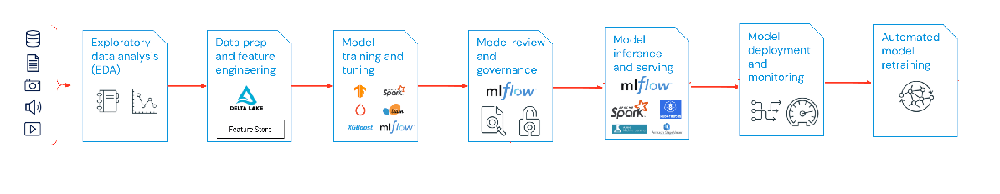
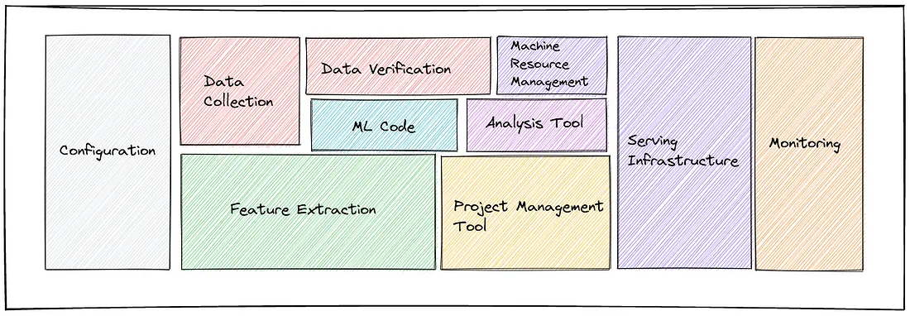
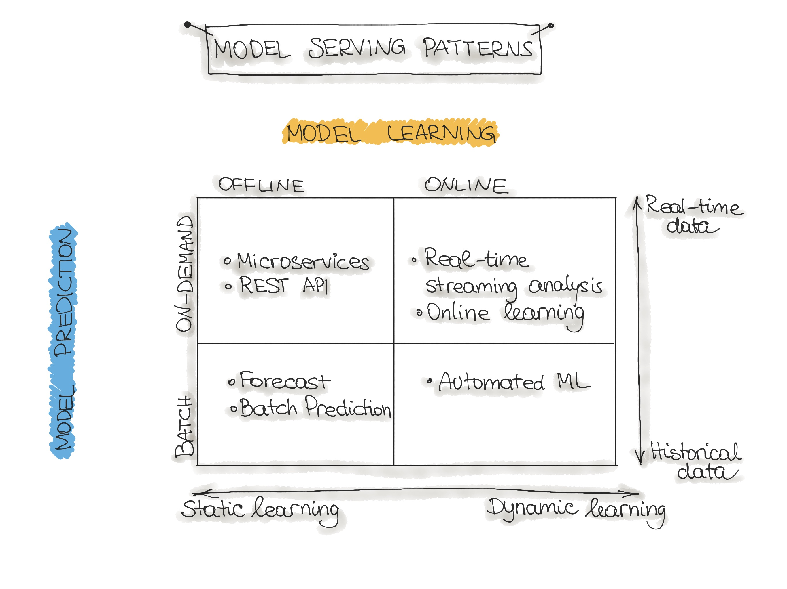

# MLOps : Machine Learning Operations

MLOps stands for Machine Learning Operations. MLOps is a core function of Machine Learning engineering, focused on streamlining the process of taking machine learning models to production, and then maintaining and monitoring them.

The necessity of MLOps can be summarized as follows:

+ ML models rely on a huge amount of data, difficult for a single person to keep track of.
+ Difficult to keep track of parameters we tweak in ML models. Small changes can lead to enormous differences in the results.
+ We have to keep track of the features the model works with, feature engineering is a separate task that contributes largely to model accuracy.
+ Monitoring an ML model isn’t like monitoring a deployed software or web app.
+ Debugging an ML model is an extremely complicated art
+ Models rely on real-world data for predicting, as real-world data changes, so should the model. This means we have to keep track of new data changes and make sure the model learns accordingly.

## ML Project Lifecycle : Scoping > Data Engineering > Modelling > Deployment > Monitoring

Data Ingestion - Collecting data by using various systems, frameworks and formats, such as internal/external databases, data marts, OLAP cubes, data warehouses, OLTP systems, Spark, HDFS etc. This step might also include synthetic data generation or data enrichment.

<table style="width:100%" >
<tr>
<th>Service Category</th>

<th>Service Description</th>

<th>Available Implementations
</th>
</tr

<tr>
<th>ML Platform</th>
<td>Provisioned as our opinionated preference for ML workflows running on a highly scalable software infrastructure.</td>
<td>

[Kubeflow](https://www.kubeflow.org/), [Kubernetes](https://kubernetes.io/)</td>
</tr>

<tr>
<th>ML Frameworks</th>
<td>Select your machine learning and deep learning framework, toolkit, and libraries.</td>
<td>

[TensorFlow](https://www.tensorflow.org/), [PyTorch](https://pytorch.org/), [Caffe](https://caffe.berkeleyvision.org/), [Keras](https://keras.io/)</td>
</tr>

<tr>
<th>Storage Volumne Management</th>
<td>Choose from software and tools for storage to meet your high performance ML needs.</td>
<td>

[Local FS](https://docs.streamsets.com/platform-datacollector/latest/datacollector/UserGuide/Destinations/LocalFS.html), [AWS EFS](https://aws.amazon.com/efs/), [AWS EBS](https://aws.amazon.com/ebs/), [Ceph](https://ceph.io/en/discover/technology/) (block and object), [Minio](https://min.io/), [NFS](https://www.techtarget.com/searchenterprisedesktop/definition/Network-File-System), [HDFS](https://hadoop.apache.org/docs/r1.2.1/hdfs_design.html)</td>
</tr>

<tr>
<th>Container Image Governance</th>
<td>Choose from software and tools that register, secure, and manage the distribution of container images.</td>
<td>

[AWS ECR](https://aws.amazon.com/ecr/), [Harbor](https://goharbor.io/), [GitLab](https://about.gitlab.com/)</td>
</tr>

<tr>
<th>Workflow Engine</th>
<td>Provisioned by default to govern scheduling and coordination of jobs.</td>
<td>

[Argo](https://argoproj.github.io/argo-workflows/use-cases/machine-learning/)</td>
</tr>

<tr>
<th>Model Training</th>
<td>Include collaboration tooling and interative model training as part of your template.</td>
<td>

[JupyterHub](https://jupyter.org/hub), [TensorBoard](https://www.tensorflow.org/tensorboard), [Argo workflow templates](https://argoproj.github.io/argo-workflows/use-cases/machine-learning/)</td>
</tr>

<tr>
<th>Model Serving</th>
<td>Pick the tool to expose trained models to business applications.</td>
<td>

[Seldon](https://www.seldon.io/), [TFX : tf-serving](https://www.tensorflow.org/tfx/guide/serving)</td>
</tr>

<tr>
<th>Model Validation</th>
<td>Set by default, models will be evaluated against test data as part of your ML pipeline.</td>
<td>

[Argo workflow templates](https://argoproj.github.io/argo-workflows/use-cases/machine-learning/)</td>
</tr>

<tr>
<th>Data Storage Services</th>
<td>Choose from storage options befitting the performance of other ML services.</td>
<td>

[Mini](https://min.io/), [AWS S3](https://aws.amazon.com/s3/), [MongoDB](https://www.mongodb.com/), [Cassandra](https://cassandra.apache.org/_/index.html), [HDFS](https://hadoop.apache.org/docs/r1.2.1/hdfs_design.html)</td>
</tr>

<tr>
<th>Data Preparation and Processing</th>
<td>Select your tooling to manage the data processing ovent of your ML pipeline.</td>
<td>

[Argo](https://argoproj.github.io/argo-workflows/use-cases/machine-learning/), [NATS](https://nats.io/), workflow application templates.</td>
</tr>

<tr>
<th>Infrastructure Monitoring</th>
<td>Elect which reporting and dashboarding tool gives you the better optics into your stack performance.</td>
<td>

[Prometheus](https://prometheus.io/), [Grafana](https://grafana.com/)</td>
</tr>

<tr>
<th>Model Monitoring</th>
<td>Find and choose the appropriate tool to watch model accuracy over time.</td>
<td>

[Prometheus](https://prometheus.io/), [Grafana](https://grafana.com/), [lsto](https://istio.io/latest/about/service-mesh/)</td>
</tr>

<tr>
<th>Load Balancing & Ingress</th>
<td>Determine the appropriate tool to expose cluster services broadly to other application services.</td>
<td>

[ELB](https://aws.amazon.com/elasticloadbalancing/), [Traefik](https://doc.traefik.io/traefik/routing/services/), [Ambassador](https://docs.traceable.ai/docs/ambassador)</td>
</tr>

<tr>
<th>Security</th>
<td>Find the right tooling for you to manage certificates, passwords and secret tuned for RBAC across all hybrid-cloud environments.</td>
<td>

[Okta](https://www.okta.com/), [Hashicorp Vault](https://www.vaultproject.io/), [AWS Certificate](https://aws.amazon.com/certification/)</td>
</tr>
<tr>
<th>Log Management</th>
<td>Make logging easier by choosing pre-integrated tools for ingest, analysis and reporting.</td>
<td>

[Elastic Search](https://www.elastic.co/), [Fluentd](https://www.fluentd.org/), [Kibana](https://www.elastic.co/kibana/), [graylog](https://www.graylog.org/)</td>
</tr>

</table>

also check @github/[[awesome-production-ml](https://github.com/EthicalML/awesome-production-machine-learning)] and this lfai mlops landscape [chart](https://landscape.lfai.foundation/).

### MLOps Level II :

Model Packaging - The process of exporting the final ML model into a specific format (e.g. PMML, PFA, or ONNX), which describes the model to be consumed by the business application. 

There are two ways how we perform ML Model Training:

+ Offline learning (aka batch or static learning): The model is trained on a set of already collected data. After deploying to the production environment, the ML model remains constant until it re-trained because the model will see a lot of real-live data and becomes stale. This phenomenon is called ‘model decay’ and should be carefully monitored.

+ Online learning (aka dynamic learning): The model is regularly being re-trained as new data arrives, e.g. as data streams. This is usually the case for ML systems that use time-series data, such as sensor, or stock trading data to accommodate the temporal effects in the ML model.

End-to-end MLOps solution : These are fully managed services that provide developers and data scientists with the ability to build, train, and deploy ML models quickly. The top commercial solutions are:

[Ray serve](https://www.anyscale.com/blog/serving-ml-models-in-production-common-patterns), [Amazon Sagemaker](https://aws.amazon.com/sagemaker/), a suite of tools to build, train, deploy, and monitor machine learning models.

Microsoft Azure MLOps suite:
[Azure Machine Learning](https://azure.microsoft.com/en-us/services/machine-learning/) to build, train, and validate reproducible ML pipelines
[Azure Pipelines](https://azure.microsoft.com/en-us/services/devops/pipelines/) to automate ML deployments
[Azure Monitor](https://docs.microsoft.com/en-us/azure/azure-monitor/overview) to track and analyze metrics
[Azure Kubernetes Services](https://azure.microsoft.com/en-us/services/kubernetes-service/) and other additional tools.

Google Cloud MLOps suite:
[Dataflow](https://cloud.google.com/dataflow) to extract, validate, and transform data as well as to evaluate models
[AI Platform Notebook](https://cloud.google.com/ai-platform-notebooks) to develop and train models
Cloud Build to build and test machine learning pipelines
[TFX](https://www.tensorflow.org/tfx) to deploy ML pipelines
[Kubeflow Pipelines](https://www.kubeflow.org/docs/pipelines/overview/pipelines-overview/) to arrange ML deployments on top of [Google Kubernetes Engine](https://cloud.google.com/kubernetes-engine) (GKE).

## MLOPs tools : [Project Jupyter](https://jupyter.org/), [Nbdev](https://github.com/fastai/nbdev), [Airflow](https://airflow.apache.org/), [Kubeflow](https://www.kubeflow.org/), [MLflow](https://mlflow.org/), [Optuna](https://optuna.org/), [AutoML tools](https://www.automl.org/automl/).

Continuous Integration (CI) is no longer only about testing and validating code and components, but also testing and validating data, data schemas, and models.

Continuous Deployment (CD) is no longer about a single software package or service, but a system (an ML training pipeline) that should automatically deploy another service (model prediction service) or roll back changes from a model.

Continuous Testing (CT) is a new property, unique to ML systems, that’s concerned with automatically retraining and serving the models.

## Large Language Models (LLMOps)

Does training large language models (LLMOps) differ from traditional MLOps?
While many of the concepts of MLOps still apply, there are other considerations when training large language models:

<b>Computational Resources</b>: Training and fine-tuning large language models typically involves performing orders of magnitude more calculations on large data sets. To speed this process up, specialized hardware like GPUs are used for much faster data-parallel operations. Having access to these specialized compute resources becomes essential for both training and deploying large language models. The cost of inference can also make model compression and distillation techniques important.

<b>Transfer Learning</b>: Unlike many traditional ML models that are created or trained from scratch, many large language models start from a foundation model and are fine-tuned with new data to improve performance in a more specific domain. Fine-tuning allows state-of-the-art performance for specific applications using less data and fewer compute resources.

<b>Human Feedback</b>: One of the major improvements in training large language models has come through reinforcement learning from human feedback (RLHF). More generally, since LLM tasks are often very open-ended, human feedback from your application’s end users is often critical for evaluating LLM performance. Integrating this feedback loop within your LLMOps pipelines can often increase the performance of your trained large language model.

<b>Hyperparameter Tuning</b>: In classical ML, hyperparameter tuning often centers around improving accuracy or other metrics. For LLMs, tuning also becomes important for reducing the cost and computational power requirements of training and inference. For example, tweaking batch sizes and learning rates can dramatically change the speed and cost of training. Thus, both classical ML and LLMs benefit from tracking and optimizing the tuning process, but with different emphases.

<b>Performance Metrics</b>: Traditional ML models have very clearly defined performance metrics, such as accuracy, AUC, F1 score, etc. These metrics are fairly straightforward to calculate. When it comes to evaluating LLMs, however, a whole different set of standard metrics and scoring apply — such as bilingual evaluation understudy (BLEU) and Recall-Oriented Understudy for Gisting Evaluation (ROGUE) that require some extra considering when implementing

resources : [ml-ops](https://ml-ops.org/), [gcloud-mlops](https://cloud.google.com/architecture/mlops-continuous-delivery-and-automation-pipelines-in-machine-learning), [three levels of mlops](https://ml-ops.org/content/three-levels-of-ml-software), [state of mlops](https://ml-ops.org/content/state-of-mlops), [landscape.lfai.foundation/](https://landscape.lfai.foundation/), @github/[awesome-prodction-ml](https://github.com/EthicalML/awesome-production-machine-learning), [MLOps Landscape in 2023: Top Tools and Platforms](https://neptune.ai/blog/mlops-tools-platforms-landscape), [A Gentle Introduction to MLOps](https://towardsdatascience.com/a-gentle-introduction-to-mlops-7d64a3e890ff), [google cloud services for mlops](https://towardsdatascience.com/google-cloud-services-for-mlops-d1702cd9930e), book : [Practitioners guide to MLOps: A framework for continuous delivery and automation of machine learning.](https://services.google.com/fh/files/misc/practitioners_guide_to_mlops_whitepaper.pdf), [mlops on vertex ai](https://www.cloudskillsboost.google/course_templates/158), [mlops on gcp](https://github.com/GoogleCloudPlatform/mlops-on-gcp), courses : [Machine Learning Engineering for Production (MLOps) Specialization](https://www.coursera.org/specializations/machine-learning-engineering-for-production-mlops), [Machine Learning Operations (MLOps): Getting Started](https://www.coursera.org/learn/mlops-fundamentals), [ML Operations with Vertex AI](https://www.youtube.com/watch?v=snUEwsft1wY&list=PLgxF613RsGoUuEjJJxJW2JYyZ8g1qOUou), [Guide to File Formats for Machine Learning: Columnar, Training, Inferencing, and the Feature Store](https://towardsdatascience.com/guide-to-file-formats-for-machine-learning-columnar-training-inferencing-and-the-feature-store-2e0c3d18d4f9).