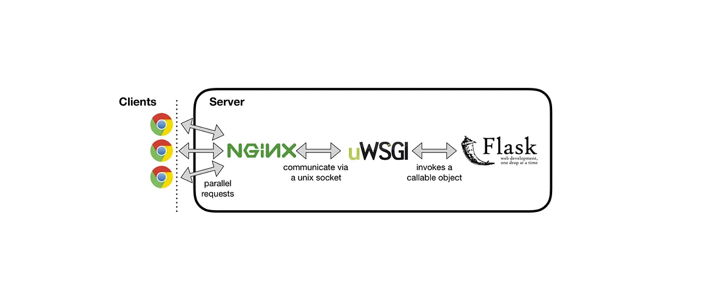

# Microservices

Microservices is an architectural style that structures an application as a collection of small, autonomous services modeled around a business domain. Each microservice is independently deployable and scalable, and it communicates with other microservices over lightweight protocols, often HTTP/REST or messaging queues.

1. `What Are Microservices?`
Microservices break down an application into a series of loosely coupled, independently deployable services. Each service focuses on a specific business capability and can be developed, deployed, and scaled independently. This architecture contrasts with the monolithic approach, where all functionalities are tightly integrated and deployed as a single unit.

Key Characteristics of Microservices:

+ `Single Responsibility`: Each microservice is responsible for a specific business function (e.g., user management, payment processing).
+ `Independence`: Microservices are self-contained and can be deployed independently of one another.
+ `Scalability`: Services can be scaled independently to meet demand.
+ `Decentralization`: Microservices often have decentralized data management, with each service managing its own database.
+ `Flexibility in Technology`: Teams can choose the best tools, languages, and frameworks for each service.

Microservices are a way to design and build software applications by breaking them down into smaller, independent pieces called "services." Each service is responsible for a specific part of the application, like handling user authentication, processing payments, or managing inventory. These services communicate with each other over a network, usually using simple protocols like HTTP, to work together as a complete application.

Microservices Architecture Components
+ `API Gateway`:

    + Serves as the single entry point for clients, routing requests to the appropriate microservice.
    + Handles cross-cutting concerns like authentication, rate limiting, and logging.

+ `Service Registry and Discovery`:

    + Services register themselves with a service registry, allowing other services to discover and communicate with them.
    + Examples: Consul, Eureka.
+ `Inter-service Communication`:

    + `Synchronous Communication`: Often implemented using HTTP/REST or gRPC.
    + `Asynchronous Communication`: Implemented using messaging systems like RabbitMQ, Kafka, or AWS SNS/SQS.
+ `Database per Service`:

    + Each microservice has its own database, promoting loose coupling and independent scaling.
+ `Circuit Breaker Pattern`:

    + Protects services from cascading failures by wrapping calls to other services and monitoring for failures.
+ `Centralized Logging and Monitoring`:

    + Aggregates logs and metrics from all services for monitoring and troubleshooting.

`Examples`: ELK Stack (Elasticsearch, Logstash, Kibana), Prometheus, Grafana.


Example of a Microservices Architecture : Imagine an e-commerce platform with the following microservices:

+ `User Service`: Manages user profiles, authentication, and authorization.
+ `Product Service`: Handles product listings, inventory, and pricing.
+ `Order Service`: Manages order processing, order history, and payments.
+ `Payment Service`: Processes payments, handles payment gateways, and manages refunds.
+ `Shipping Service`: Manages shipping rates, tracking, and delivery statuses.

Each service is independently deployable and interacts with other services through REST APIs or messaging queues.

Containers are a well-suited microservices architecture example, since they let you focus on developing the services without worrying about the dependencies. Modern cloud-native applications are usually built as microservices using containers.


Tools : [Google Microservices Stack](https://cloud.google.com/learn/what-is-microservices-architecture), AWS Containers - [Amazon Elastic Container Service](https://aws.amazon.com/ecs/) and Serverless - [AWS Lambda](https://aws.amazon.com/lambda/). Amazon Microservice Ecosystem [stack](https://aws.amazon.com/microservices/). To learn more about MLOps, go to my notes @[MLOPS](./MLOPS.MD) and @[VERTEX AI](./VERTEXAI.MD).

<a> </a>

Microservices are an application architecture style where independent, self-contained programs with a single purpose each can communicate with each other over a network. Typically, these microservices are able to be deployed independently because they have strong separation of responsibilities via a well-defined specification with significant backwards compatibility to avoid sudden dependency breakage. [[source](https://www.fullstackpython.com/microservices.html)]

### Microservice Example:

We develop a video to mp3 conversion flask web application and learn microservices along the way. Tech stack: [ Python, Flask, MongoDB, RabbitMQ, MySQL, Docker, Kubernetes (kubectl, minikube, [k9](https://k9scli.io/) ) ]



code : @[microservices](microservices)

```docker
    $ docker --version
    $ kubectl
    $ minkube start
```

AUTH SERVICE with JSON WEB TOKEN (JWT) → ( [code](microservices/auth/server.py) ) & ([mysql_db](https://github.com/florist-notes/linux_d/blob/main/sysdesign/microservices/auth/init.sql)) : ` $ mysql -uroot < init.sql`

```python
import jwt, datetime, os
from flask import Flask, request
from flask_mysqldb import MySQL

server = Flask(__name__)
mysql = MySQL(server)

@server.route("/login", methods=["POST"])
def login():
    auth = request.authorization
    if not auth:
        return "missing credentials", 401

    # check db for username and password
    cur = mysql.connection.cursor()

```

` $ docker build . ` > ` $ k9s` to deploy our [infrastructure code](microservices/auth/manifests) for auth deployment. Do `$ kubectl apply -f -/`

MongoDB & GridFs → [code](microservices/gateway/server.py). GridFs helps us store large files in mongodb.

```python

import os, gridfs, pika, json
from flask import Flask, request, send_file
from flask_pymongo import PyMongo
from auth import validate
from auth_svc import access
from storage import util
from bson.objectid import ObjectId

server = Flask(__name__)

mongo_video = PyMongo(server, uri="mongodb://host.minikube.internal:27017/videos")

mongo_mp3 = PyMongo(server, uri="mongodb://host.minikube.internal:27017/mp3s")

fs_videos = gridfs.GridFS(mongo_video.db)
fs_mp3s = gridfs.GridFS(mongo_mp3.db)

```

Architecture Overview (RabbitMQ) → [ [code](microservices/rabbit/manifests) ]   Synchronous & Asynchronous Interservice Communication.

Deploying microservices can be done using various platforms:

+ `Docker`: Each microservice can be containerized using Docker, allowing for easy deployment and scaling.
+ `Kubernetes`: An orchestration platform for managing containerized applications, ideal for deploying microservices at scale.
+ `Cloud Services`: Platforms like AWS, Google Cloud, and Azure offer managed services for deploying microservices, including container orchestration, serverless functions, and API gateways.

Learning : [Microservices Explained in 5 Minutes](https://youtu.be/lL_j7ilk7rc), [Microservice Architecture and System Design with Python & Kubernetes](https://youtu.be/hmkF77F9TLw), [Python Microservices for Beginners](https://youtu.be/rOpJhKa-Chk), [How to Build a Microservice in Python](https://www.makeuseof.com/python-microservice-how-build/), [Python Microservices With gRPC](https://realpython.com/python-microservices-grpc/), [Python Microservices Web App (with React, Django, Flask) - Full Course](https://youtu.be/0iB5IPoTDts), [Python Microservices Full Course - Event-Driven Architecture with RabbitMQ](https://youtu.be/ddrucr_aAzA), [Microservices with FastAPI – Full Course](https://youtu.be/Cy9fAvsXGZA), [Microservices in Python using Flask Framework | Dockerize and Deploy to Kubernetes with Helm](https://youtu.be/SdTzwYmsgoU), [Automate with Python ](https://youtu.be/PXMJ6FS7llk), [Microservices in Python](https://sonusharma-mnnit.medium.com/building-a-microservice-in-python-ff009da83dac), [Building Microservices: Designing Fine-Grained Systems](https://www.amazon.de/-/en/Sam-Newman/dp/1492034029/), [Mastering Chaos - A Netflix Guide to Microservices](https://youtu.be/CZ3wIuvmHeM).