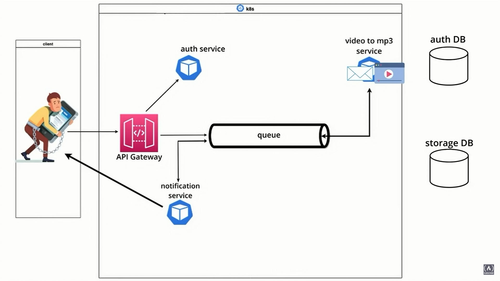
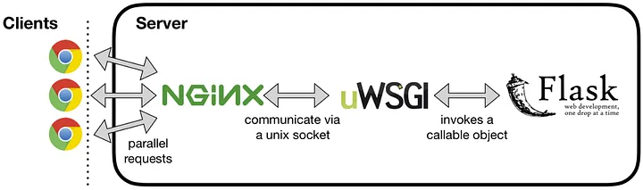

# Microservices


<a> </a>

Microservices are an application architecture style where independent, self-contained programs with a single purpose each can communicate with each other over a network. Typically, these microservices are able to be deployed independently because they have strong separation of responsibilities via a well-defined specification with significant backwards compatibility to avoid sudden dependency breakage. [[source](https://www.fullstackpython.com/microservices.html)]

We develop a video to mp3 conversion flask web application and learn microservices along the waya.

Tech stack: [ Python, Flask, MongoDB, RabbitMQ, MySQL, Docker, Kubernetes (kubectl, minikube, [k9](https://k9scli.io/) ) ]



code : @[microservices](microservices)

```docker
    $ docker --version
    $ kubectl
    $ minkube start

```

AUTH SERVICE with JSON WEB TOKEN (JWT) → MongoDB & GridFs → Architecture Overview (RabbitMQ) → Synchronous Interservice Communication → Asynchronous Interservice Communication →  


Learning : [Microservices Explained in 5 Minutes](https://youtu.be/lL_j7ilk7rc), [Microservice Architecture and System Design with Python & Kubernetes](https://youtu.be/hmkF77F9TLw), [Python Microservices for Beginners](https://youtu.be/rOpJhKa-Chk), [How to Build a Microservice in Python](https://www.makeuseof.com/python-microservice-how-build/), [Python Microservices With gRPC](https://realpython.com/python-microservices-grpc/), [Python Microservices Web App (with React, Django, Flask) - Full Course](https://youtu.be/0iB5IPoTDts), [Python Microservices Full Course - Event-Driven Architecture with RabbitMQ](https://youtu.be/ddrucr_aAzA), [Microservices with FastAPI – Full Course](https://youtu.be/Cy9fAvsXGZA), [Microservices in Python using Flask Framework | Dockerize and Deploy to Kubernetes with Helm](https://youtu.be/SdTzwYmsgoU), [Automate with Python ](https://youtu.be/PXMJ6FS7llk), [Microservices in Python](https://sonusharma-mnnit.medium.com/building-a-microservice-in-python-ff009da83dac).