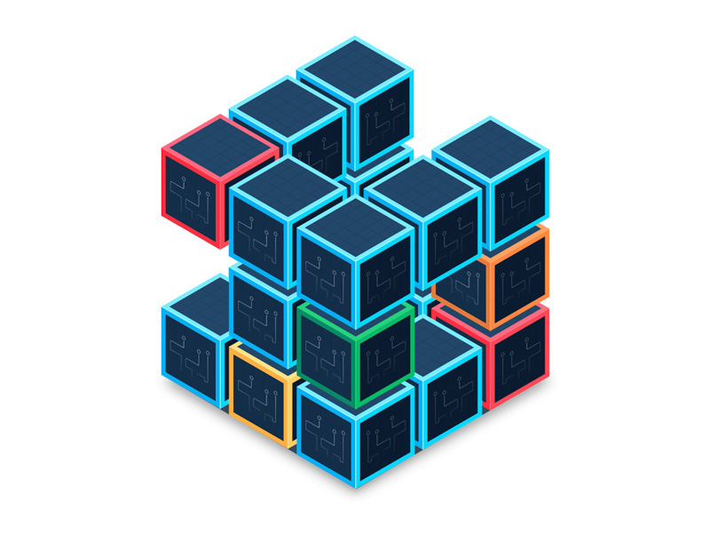
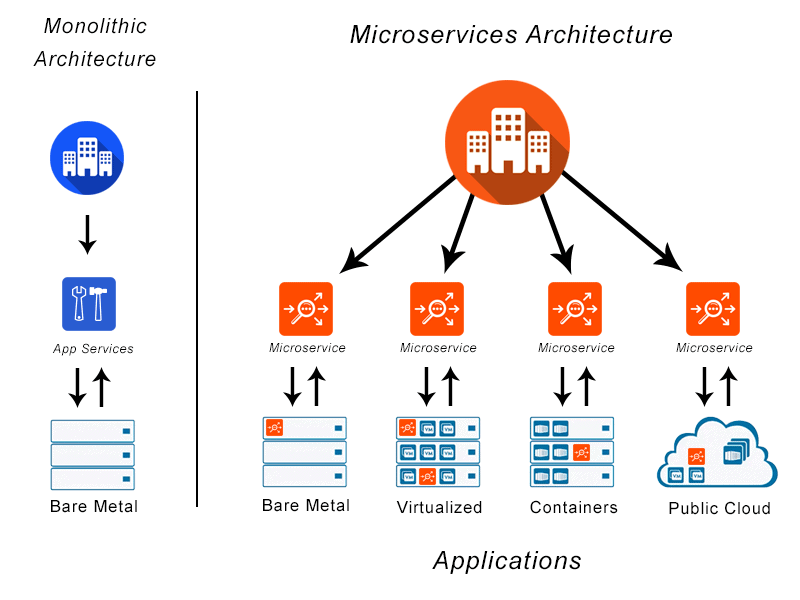

# Microservices

Learning : [Microservices Explained in 5 Minutes](https://youtu.be/lL_j7ilk7rc), [Microservice Architecture and System Design with Python & Kubernetes](https://youtu.be/hmkF77F9TLw), [Python Microservices for Beginners](https://youtu.be/rOpJhKa-Chk), [How to Build a Microservice in Python](https://www.makeuseof.com/python-microservice-how-build/), [Python Microservices With gRPC](https://realpython.com/python-microservices-grpc/), [Python Microservices Web App (with React, Django, Flask) - Full Course](https://youtu.be/0iB5IPoTDts), [Python Microservices Full Course - Event-Driven Architecture with RabbitMQ](https://youtu.be/ddrucr_aAzA), [Microservices with FastAPI – Full Course](https://youtu.be/Cy9fAvsXGZA), [Microservices in Python using Flask Framework | Dockerize and Deploy to Kubernetes with Helm](https://youtu.be/SdTzwYmsgoU), [Automate with Python ](https://youtu.be/PXMJ6FS7llk).