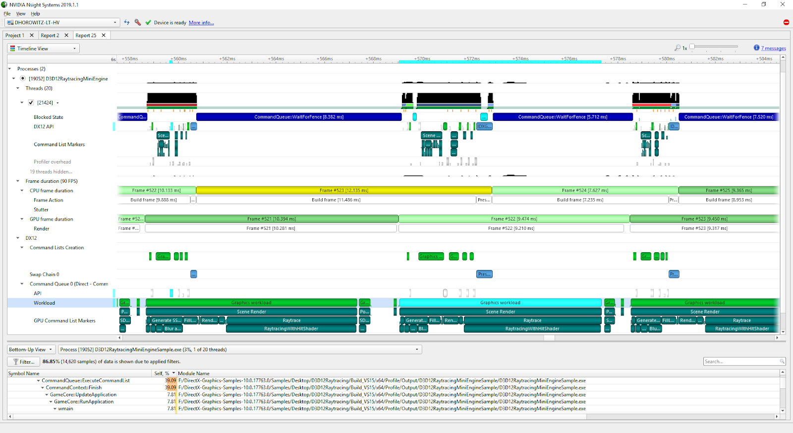

# NVIDIA NSIGHT:

NVIDIA's Nsight Systems and Nsight Compute are performance analysis tools specifically designed for GPU-accelerated applications. Each has distinct uses:

## Nsight Systems [[web](https://developer.nvidia.com/nsight-systems) : [gs](https://developer.nvidia.com/nsight-systems/get-started)]:

+ `Purpose`: Primarily a system-wide performance analysis tool, Nsight Systems gives a high-level overview of your application’s behavior. It provides a timeline view of how the GPU and CPU interact, allowing you to see where bottlenecks or stalls occur and what might be affecting overall performance.

+ `Layer-wise Latency`: For deep learning models, Nsight Systems can help identify latency at each layer by visualizing the execution timeline of each CUDA kernel launched for that layer. This lets you see how long each layer takes and identify layers with unusually high latency, which may indicate bottlenecks in the model.

+ `Memory Transfers`: Nsight Systems shows memory transfer activity between CPU and GPU, helping to identify whether memory bandwidth limits are slowing down processing. It also provides insights into the CPU’s interaction with the GPU and can flag if CPU-GPU synchronization is impacting layer performance.

+ `Overall Use Case`: Best for identifying overall system-level bottlenecks, workload distribution, and how different parts of the pipeline contribute to latency.

## Nsight Compute [[web](https://developer.nvidia.com/nsight-compute):[gs](https://developer.nvidia.com/tools-overview/nsight-compute/get-started)]:

+ `Purpose`: A lower-level, CUDA kernel-centric profiler that provides deep insights into each kernel’s behavior on the GPU. Nsight Compute is designed for developers needing precise performance metrics at the kernel or even at an instruction level.

+ `Layer-wise Profiling`: Since each layer in a deep learning model corresponds to one or more CUDA kernels, Nsight Compute allows you to profile each layer’s kernel(s) in terms of performance metrics like execution time (latency), throughput, and efficiency.

+ `Floating Point Operations (FLOPs)`: Nsight Compute can calculate FLOPs, which represent the computational workload. High FLOP counts are expected in computationally heavy layers (like convolution layers in deep learning models). Monitoring FLOPs per layer helps in identifying which layers are computationally intensive and could benefit from optimization.

+ `Memory Bandwidth`: Nsight Compute measures memory bandwidth utilization, showing how efficiently each layer accesses memory. High bandwidth utilization indicates that the layer may be limited by memory rather than computation, which can impact the overall performance.

+ `Detailed Performance Metrics`: Besides latency and FLOPs, Nsight Compute offers other metrics like warp efficiency, instruction mix (e.g., ratio of floating-point operations to memory operations), and cache utilization.

In summary, Nsight Systems helps you understand the overall pipeline and layer-wise latency in a system-wide context, while Nsight Compute allows for detailed kernel-level profiling, providing metrics like FLOPs and memory bandwidth. Together, they provide a comprehensive view for optimizing both individual layer performance and end-to-end model latency on NVIDIA GPUs.

## Roofline on NVIDIA - GPUs:

Roofline modeling is a visual approach to performance analysis for understanding the computational efficiency of GPU kernels (or any compute workload) by identifying key bottlenecks, either in compute performance or memory bandwidth. In the context of GPU kernels, roofline modeling helps determine whether a given kernel's performance is limited by the computational power of the GPU or by its memory bandwidth.

Key Components of Roofline Modeling
+ Performance Rooflines: Roofline modeling includes two main performance ceilings:
    + `Compute Roofline`: This is the maximum achievable computational throughput of the GPU (e.g., FLOPs per second).
    + `Memory Bandwidth Roofline`: This is the maximum data transfer rate between memory and the processing cores (e.g., GB per second).

These rooflines form horizontal and sloped "roofs" on a plot, showing the upper bounds of what the hardware can achieve in terms of compute or memory performance.

### + Operational Intensity: 

Operational intensity (OI) measures the ratio of floating-point operations (FLOPs) to bytes of data movement. It is calculated as:

    Operational Intensity (OI) = FLOPs / Data Movement (Bytes)
 
This is plotted on the x-axis and reflects the efficiency of a kernel in terms of data reuse. Higher operational intensity implies more computations per byte of data moved.

### + Attainable Performance:

Given a kernel’s operational intensity, the roofline model indicates the maximum attainable performance. For example:
 + If the kernel’s OI is low, it is likely memory-bound (performance limited by memory bandwidth).
 + If the kernel’s OI is high, it is likely compute-bound (performance limited by the compute throughput).

## How Roofline Modeling Works

+ Plotting the Roofline: A roofline plot is a log-log graph, where:

    + The x-axis represents the operational intensity.
    + The y-axis represents the achievable performance (e.g., FLOPs/sec).
    + The memory bandwidth roofline appears as a sloped line (starting from low operational intensity on the left) and transitions into a flat line, which is the compute roofline at higher operational intensities.

+ Plotting Kernel Performance:

    + Each GPU kernel (or layer in a deep learning model) can be plotted on this graph based on its operational intensity and achieved performance.
    + The kernel's position relative to the rooflines shows whether it is memory-bound or compute-bound:
        + Below the memory roofline: Memory-bound, suggesting that performance could improve with better memory access patterns.

        + Below the compute roofline but above the memory roofline: Compute-bound, suggesting that performance could be improved by optimizing computations or exploiting parallelism.

`Identify Bottlenecks`: Roofline modeling helps pinpoint whether kernels are hitting memory or compute bottlenecks, guiding where to focus optimization efforts.

+ Optimization Strategies:
    + `For memory-bound kernels`: Improving data locality, using shared memory, or optimizing memory access patterns may increase performance.
    + `For compute-bound kernels`: Increasing instruction-level parallelism, using efficient algorithms, or exploiting GPU-specific parallel computation capabilities can yield gains.

### Resources:
+ [ [PRoof: A Comprehensive Hierarchical Profiling Framework for Deep Neural Networks with Roofline Analysis](https://dl.acm.org/doi/pdf/10.1145/3673038.3673116) : [code](https://github.com/PRoof-framework/PRoof) ]
+ [[ What’s the backward-forward FLOP ratio for Neural Networks? ](https://www.lesswrong.com/posts/fnjKpBoWJXcSDwhZk/what-s-the-backward-forward-flop-ratio-for-neural-networks)]
+ [ [ LLM Inference Unveiled: Survey and Roofline Model Insights ](https://arxiv.org/pdf/2402.16363v3) ]
+ [[ Federated Fine-Tuning of LLMs on the Very Edge: The Good, the Bad, the Ugly ](https://dl.acm.org/doi/10.1145/3650203.3663331)]
+ [ [Roofline Performance Model for HPC and Deep-Learning Applications](https://developer.nvidia.com/gtc/2020/video/s21565-vid) ]
+ [gitlab/roofline-hackathon-2020](https://gitlab.com/NERSC/roofline-on-nvidia-gpus/-/tree/roofline-hackathon-2020/)
+ $ [conda install](https://anaconda.org/nvidia/nsight-compute) | [nsight-compute cli](https://docs.nvidia.com/nsight-compute/NsightComputeCli/index.html#quick-start?ncid=em-prod-821317%23cid=dev02_em-prod_en-us)
+ [Introduction to NVIDIA Nsight Compute - A CUDA Kernel Profiler](https://youtu.be/nYSdsJE2zMs?si=xf1cqpGx7UtanVwW)
+ [NVTX annotations for layer-wise latency](https://developer.nvidia.com/blog/nvidia-tools-extension-api-nvtx-annotation-tool-for-profiling-code-in-python-and-c-c/)
+ [Operating System Basics](https://youtu.be/9GDX-IyZ_C8?si=_pBO_gkkRkHveHmt) | [Intro to NVIDIA Nsight Compute](https://youtu.be/Iuy_RAvguBM?si=D_ANR4-hI4lRocxF)
+ [Roofline and NVIDIA Ampere GPU Architecture Analysis](https://youtu.be/VtkxhygfNsY?si=xwGHq477AhmdFUr7)
+ [CUDA Developer Tools | Memory Analysis with NVIDIA Nsight Compute](https://youtu.be/GCkdiHk6fUY?si=BiUR5XHjxfwZhfIP)
+ [Introduction to Kernel Performance Analysis with NVIDIA Nsight Compute](https://youtu.be/fsC3QeZHM1U?si=LHIQuLSVd7UpsqJE)
+ [Profiling Deep Learning Applications with NVIDIA NSight](https://youtu.be/K27rLXkOiqo?si=GetLfXGCWsrKgYx3)
+ [NVIDIA Nsight Compute Kernel Profiling Guide](https://docs.nvidia.com/nsight-compute/ProfilingGuide/index.html) 
+ [[ Optimizing CUDA Memory Transfers with NVIDIA Nsight Systems ](https://developer.nvidia.com/blog/optimizing-cuda-memory-transfers-with-nsight-systems/)]
+ [Accelerating HPC Applications with NVIDIA Nsight Compute Roofline Analysis](https://developer.nvidia.com/blog/accelerating-hpc-applications-with-nsight-compute-roofline-analysis/)
+ [ [Nsight Compute Feature Spotlight: Roofline Analysis, Asynchronous Copy, Sparse Data Compression](https://youtu.be/DnwZ6ZTLw50?si=1EbQ2AQkeYvCv4Mc) ]