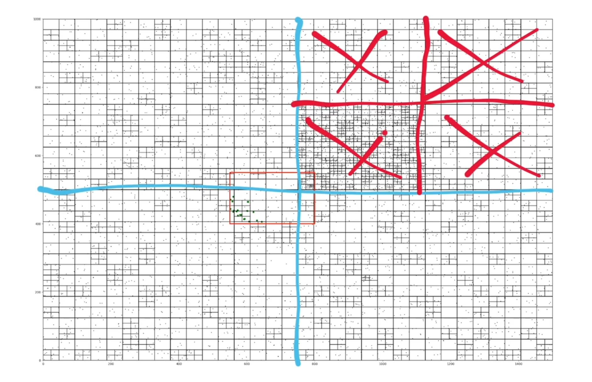
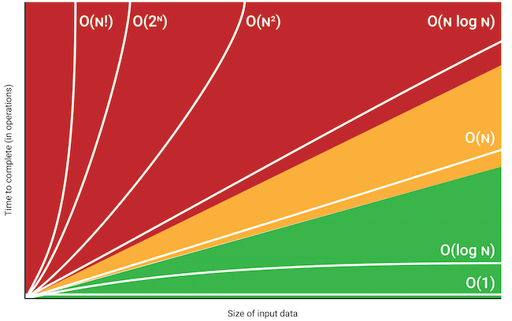

# System Design and Architecture

<p align="justify">
Coding tests assess problem solving but theoretical knowledge is important and Systems Design interviews assess on theoretical knowledge. How to build robust, functional and scalable systems.

System Design Fundamentals : System Design interviews are very intentionally vague. Say design "uber". It's your job to make the interviewer understand your solution, design choices and defend your solution.

Client Server Model : Client speaks to the server, Server listens to clients and speaks back. Client requests data from a server and server sends back data. e.g user/client (browser) visits a website - algoexpert (server). Browser asks DNS for algoexpert's IP address and sends https request and then packet to algoexpert's IP address. A server usually listens to requests via ports. There re 16k ports usually. Specify the port you want to communicate using. HTTP request is port 80, HTTPS is port 443. 127.0.0.1 is your local IP address, always points to local machine. If you send a http request to an IP , you're trying to see the html of that IP address. Browser receives that response and renders the html.

<a> </a>

Network Protocols : Clients and Servers interact with one another following network protocols. IP - Internet Protocol; TCP - Transmission Control Protocol; HTTP - HyperText Transer Protocol. IP - The modern internet effectively operates following IP. Data is sent in the form of IP packets. 2 main sections of IP packet - header and data. IP header contains - source and destination IP address, total size of packet and version of IP packet (IPv4 or IPv6). IP packets are limited to 2^16 bytes ~ 65k bytes ~ 0.065 MB (Thats low). So we have multiple IP packets. Packets need to be sent in correct order and this is where TCP comes into play. TCP is built on top of IP. TCP is meant to send IP packets in ordered, reliable, error-free way. In TCP, In data portion of IP packet, we have a TCP header - information about ordering of packets. e.g - for client server to communicate with TCP, they first need to form a TCP connection with the destination server. This is done via handshake. Once connection established - both sends and receives data. If one machine doesn't sends packets within a certain amount of time, connection can be timed out. It lacks a robust framework that devs can use in a meaningful way and lacks easy communication channels for clients and servers, In TCP we are sending arbitrary data. HTTP comes into play here. HTTP was built on top of TCP. It introduces a new abstraction ~ request-response paradigm. One machine sends a request to another machine and the other machine sends a response. Most modern day communication relies on HTTP. 404 (not found) 403 (forbidden). HTTP allows us to put a lot more business logic in code - request, responses, method - GET, POST, pathnames etc.

Storage : A database serves 2 purposes - store and retrieve data. read/write ; get/set etc. A database is just a server. Persistence of data is very very important. DISK vs MEMORY. If database writes data to disk - that data will persist even when the db server goes down. If db writes data into memory, if db server is booted - data is lost. Reading / Writing data in memory is much faster. Distributed storage is important with consistency.

Latency and Throughput : 2 important measures of the performance of a system. Latency - how long it takes data to traverse a system, from one point to another point in a system. In Networks - how long does it takes a request from a client to a server and from the server back to the client. Reading a piece of data from memory/disk - time required to read that data. Systems are built with different tradeoffs having high or low latencies. e.g - Reading 1 MB sequentially from "memory" takes 250 µseconds. It is a very fast operation. Reading 1 MB sequentially from "SSD" takes 1000 µs. Sending 1 MB data over a 1 Gbps network takes 10,000 µs. Reading 1 MB from a HDD takes 20,000 µs. Sending a packet ~ 1000 bytes over the network from California to Netherlands and back to California takes 150,000 µs. Sending data around the world takes a lot longer than reading from memory/SSD/HDD. Video games need low latency. Throughput - How much work a machine can perform in a given period of time. How much data can be transferred from one point in a system to another point. We measure throughput in Gigabit, Megabit, Kilobits. Billion bits per sec ~ 1 Gigabit. If requests == bits, then how many clients/bits can a server handle at a time or let through per sec. Instead of having a single server, use multiple server to increase throughput.

Availability : SLA/SLO , Nines, Redundancy. Systems availability - how resistant is the system to failures. Will the system go down or be available = fault tolerance. We measure availability with the % of a systems uptime in a given year. If a system is 99% available, we say it has 2 nines availbility, for 99.9% we say 3 nines availability, for 99.99% we say 4 nines availability. [ nines chart ]. 4 nines and up is good. 5 nines and up is gold standard. SLA (Service Level Agreement) ; SLO (Service Level Objective). SLO is a component of SLA. SLA is made up of SLO. % of uptime gaurantee is an SLO or % of error handling is an SLO. e.g Stripe (AlgoExert uses Stripe) needs high availability. There shouldn't be a single point of failure, these single point of failures are handled with Redundancy. Redundancy - Making multiple copies of your system. Passive Redundancy : Having multiple components in layers of a system ~ other similar component will take place of a dead component (e.g airplane engines) ~ all component takes part when active. Active Redundancy - Multiple machines act in such a way that only one/few will be typically handling the traffic, if one fails, other machines will know and will take over.

Caching : We do caching in algorithms to avoid redoing the same operations, specifically computationally complex operations that we perform multiple times. We use caching to speed up our algorithms. Caching is used to speed up a system, increase latency of a system. Caching = storing data in a different location than it generally is such that it is faster to access data in this new location. Caching also at client level. Client caches some data value so that it no longer has to go to server to retrieve it. We can also cache at the server level, such that clients visit the server multiple times and the server doesn't have to go to the database multiple times to retrieve data (maybe only once). We can have cache between server and db. We can also cache at hardware level - CPU caches. Caching is important if we are doing lot of network transactions and we wanna avoid doing all of these network transactions. Computationally long operations (poor time complexity) are also cached. We may cache data in some component attached to server like Reddis, which is an in-memory database. 2 popular types of caches - 1) write through cache (when we write a piece of data it will write it both in the cache and main source of data) Cache and database are always in sync. If you write / edit a post, it writes it in caches and also updates the db (network transaction). 2) write back cache - write post and it updates only the cache. It doesn't get reflected in the db yet. At some other point system asynchronously updates the db with the cache. If I loose the data from cache before the cache updates the db asynchronously, then we are gonna loose data. Say we design YouTube comment section and every server caches the YouTube comments. Caches can become stale if they're not updated properly. So we need a single source of truth for the caching mechanism. Eviction policies with caching - we cannot store infinite cache. How do we get rid of data in caches? LRU policy (Least Recently Used) pieces of data are removed. LFU (Least Frequently Used) is also removed, also random, LILO, FIFO etc.

<a> </a>

Proxies : Reverse Proxies (R) / Forward Proxies (P). Proxy in general is Forward Proxy. Proxy sits between client and server. P acts on behalf of client, it is in the clients side/team. Client sends a request that is meant to go to the server but first goes through the forward proxy. Server responds to the proxy and proxy sends it back to the client. Forward Proxy can hide the identity of the client while requesting something from the server. Source IP address to server will be of P's. Reverse Proxies act on behalf of server. If clients wants to send a request to a server and Reverse Proxy is configured, the request will go to a reverse proxy and the client won't know that it's request will go to a reverse proxy. Client isn't aware of the reverse proxy and server aren't aware of forward proxies. Configure Reverse Proxies to filter out requests. Reverse Proxies can also act as load balancers. Reverse Proxy can decide how to distribute the incoming requests to different servers.

<a> </a>

Load Balancers : Client → Load Balancer → Server. If we have multiple clients to a server it will become overloaded. Our single server can only handle a limited amount of requests in a given time. We scale our system. 1) We can increase power/ performace of our server 2) We can increase number of servers. How come clients know to issue requests to particular servers? = Load balancers. Load Balancers balances work loads across resources. Traffic is evenly distributed across servers. Load Balancers are kind of a reverse proxy. DNS Round Robin act as load balacers ~ single domain name gets multiple IP addresses, the multiple IP addresses are returned in a load balanced way. S/W & H/W load balancers. Load Balancer and servers are configured to know about each other so that traffic can be distributed later. Types ~ pure random redirection, round robin approach, weighted round robin approach, hashed ip address based selection, path based etc. All requests related to running code on AlgoExpert are redirected to a particular server, for payments it is redirected to a particular server. Multiple Load Balancers with different server selection strategies.

Hashing : Consistent hashing, Rendezvous hashing; data is hashed into integer value. Say clients send very computationally expensive requests, one way to deal is caching. If Load Balancer with a round robbin approach redirects similar long computationally expensive requests from one single client into different servers, then the there will be no use of caching the results of the first request in the first server. The second request will hit a completely different server and do the computationaly long operation again. This is where hashing comes into play. e.g Hash the names of our clients/ ip address, get the integers, % (modulo) all these hashes by the number of servers. So we get a single integer for each client and we send all those requests to a particular server. Hashing Function needs to give good uniformity. What if server dies? or we may need to add a new server to our system? If we mod our hashes with a completely new server number, then our traffic from particular clients will be rerouted to completely different servers than before. So we will miss cache hits. This is really bad for a large system. The in-memory caches are no longer useful. We use complicated hashing strategy. Consistent Hashing - Instead of servers being organized in a vertical line, we are going to organize them in a circle. We place our servers on the circle in an evenly distributed way via a hashing function. We similarly position the clients in a circle as well. We go to each client and in a clockwise direction [or counter], we move and the first server that we encounter will be taking the clients requests. What if server C dies? We have to redo our calculations (mod by 3). What happens if we add a new server? In a circular order, if we remove or add new server, most of the mappings from clients to servers remain intact and only few needs to be updated. We are not changing modulo again so that position of clients remain the same. It maintains some level of consistency between the client side hashes and target servers. If we want more evenly distributed traffic. We can use multiple hashing functions as well for more even distribution. Each server might have multiple positions. If we have a powerful server, we can hash it multiple times to have multiple locations to evenly distribute load. This is consistent Hashing. Now 2) Rendezvous Hashing ~ For every username it is going to calculate a score/ ranking for destination servers. If we remove a server that was ranked high, then mapping will go to second highest ranking server.

<a> </a>

Relational Databases : 2 major categories by structure imposed on data - relational db vs non relational db. Relational Databases imposes a tabular like structure on its data. Data stored in a relational db are stored in tables, tables = relations. They typically represents an entity. Rows in relational db are called records and are very structured. Non relational databases do not have tabular like structure, most times are unstructured but if sometimes structured they are not in the form of tables (lot more flexible and lot less rigorous). Most rdb support SQL (Structured Query Language) ~ Querying Language to perform complex query in rdb. Non relational db is called No SQL db, e.g Google Cloud Data Store. Relational DB - Postgres. Why not use Python Scripts to process data ? When data is very humangous, we can't process with a python script as we need to load the data in memory. A SQL database must use an ACID transaction. rdb are ACID ( Atomacity Consistency Isolation Durability ) ~ A: transactions consists of multiple sub operations, they must be atomic operations, if one fails then all fails (e.g ~ Payments), The entire transaction happens at once or doesn't happens at all. C: All transactions must abide by the consistent rules, all must go through same. I: Multiple transactions can occur at the same time, but they must complete like in a sequence. D: Effect/Data stored must be durable on a disk. What if we need to find the largest transaction, search sequentially in TB of data? That'll be really slow. Database Index is important ~ Create an auxiliery data structure in my db that is gonna be optimized for fast searching for a specific attribute on a table. DB index for amount, that will allow fast searching much faster than normal traversal. There are bitmap, reverse, dense indexes. In a db index 'amount' is ordered in a sorted order and do binary search. DB selection is important.

<a> </a>

Key - Value Stores : Most popular nonrelational db is key value store. Type of db that allows to store key-value mapping. e.g Caching is kind of key value mapping. e.d DynomoDB, Reddis, Zookeeper. Different Key Value stores behaves differently, some stores data to disk.

Specialized Storage Paradigms: Blob Store: GCS, S3; Time Series DB: InfluxDB, Prometheus; GraphDB: Neo4j; SpatialDB: QuadTree. Blob : Binary Large OBject, blob = arbitrary piece of unstructured data, it doesn't makes sense to store blob in tabular form so we have GCS (Google Cloud Storage), S3 (Amazon S3). They sort of behave like key value storage, we access via some key, but it is not key-value storage. It is very hard to implement Blob storage solutions, so it is not recommended to build one yourself with time constraints. Time Series DB stores time series data, used for monitoring and logging, IOT telemetry system, stock system etc. GraphDB is built on top of the graph data model. Cypher is a quering language created by Neo4j. Social Networks can be covered with Graph DB. SpatialDB is optimized with Spatial Data (Geometric Space) ~ locations on a Map (Google Map). They rely on spatial index. Different types of spatial indices - Quad Tree, KD Tree, M Tree etc. In a Quad Tree there are 4 or 0 children nodes. The way a QuadTree works is that divide every square or rectangle by 4. The outermost rectangle is the root node and 4 rectangles are the children nodes of the root node. We keep sub dividing rectangles into 4 until we reach the end of the tree. We keep on sub dividing squares when we have more than one location (say a city), so we see dense sub divisions. We can traverse these subtree in log_4(n). Locations nearby on Google Map. We can find locations very fast.

<a> </a>

Replication and Sharding : A systems performance is very dependent on its database's performance. A Replica of the main db. The replica would take over if main db fails, the main db keeps updating the replica. If main db comes back up, replica updates and they swap roles again. Update happens from main to replica in a synchronous way, if write doesn't happen in replica, it won't happpen in main. If main db starts getting overloaded, low throughput, make db more powerful ? multiple normal db ? We can actually split up data, where one part of data is stored in one db server and another in another db server, instead of having multiple copies of same data in different db. Splitting up of main db to bunch of little db = sharding. Say any payment coming from customer name staring from "A to F" will go to shard 1, or region they are coming from. If certain shard has more traffic than other, say name starting with "A to F" vs "X to Z". It will become overloaded. We can use hashing function to evenly distribute data.

<a> </a>

Leader Election : Say we are working at a product that allows users to subscribe on a timely basis e.g Netflix. For such a system db stores info on user subscription, we use a third party service for say payment (PayPal, Stripe). The third party service must communicate with the db and it must know when a user should be charged again, how much. We do not want the 3rd party service to be hooked up directly to our db as db is very sensitive. So we insert some service in the middle, which communicates with the db and tells the 3rd party service. If there is one one service (server) in between, what happens when it fails, then our entire payment system fails. So we introduce redundancy. We don't want to duplicate requests, we want to request payment only once. If we have 5 servers, with leader election, a particular server is chosen as leader. 5 servers are effectively responsible but they are gonna elect a leader, only server that will do the business logic, other 4 servers will sit there for backup. If something happens to the leader, a new leader from the 4 will take over. This is difficult, what happens if there is network failures? The act of multiple machine gain consensus/ agree on something is difficult. We can use consensus algorithm to reach consensus/agree to select our leader. Paxos and Raft are consensus algorithm. We use 3rd party service who uses Paxos and Raft under the hood - Zookeeper and ETCD. Uber uses Zookeeper in their internal systems. ETCD is a key value store but highly available and strongly consistent. ETCD uses Raft consensus algorithm.

Peer-to-Peer Networks : Distribute files to 1000's of machines. You know how torrent works ;) . Divide the total file into many small files and distribute it among peers for them to collect all other files from other peers that they don't have. The server sends all small files to multiple peers and each peer now collects the remaining files from other peers. We parallelize transfers. Information among peers are holded with hash tables. Say ip addresses of peers are hashed for specific files. P2P network operates with DHT (Distributed Hash Table) to hold information. Kraken by UBER is a DHT P2P Network.

Polling and Streaming : If data gets updated regularly and clients gonna see updates regularly, say temperature. This is where polling and streaming comes into play. Polling : Client issues a request following a set interval. For instant messaging, chat rooms, we work with streaming. If we do polling for every 0.1 s for instantaneous feeling, we overload the server, we issue 10 requests per second for 1 client just to get messages, thats where streaming comes into play. Streaming is done through socket, a file where computers can read write with another system, it is like a portal. In streaming, there's a continuos stream of data without having to issue requests repeatedly.


<a> </a>

Configuration : config files - config.json / config.yaml. Configuration is a set of parameters that our system is going to use, we configure them in an isolated manner either in JSON or YAML. Uber has config files in yaml. 2 primary types - static and dynamic. Static is bundled with application file and if we edit, we need to deploy the entire code package. Dynamic configuration completely separated from application package. It is more complex and has to be back by some db.

Rate Limiting : We don't allow more than 2 requests per sec. If clients continue sending more requests, it will be overloaded. System will be brought down ~ DOS (Denial of Service) attack. The bad actor clogs the system, so we need rate limiting. Running code of AlgoExpert has rate limiting. A dDOS (Distributed DOS) bypasses rate limiting by attacking from machines from completely different orgs. Our servers before interacting with the db interacts with reddis and checks for rate limiting, then either approves or disapproves to continue.

Logging and Monitoring : We put log statements in code to log important information. e.g Google Stackdriver can be used for logging. Monitoring comes down to gathering metrics and making sure the system is up and running. For gathering metrics, we may use time series db, prometheus is used in algoexpert. Grafana is used to make graphs from data in prometheus. We can create alerts, hook up our monitoring system to slack so we get updates on abnormal conditions.

Publish and Subscribe Patterns : The pub sub model. Say, a client triggers an asynchronous operation, goes to server , takes some time to complete operation and goes back to client. pub sub model has 4 entities, Publishers, Subscribers, Topic, Message. In each topic we might be publishing different specific data. The Publishers and Subscribers don't really know about each other, they know about Topics. If Subsciber doesn't sends an ACK back to Topic, the message can be sent again, this is called Idempotency. Idempotent operation has same outcome regardless of how many times it is performed. Messages is gauranteed delivery at least once. We can put filters in subscribers, say "I only want tech company stock prices". Important pub sub systems - Apache Kafka, Google pub sub. They offer end-to-end encryption, filtering systems etc.

<a> </a>

MapReduce : In early days Google Engineers were dealing with very very large datasets, these engineers had to process these data stored across 100s of machines. They had to find a way to process in a distributed setting in a fault tolerant manner. A framework to process very large datasets that were spread across 1000s of machines in a distributed setting in a fault tolerant way. 2 steps - Map and Reduce steps. e.g - Data is stored in 4 machines and we apply map function to these data, map transforms these data into key-value pair. These key-value pairs are shuffled around and organized in a way that makes sense. In the Reduce step, they are reduced into some final output. We don't want to move these data sets, but move these map functions to the data. Key-Value pair structure is very important. Map Reduce handles faults very well. It is important to decide: What Map function to specify, What Reduce function to specify? How these key-value pairs are reshuffled in a meaningful way? We count occurences of A,B,C in wikipedia (Example), and the flow in MapReduce is in the figure.

Security and HTTPS : HTTP , Man In The Middle (MITM) Attack; Encryption, Symmetric(1 key) - AES, Asymmetric(2-key) - DES; HTTPS - TLS(handshake), SSL(certificate). Transport Layer Security (TLS) is the successor protocol to SSL. TLS is an improved version of Secure Sockets Layer (SSL). It works in much the same way as the SSL, using encryption to protect the transfer of data and information.

API Design : Stripe's actual product is it's API. So we focus on API Design, it is a very rigorous review and analysis process as it affects a wide spectrum of users.


</p>

# DATA STRUCTURES

<p align="justify">


Data Structures: Manipulating Data = Structuring Data , Every Engineer moves data around on a day to day basis. Data Structures are ways to organize and manage data. e.g 1→2→4→5. or

```

      2
    ↙   ↘
  4      7
↙ ↘    ↙  ↘
3  2   1   9
```


Complexity Analysis: Time Complexity and Space Complexity = Space Time Complexity. Different Data Structures have different space time ramifications.

Memory: 1 memory slot can hold 8 bits = 1 byte. So to store a variable 1, we store 0000 0001 in memory or for 3 , 0000 0011. We have 2^8 = 256 potential data values in 1 byte to store in each memory slot.
So how do we store a number bigger than 256 ? We increase the number of bits, say 32 or 64. We store in back to back free contiguos memory slots. int is 32 bits and long is 64 bits, so, int takes = 32/8 = 4 bytes = 4 back to back memory cell to store as each cell store 1 byte. To store int a=1; in memory, we do it as:

</p>

<a> </a>

Why put 0000 0001 to the left of all 4 cells and not right? Due to [Endianness](https://en.wikipedia.org/wiki/Endianness)!

Second figure is to store a list [1,2], 8 cells or 64 bits in total, 32 bits each i.e 4 byte and 4 byte. It needs a contiguos fixed width space/memory to store the list. Now, how to store strings? ASCII mapping. Each leter is mapped to a number and it is same thereafter. For pointers, we can store in a memory address , the memory address of another cell. Our computers can access these memory addresses directly, very quickly!

<b>Big O Notation:</b> In the worst case scenario. Let's take 3 different algorithms:
(1) f_1(a) => 1 + a[0]
(2) f_2(a) => sum(a)
(3) f_3(a) => pair(a)      ...a = [...N] (integer array of length N)

For N=1, (1),(2) & (3) runs almost in same time frame.For N=10000000, (1) runs instantly, (2) takes a bit time but (3) crashes and takes forever. The speed is dependent on the size of the array, so it is more meaningful to express speed in terms of size of input. If size of input grows, the time taken grows as well.
For (1) we have O(1), For (2) we have O(n) and for (3), we have O(n^2). From Asymptotic Analysis point of view, we consider O(8) == O(1) == Constant as it doesn't depends on the number of input. Even if input number changes, we'll have the same number of operations. So integer taking up 4 bytes or 8 bytes doesn't really matter for time complexity as it takes only O(1).
O(n^2+n+1) = O(n^2); O(2n^2) = O(n^2) ; O(1) < O(logn) < O(n) < O(nlogn) < O(n^2) < O(2^n) < O(n!)

<a> </a>

<b>Scenarios:</b>
1) Algorithm performing bunch of elementary operations ~ O(1)
2) Algorithm traversing an array once ~ O(n)
3) Algorithm traversing the array twice, left to right and back ~ O(2n)= O(n)
4) Algorithm to traverse an array with nested forloop (e.g pairing numbers) ~ O(n^2+2n) = O(n^2)
5) Algorithm to add two arrays with n and m numbers respectively ~ O(n+m)

<b>Logarithm:</b>
log_b(x) = y, iff b^y = x ; In computer science ,we always assume a base 2. So in logn, it has base 2 (Binary). In Mathematics we use base 10. log(1) = 0; log(4) = 2; log(16) = 4;
2^x = N, log(N) = x; So While N increase very large, x increases only by a minute amount. So x will be small and hence O(log(N)) is a much better complexity than O(N) as N increases. So O(log(N)) will be way better as input size increases. 2^20 ~ 1 Million , 2^30 ~ 1 Billion , so x only increased by 10 but N (input size) moved from 1 Million to a Billion. x here is time, but for O(N) it will be very linear.
e.g - Array of length 8 and an algorithm where in at every step it eliminated half of the array. Array [0, 1, 2, 3, 4, 5, 6, 7]. Let's say it elimiates the right side, at every step = [0, 1, 2, 3, 4, 5, 6, 7] → [0, 1, 2, 3] → [0, 1] → [0]. We had an array of length n = 8, and total amount of operations that we performed is basically log(n) ~ log(8) = 3 and here we performed 3 operations. If we increase array size by double, say [0, 1, 2, 3, 4, 5, 6, 7, 8, 9, 10, 11, 12, 13, 14, 15] it will only take one extra step to get to [0, 1, 2, 3, 4, 5, 6, 7]. No of operation increases only by 1 as we double the input size. Half a Binary Tree in each iteration is O(logn).

<b>Arrays:</b> Say a = [1,2,3], and we have 64 bit integers so 8 bytes = 8 memory slots for each integer. For a , we need 3 x 8 = 24 memory slots. There are two types of arrays - Static Array and Dynamic Array. a[100] is a static array where we specify the length.

<a> </a>

<b>Reading/Write element of an array:</b> O(1) ST; Initialize an array: O(8N) ~ O(N) ST [for 64 bit int] for us N=3; Traverse: O(N) T, O(1) S; Copy: O(N) ST. Copying an array is expensive (slice an array etc) is O(n); Insertion: O(N) T, O(1) S. We need to shift elements, so we need to copy everything and find a new memory space of length (old memory length + 8 byte). This is nota good complexity to have considering we keep appeding values to an array all the time. So we need Dynamic Arrays! In C++ it is called a vector and in Java it is called an arraylist. Dynamic Arrays allows faster insertion at the end of the array. Dynamic arrays allocates close to 2x memory slot for a given array, so we have more space at the end. For [1,2,3] we have a dynamic array similar to [1,2,3,.,.,.] under the hood. Constant time insertion O(1). If we exhaust the extra space while inserting, only then we copy the array in memory similar to a static array. The copy will give another double amount of memory space that we need.
e.g: [1,.], We insert 2 in O(1) [1,2], then we insert 3 in O(N) (The array is copied to new space in memory with extra space for insertion and old memory space is freed), we have [1,2,3,.], we insert 4 in O(1) and have [1,2,3,4], then we insert 5 in O(N) giving us [1,2,3,4,5,.,.,.], where rest 6,7,8 is inserted in O(1).
Insert for Dynamic array: O(1) T , We have so many constant time insertions that the few linear time insertions gets cancelled out. This is known as Ammortized Analysis. If we want to insert in the middle or beginning of the array, then dynamic arrays won't really help. It will be O(n). Popping value out of an array/ removing value out of an array: pop() ~ O(1); To pop value from beginning or middle of an array ~ O(N). Because we are shifting.

<b>Linked List:</b> 3→1→4→2 . In array we have to allocate back to back memory slots, but in Linked List it overcomes that limitation. Linked List stores elements anywhere in the memory and they connect elements using pointers. Each element is called a node and it points to next node. Linked List can be anywhere in memory. First element is head of the linked list.
Get: O(i) T, where i is the index & O(1) S ; Set: O(i) T, O(1) S; Init: O(N) ST; Copy: O(N) ST; Traverse: O(N) T, O(1) S;
Insertion: 3→1→4→2 to 5→3→1→4→2 ; We create a new head node and point it to the old head node. O(1) ST, if insert at tail (some linked list has reference to tail ) if we dont have a reference to tail, we have to traverse the linked list and is O(n). Deletion:same ;
There's Doubly linked list, Circular linked lists.

<b>Hash Table</b>:
"foo" ⇒ 1
"bar" ⇒ 2
"baz" ⇒ 3

Hash Table is a key value store. Key {"foo", "bar", "baz"}. Insertion, Deleting or Searching a key-value pair are constant time operations O(1). Similar to arrays where keys are indices in arrays but in HT keys can be anything from strings to other data types. Key gets transformed into an index when passed through a hash function. So hash function converts {"foo", "bar", "baz"} into indexes against which values {1,2,3} are stored. So we have constant lookup ~ O(1).
Many hash functions!! to convert the strings {"foo", "bar", "baz"} into integer value indexes. Say we use conversion standard of ASCII character to encoded integer values and then sum up the encoded values. Say we get 301 for "foo", it is very huge number and we are only dealing with an array of 3 indices. So we 301 % n, where n = length of array. So 301 % 3 = 1 is the index for "foo". Say "bar" is 602 and "baz"is 90, so 602 % 3 is 2 and 90 % 3 is 0. So we have key value pair as , "foo" 1 ⇒ 1 , "bar" 2 ⇒ 2 and "baz" 0 ⇒ 3. What if two keys or strings map to same index? We create a linked list of potential values. The hashed keys out from a hash function collides and we need to store their value in the same index. Lets say "abr" index value is 2. So we store the value for keys "bar" and "abr" in the same index as a linked list. Here arises a problem, how do we know, which value is stored for "abr" or "bar" in the linked list. In each node of the linked list, we point it to the key. So, for same index in the Value table, we have a linked list and each node of the linked list points to the original key in memory. In the worst case, if every key after hashing, maps to the same value, it will create one huge linked list. So Insertion, Deletion and Searching is O(n). Hash Tables support constant time O(1) Insert, Search and Delete on average but on the worst case scenario, it is O(n).
Solution: Very strong hashing functions to minimise the number of collisions. They have become the standard that we assume O(1) for interviews and in industry. We treat the act of hashing keys, a constant time operation O(1). What happens if we run out of space in our underlying array of values. What if we had 300 keys ? so a 100 keys mapped to index 0, 100 keys mapped to index 1 and another 100 to index 2. We introduce the concept of resizing. We use a hash table that resizes itself (Sort of like a dynamic array would do). The overall space complexity is O(n).

<b>Stacks and Queus</b>:
Stacks are LIFO and Queues are FIFO. They support constant time & space O(1) ST for insertion and deletion of objects. Search is O(n) T, O(1) S. push(), pop() ; enqueue(), dequeue(); peek().

<b>Strings</b>: In ASCII Table ; A→65, a→97. Traversing through a string is O(n) T, O(1) S; Copy is O(n) ST, Get is O(1) ST. In C++ strings are mutable. In Python, Java string are immutable.
e.g - foobar = "this is a string", & if we do, foobar += "x"; In Python, (where strings are immutable) creates a brand new string and adds new letter to that string. It is not a contant time operation and is O(n). Similarly, adding two strings , concatenating two strings all are O(n+m).

<b>Graphs</b>: Graphs are made up of nodes and edges. A graph is said to be connected if you can reach any other node from one node within a graph. If graph has a cycle, we call it a cyclic graph. For cyclic graph, be careful with infinite loops. Sometimes when we are dealing with 2D arrays, they are mostly graph problems. Strings, and we are swapping letters in a string, e.g we have got "abc" and we wish to replace every letter of the string with the letter "x". This might lead to a graph structure, where nodes in the graphs are strings and the edges will be transformations (swap one character with "x"). While representing a graph in code, we represent it as an adjacency list. Maybe we can represent graphs in hash tables where we store every node as a key and key points to the relevant nodes. So every nodes stores a list of its neighbours or list of its adjacencies. Creating a graph, we are storing, V vertices and E edges. Space complexity of storing a graph is O (V+E). Traversing a graph has 2 main method : BFS and DFS. Time complexity for traversal is O(V+E).

<a> </a>

<b>Trees:</b> Each node in a tree can have only one parent. Different types of tree - Binary Tree, k-ary trees (atmost k child from each node), BST, Heaps - min & max heaps, Tries etc. Storing a tree will be O(n) S. Traversing an entire tree : O(n) T. Traversing from top to bottom via one path , say in a Binary Tree is O( log(n) ) T ~ Balanced Binary Tree. AVL or Red Black Tree are balanced to maintain O(logn). If the tree is skewed, then it will be O(n). A complete tree will be filled at every level except/maybe the last level, where only nodes filled from left to right is accepted. A tree is full when every node in the tree has no children node or k-children node, where k is the number in k-ary tree. For k=2 (Binary Tree), every node must have 2 children or no children. Perfect Tree: All the leaf nodes have the same depth.

Example of complete tree:

```

     o            o              o
    / \          / \            / \
   o   o       o   o         o   o
  / \  /       / \  / \      / \  / \
 o  o o     o  o o  o    o  o o  o
                             /
                            o
                            
                            
                            
```